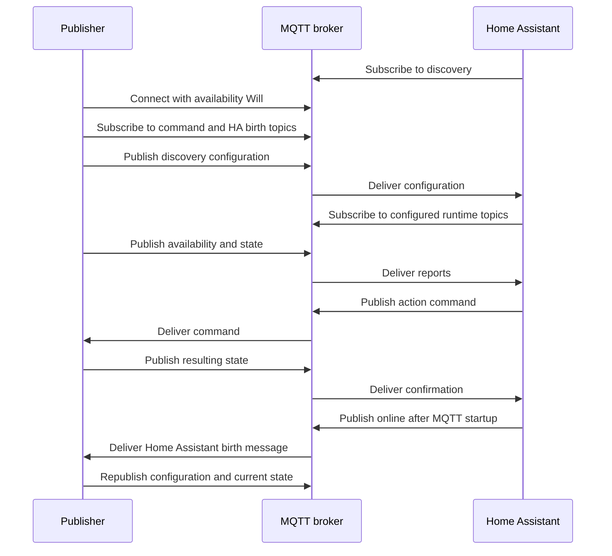

# Home Assistant MQTT Discovery — specification guide

## 1. Scope, baseline, and notation

This reference specifies how an independent MQTT publisher describes devices,
entities, automation triggers, and tag scanners to Home Assistant. It covers
configuration messages, runtime message contracts, every supported component,
all documented configuration fields, and the complete discovery abbreviation
maps for the baseline below.

**Baseline:** Home Assistant Core **2026.9.2** and the official documentation
snapshot **9a3fdc5c7bd5607540d7a19776e611cfdb573318**, inspected on
**2026-09-15**. This is a consolidated guide, not an official standard published
by Home Assistant. Later releases may add or change capabilities. Where the
snapshot's prose differs from the release code, this guide identifies the
specific difference and uses the release schema for the executable requirement.

Sources: [release schemas](https://github.com/home-assistant/core/tree/2026.9.2/homeassistant/components/mqtt)
and [documentation snapshot](https://github.com/home-assistant/home-assistant.io/tree/9a3fdc5c7bd5607540d7a19776e611cfdb573318/source/_integrations).

### Reading this reference

- **Required** means the field is needed in the stated schema or condition.
- **Optional** means it may be omitted; it does not mean it applies to every platform.
- **Conditional** requirements override a simple Required/Optional label.
- `<placeholder>` denotes a value chosen by the publisher. Square brackets in
  topic grammar denote an optional segment; do not transmit the brackets.
- Examples use independent, fictional identifiers. Topic names outside the
  discovery namespace are application choices.
- JSON `null`, an absent key, an empty string, and a zero-byte MQTT payload are
  different values and have different effects.

### Contents

1. [Scope and baseline](#1-scope-baseline-and-notation)
2. [Architecture and transport](#2-architecture-and-transport)
3. [Discovery addressing and identities](#3-discovery-addressing-and-identities)
4. [Common configuration objects](#4-common-configuration-objects)
5. [Single-component discovery](#5-single-component-discovery)
6. [Device discovery](#6-device-discovery)
7. [Operational topics](#7-operational-topics)
8. [Serialization, templates, and shorthand](#8-serialization-templates-and-shorthand)
9. [Availability and restart behavior](#9-availability-and-restart-behavior)
10. [Updates, removal, and migration](#10-updates-removal-and-migration)
11. [Supported component matrix](#11-supported-component-matrix)
12. [Runtime payload contracts](#12-runtime-payload-contracts)
13. [Validation and interoperability](#13-validation-and-interoperability)
14. [Version and source differences](#14-version-and-source-differences)
15. [Source attribution](#15-source-attribution)
16. [Complete configuration catalogue](#16-complete-configuration-catalogue)
17. [Complete topic-field index](#17-complete-topic-field-index)
18. [Complete abbreviation maps](#18-complete-abbreviation-maps)
19. [Device-class and state-class enumerations](#19-device-class-and-state-class-enumerations)

## 2. Architecture and transport

There are three roles:

| Role | Responsibility |
| --- | --- |
| Publisher | Implements the external device/service behavior, publishes discovery and reports, and handles relevant commands. |
| MQTT broker | Authenticates clients, applies permissions, routes subscriptions/publications, and manages retained messages and sessions. |
| Home Assistant MQTT integration | Parses discovery, creates/configures the relevant objects, subscribes to reports, and publishes commands. |

A device can expose many entities. A gateway can expose many devices. A discovery
publisher does not have to be the physical device itself. Discovery configures
the Home Assistant side of an agreed message contract; it does not supply a
command handler, sensor implementation, or broker connection.

Home Assistant's current integration requires a broker supporting MQTT 5.
Other clients can use a broker-supported protocol version; discovery's JSON
format is independent of the client's programming language. Broker address,
port, authentication, TLS, client ID, keepalive, and transport selection are
connection settings, not entity discovery fields.
[MQTT integration connection requirements](https://www.home-assistant.io/integrations/mqtt/#broker-configuration).

### Publication properties

| Property | Meaning | Relationship to discovery |
| --- | --- | --- |
| Topic | MQTT routing address | Configuration topics follow section 3; runtime topics come from configuration fields. |
| Payload | Message bytes | Discovery uses a JSON object, except lifecycle control messages. Runtime encoding depends on the platform. |
| QoS | 0: at most once; 1: at least once; 2: exactly once at the MQTT exchange level | Set independently for publishing and subscribing. It does not guarantee exactly-once physical effects. |
| Retain flag | Store the latest retained payload for a topic | Set on the discovery publication itself to retain configuration. |
| Message expiry | MQTT 5 lifetime for a queued/retained message | Separate from sensor `expire_after` and from entity availability. |
| Last Will | Publication registered on connection for abnormal disconnect handling | Usually supplies device availability; discovery only declares where to listen. |

A retained message is a latest-value slot, not a history. Ordinary non-retained
publication does not erase an earlier retained payload. To erase that slot,
publish a retained zero-byte payload to the same topic. Persistence across a
broker restart depends on broker settings. Duplicate delivery remains relevant
for idempotent command handling.
[MQTT transport concepts](https://mosquitto.org/man/mqtt-7.html).

## 3. Discovery addressing and identities

### Topic grammar

```text
single component:
  <discovery_prefix>/<component>/<object_id>/config
  <discovery_prefix>/<component>/<node_id>/<object_id>/config

device with multiple components:
  <discovery_prefix>/device/<object_id>/config
  <discovery_prefix>/device/<node_id>/<object_id>/config
```

`discovery_prefix` defaults to `homeassistant`. It must match the integration's
configured discovery prefix. `component` must be one of the values in section 11;
`device` selects the multi-component envelope. `node_id` and `object_id` are
nonempty strings using `[a-zA-Z0-9_-]`. The optional node ID organizes topics;
it does not itself create a device-registry relationship.

Example addresses:

```text
homeassistant/sensor/example_temperature/config
homeassistant/cover/gateway_a/window_3/config
homeassistant/device/example_device/config
```

Home Assistant subscribes for discovery configurations under its configured
prefix. A diagnostic MQTT client can listen to `<discovery_prefix>/#`; this is a
subscription filter, not a valid topic to publish a configuration to.
[Discovery addressing and parser](https://github.com/home-assistant/core/blob/2026.9.2/homeassistant/components/mqtt/discovery.py).

### Identity domains

| Identifier | Scope and purpose | Stability rule |
| --- | --- | --- |
| MQTT client ID | Broker connection/session | Concurrent clients need distinct IDs. |
| Discovery topic | Address of one configuration | Reuse the address when updating that configuration. |
| `node_id` | Optional topic grouping | Preserve if keeping the discovery identity. |
| `object_id` | Configuration identifier within the discovery topic | Does not select the resulting Home Assistant `entity_id`. |
| `components` mapping key | Component identity inside device discovery | Preserve across updates and restart. |
| `unique_id` | Entity-registry identity within the relevant integration/platform | Keep stable; do not reuse for different entities. |
| `device.identifiers` / `device.connections` | Device-registry matching | Reuse across entities representing the same device. |
| `entity_id` | Home Assistant address, such as `sensor.study_temperature` | May be assigned or renamed by Home Assistant/the user. |
| `default_entity_id` | Initial entity-ID suggestion | With `unique_id`, normally used at first registration; not a permanent rename command. |
| `device.name` / entity `name` | Human-readable labels | Labels can change without changing physical or entity identity. |

A discovery topic's optional node and object IDs, an entity's unique ID, and a
device identifier are distinct namespaces. Giving two entities the same device
identifier groups them; giving them the same unique ID can cause conflicts.
[Entity and device configuration schemas](https://github.com/home-assistant/core/blob/2026.9.2/homeassistant/components/mqtt/schemas.py).

## 4. Common configuration objects

Common metadata is defined here once. The catalogue gives the supported fields,
platform-specific requirements, and defaults for each component. A shared field
name does not make it valid in every component or every envelope position.

### Entity metadata

| Field | Type | Semantics |
| --- | --- | --- |
| `name` | string or permitted `null` | Feature name; `null` can mark the main feature named by its device. |
| `unique_id` | string | Stable registry identity. Required for entity components inside device discovery. |
| `default_entity_id` | string | Suggested entity address, including domain. |
| `icon` | string | Icon identifier, commonly `mdi:...`. |
| `entity_picture` | URL string | Entity image. |
| `entity_category` | string | `config` or `diagnostic`, when applicable. |
| `enabled_by_default` | boolean | Initial entity-enabled setting; default `true`. |
| `visible_by_default` | boolean | Initial visibility setting; default `true`. |
| `device_class` | string or permitted `null` | Domain-specific semantic class; see section 19. |
| `group` | list of strings | Unique IDs of existing member entities if this entity represents a group. |
| `json_attributes_topic` | subscription topic | Receives a JSON object containing supplementary attributes. |
| `json_attributes_template` | template string | Extracts the attributes object from a larger payload. |
| `encoding` | string | Runtime text encoding, normally `utf-8`; `""` disables incoming text decoding where supported. |
| `qos` | integer 0, 1, or 2 | Entity-related subscription/publication QoS. Default normally 0. |
| `retain` | boolean | Retention of commands sent by Home Assistant on platforms supporting this field. |
| `message_expiry_interval` | nonnegative integer seconds or duration object | MQTT 5 expiry for outgoing messages. Object keys include `days`, `hours`, `minutes`, and `seconds`. |

Registry metadata may be ignored without an entity `unique_id`. User-customized
registry settings can take precedence over discovery defaults. JSON attributes
are not additional entities and do not replace the platform's state contract;
reserved entity attributes can be blocked by the platform.
[Shared entity schemas](https://github.com/home-assistant/core/blob/2026.9.2/homeassistant/components/mqtt/schemas.py)
and [base MQTT schemas](https://github.com/home-assistant/core/blob/2026.9.2/homeassistant/components/mqtt/config.py).

### `device` object

| Field | Type | Meaning |
| --- | --- | --- |
| `identifiers` | string or list of strings | Stable publisher-defined device identifiers. |
| `connections` | list of two-element string arrays | Connections such as `[["mac", "02:11:22:33:44:55"]]`. |
| `name` | string | Human-readable device name. |
| `manufacturer` | string | Manufacturer metadata. |
| `model` | string | Model name. |
| `model_id` | string | Model identifier. |
| `serial_number` | string | Device serial number. |
| `hw_version` | string | Hardware revision. |
| `sw_version` | string | Device software version. |
| `configuration_url` | URL string | Management page using a supported `http`, `https`, or `homeassistant` URL. |
| `suggested_area` | string | Initial area suggestion. |
| `via_device` | string | Identifier of an upstream device/gateway. |

The release schema requires at least one nonempty identifying value in
`identifiers` or `connections` when a `device` object is supplied. Provide a name
for a newly described device; see the documentation/schema difference in
section 14. An upstream `via_device` relationship is different from grouping
several entities into the same device.
[Device registry schema](https://github.com/home-assistant/core/blob/2026.9.2/homeassistant/components/mqtt/schemas.py).

### `origin` object

| Field | Type | Requirement |
| --- | --- | --- |
| `name` | string | Required inside `origin`; names the publishing application. |
| `sw_version` | string | Optional application version. |
| `support_url` | string | Optional application support URL. |

`origin` is optional for single-component discovery and required at the device
envelope root. It describes the publisher, while `device` describes the represented
device. Origin metadata assists logging and troubleshooting.
[Origin validation](https://github.com/home-assistant/core/blob/2026.9.2/homeassistant/components/mqtt/schemas.py).

### Availability objects

Choose either a single `availability_topic` or an `availability` list, not both.

```json
{
  "availability": [
    {"topic": "example/gateway/availability"},
    {
      "topic": "example/device/health",
      "value_template": "{{ value_json.connection }}",
      "payload_available": "connected",
      "payload_not_available": "disconnected"
    }
  ],
  "availability_mode": "all"
}
```

This is a configuration fragment. Each list entry requires `topic`; optional
`payload_available` and `payload_not_available` default to `online` and `offline`.
An entry's `value_template` processes its received payload. Single-topic
configuration uses `availability_template` at entity level instead.

| `availability_mode` | Entity is available when… |
| --- | --- |
| `all` | All configured sources have reported the available value. |
| `any` | At least one configured source has reported the available value. |
| `latest` | The most recent recognized availability report says available; this is the default. |

Availability indicates reachability/readiness, not the entity's ordinary state.
[Availability schema](https://github.com/home-assistant/core/blob/2026.9.2/homeassistant/components/mqtt/schemas.py).

## 5. Single-component discovery

Publish one serialized JSON object to a component discovery topic. The topic
selects the platform. Configuration options live directly in the object; there
is no outer `mqtt`, platform list, or `components` wrapper. Omit `platform` here;
that discriminator belongs to components inside device discovery.

For example, on `homeassistant/sensor/example_temperature/config`:

```json
{
  "name": "Temperature",
  "unique_id": "example_temperature",
  "state_topic": "example/measurements",
  "value_template": "{{ value_json.temperature }}",
  "device_class": "temperature",
  "unit_of_measurement": "°C",
  "state_class": "measurement",
  "device": {
    "identifiers": ["example_device"],
    "name": "Example device"
  },
  "origin": {
    "name": "Example publisher"
  }
}
```

On the declared state topic, a matching runtime payload is:

```json
{"temperature": 23.4}
```

A single component need not correspond to an entity: `device_automation` describes
a trigger and `tag` describes a scanner. Their contracts differ from ordinary
entity metadata; see their catalogue entries.
[Single-component processing](https://github.com/home-assistant/core/blob/2026.9.2/homeassistant/components/mqtt/discovery.py).

## 6. Device discovery

Device discovery puts multiple component configurations into one publication.
It reduces repeated device metadata and is the recommended format for a device
with multiple components.

### Root envelope

| Field | Requirement and scope |
| --- | --- |
| `device` | Required device object; shared by all components. |
| `origin` | Required publisher object; shared by all components. |
| `components` | Required object mapping stable component keys to component objects. |
| `availability`, `availability_topic`, `availability_mode`, `availability_template`, `payload_available`, `payload_not_available` | Optional shared availability configuration. |
| `state_topic`, `command_topic` | Optional shared operational topics. |
| `qos`, `encoding`, `message_expiry_interval` | Optional shared transport behavior. |

That is the complete shared-root option set for the baseline. Entity fields such
as `name`, `unique_id`, `retain`, `device_class`, and `value_template` belong inside
components. The `~` shorthand is not a supported root option in this envelope;
it can be placed in an individual component configuration.

Each component contains `platform` plus its platform options. Entity components
also require `unique_id`. Component-level supported shared options take precedence
over root defaults. `device` and `origin` come from the root and cannot be overridden
by individual components. Inheritance is per field, not a deep merge of arbitrary
objects; avoid inheriting one availability form while specifying the other.
[Envelope and shared-option schemas](https://github.com/home-assistant/core/blob/2026.9.2/homeassistant/components/mqtt/schemas.py).

For `homeassistant/device/example_device/config`:

```json
{
  "device": {
    "identifiers": ["example_device"],
    "name": "Example device"
  },
  "origin": {
    "name": "Example publisher",
    "sw_version": "2.0"
  },
  "availability_topic": "example/device/availability",
  "components": {
    "measurement": {
      "platform": "sensor",
      "name": "Temperature",
      "unique_id": "example_temperature",
      "state_topic": "example/measurements",
      "value_template": "{{ value_json.temperature }}",
      "device_class": "temperature",
      "unit_of_measurement": "°C",
      "state_class": "measurement"
    },
    "output": {
      "platform": "switch",
      "name": "Output",
      "unique_id": "example_output",
      "command_topic": "example/output/set",
      "state_topic": "example/output/state",
      "payload_on": "ON",
      "payload_off": "OFF"
    }
  }
}
```

This is an alternative to single-component publications for these identities.
Do not simultaneously advertise conflicting definitions of the same entities.
One invalid component is not an application-level transaction rollback mechanism
for the whole device; monitor validation and setup results.
[Device discovery processing](https://github.com/home-assistant/core/blob/2026.9.2/homeassistant/components/mqtt/discovery.py).

## 7. Operational topics

No universal `/set`, `/state`, `/status`, or telemetry hierarchy is imposed.
Discovery binds Home Assistant to the addresses chosen by the publisher.
The complete topic-field-to-platform index appears in section 17.

| Topic family | Direction relative to Home Assistant | Contract |
| --- | --- | --- |
| Discovery `.../config` | Inbound | Configuration object or lifecycle control payload. |
| `state_topic` | Inbound | Platform state: scalar text, structured JSON, or another specified encoding. |
| `command_topic` | Outbound | Platform command payload. |
| `availability_topic`, `availability[].topic` | Inbound | Availability match values, optionally template-extracted. |
| `json_attributes_topic` | Inbound | Attribute object, optionally template-extracted. |
| `*_state_topic`, measurement topics, `position_topic` | Inbound | Feature-specific state such as brightness, fan mode, target temperature, position, or version. |
| `*_command_topic`, `set_fan_speed_topic`, `send_command_topic` | Outbound | Feature-specific commands and custom commands. |
| `topic` for triggers/tag scanners | Inbound | Trigger event or tag ID. |
| Camera `topic`, image `image_topic` / `url_topic` | Inbound | Binary image data, encoded image data, or an image URL. |
| Home Assistant birth/status topic | Outbound | Default `homeassistant/status`, `online` / `offline`; integration settings can change/disable it. |

Some fields use exceptions to these naming conventions, so use the catalogue's
semantics rather than guessing from a suffix. A shared state topic can feed
several entities through different templates. A shared command topic needs an
unambiguous command format so the receiver can distinguish requested actions.

### Topic validation

Home Assistant's MQTT topic validator accepts nonempty UTF-8 strings up to
65,535 encoded bytes. It rejects NUL, control characters, and Unicode
noncharacters. Publish topics cannot contain `+` or `#`. Subscription filters
may use `+` only as an entire level, and `#` only as the final level. A platform
may impose further constraints. Topic names are case-sensitive.
[Topic validators](https://github.com/home-assistant/core/blob/2026.9.2/homeassistant/components/mqtt/util.py).

## 8. Serialization, templates, and shorthand

### JSON and value interpretation

Discovery is a JSON object, not YAML or an array. Use valid JSON strings,
numbers, booleans, arrays, and objects. Do not double-encode the entire object
into a JSON string. Do not include code comments or trailing commas. A JSON
field whose schema expects a string is not interchangeable with a numeric value
just because both print similarly.

A platform's **discovery configuration schema** and **runtime message schema**
are separate. For example, every MQTT light has JSON discovery, but its runtime
`schema` can be `default`, `json`, or `template`. `payload_on` describes a command
value; it is not itself a command sent by the discovery publication.

### Templates

| Template family | Input/output |
| --- | --- |
| `value_template`, `*_value_template`, state templates | Transform received messages into the value expected by the platform. |
| `command_template`, feature command templates | Transform an action's value into the bytes/text published to a command topic. |
| `availability_template` / list-entry `value_template` | Extract the value compared against available/unavailable payloads. |
| `json_attributes_template` | Extract an object to use as entity attributes. |
| Light `command_on_template`, `command_off_template` | Build the template-schema light's command payload. |

Common incoming variables are `value` (text) and `value_json` (decoded JSON).
Outgoing variables are platform-specific: for example a scalar `value`, lock
code information, light brightness/color values, or infrared timings. See the
field description before using a variable. Template strings are Jinja expressions
executed by Home Assistant; the publisher serializes them as JSON strings.
[MQTT template models](https://github.com/home-assistant/core/blob/2026.9.2/homeassistant/components/mqtt/models.py).

An extraction example:

```json
{
  "state_topic": "example/telemetry",
  "value_template": "{{ value_json.environment.temperature }}"
}
```

Unknown state, invalid values, empty messages, and template errors are handled by
the individual platform. There is no universal runtime `null` reset convention.
The string `None`, lowercase `none`, JSON `null`, and an empty payload must not
be substituted for one another without consulting the field contract.

### Abbreviations

Section 18 lists every mapping. Abbreviations are expanded before platform
validation. Different maps apply to general keys, `device`, and `origin`.
Do not send both a long key and its alias in the same object. An abbreviation
existing in the map does not make that field valid for all components.

### `~` base-topic substitution

For single-component discovery, or inside a component object:

```json
{
  "~": "example/output",
  "command_topic": "~/set",
  "state_topic": "~/state"
}
```

This expands to `example/output/set` and `example/output/state`. The base replaces
a leading or trailing `~` in topic-valued fields, including supported availability
entries. It is not arbitrary string interpolation and does not rewrite templates,
identifiers, or payload strings. Use it at one boundary of a topic value rather
than both. The root of a device-discovery envelope does not accept `~` in the
baseline schema.
[Abbreviation and base-topic expansion](https://github.com/home-assistant/core/blob/2026.9.2/homeassistant/components/mqtt/discovery.py).

## 9. Availability and restart behavior

### Typical lifecycle



This is a recovery-capable publication strategy, not a mandatory ordering of all
MQTT clients. There is no standardized discovery request/acknowledgment topic.
MQTT PUBACK acknowledges transport receipt, not successful Home Assistant entity
creation or a completed physical command.

### Retention choices

| Message kind | Usual policy | Reason |
| --- | --- | --- |
| Discovery | Retained, or resent on Home Assistant birth | Configuration must be offered after MQTT integration startup/reload. |
| Current state | Retain when meaningful, or refresh after subscription/setup | Gives a newly created entity an initial report. |
| Availability | Retained online/offline reports and retained Will are common | Preserves latest connectivity status for subscribers. |
| Commands | Normally non-retained | Prevents old commands from being executed upon a later subscription. |
| Events, button presses, tag scans | Normally non-retained | They represent occurrences, not durable current state. |

The publisher must arrange rediscovery after Home Assistant starts. Options are
retained discovery, responding to its configured birth message, or periodic
republication; birth-triggered republication can use jitter to avoid bursts.
Republish relevant state after discovery as well. Integration birth/status is
separate from each external device's availability topic.
[Discovery recovery](https://www.home-assistant.io/integrations/mqtt/#discovery-messages-and-availability).

### Availability versus freshness

- Availability indicates whether an entity's data/control source is usable.
- `expire_after`, on supporting sensors, expires state after missing reports.
- `off_delay`, on binary sensors, automatically resets an on state after a delay.
- `force_update`, on supporting platforms, requests updates even when the value
  has not changed; it is not a heartbeat mechanism.
- MQTT message expiry controls broker message lifetime, not Home Assistant state.

Register a device's Will at connection time. A normal clean disconnect suppresses
that Will, so an application shutting down deliberately should publish its own
offline report. Home Assistant's integration supplies its own shutdown/birth
behavior. Detection of abrupt loss can be delayed by MQTT keepalive and network
failure detection. Retained state cannot prove that a disconnected device is
still in that state.
[MQTT Will semantics](https://mosquitto.org/man/mqtt-7.html).

## 10. Updates, removal, and migration

### Reconfiguration

Publish the new complete configuration at the existing discovery topic. Preserve
identifiers for the same entities and device. Treat this as replacement
configuration rather than a generic JSON Merge Patch. Sending a report on a
state topic does not update discovery metadata.

Unknown/unsupported options may be stripped or rejected depending on the selected
schema; successful JSON parsing alone does not establish configuration validity.
Repeated advertisements must not create new identities for the same entity.

### Remove a single-component configuration

Publish **zero bytes with retain set** to the exact discovery topic. This both
signals removal and clears retained discovery. Sending `{}`, JSON `null`, or
`""` does not perform the zero-byte operation. Stop future re-advertisement if
removal should persist. Clear stale retained operational values separately if
those values should also be discarded.

### Remove components from device discovery

Use the existing envelope and put only the platform in the component to remove:

```json
{
  "device": {"identifiers": ["example_device"], "name": "Example device"},
  "origin": {"name": "Example publisher"},
  "components": {
    "measurement": {"platform": "sensor"}
  }
}
```

This is a removal marker for that component. Include unchanged components in the
same update when maintaining a larger device. After removal, publish the final
configuration with the removed entry omitted. Publish a retained zero-byte
payload on the device discovery topic to remove the whole published device
configuration. The device-registry record can remain if other references exist.
[Removal processing](https://github.com/home-assistant/core/blob/2026.9.2/homeassistant/components/mqtt/discovery.py).

### Migrate between discovery formats

For single-component → device discovery:

1. Ensure entity unique IDs and device identifiers are stable and present.
2. Prepare the device envelope with matching unique IDs/device context and
   stable component keys.
3. Send the following control payload to each old single-component discovery topic:

   ```json
   {"migrate_discovery": true}
   ```

4. Publish the new device discovery configuration.
5. Check Home Assistant's logs and resulting entities.
6. Clear old retained single-component discovery topics with retained zero-byte
   publications after the migration has succeeded.

For rollback, send the migration control payload to the device topic, restore the
single-component configurations, and clear the old device topic. Migration
unloads the old definitions while retaining relevant registry settings. Use the
control object by itself; `migr_discvry` is its supported abbreviation.
[Migration protocol](https://www.home-assistant.io/integrations/mqtt/#migration-from-single-component-to-device-discovery).

## 11. Supported component matrix

The baseline supports **32 component discriminators**: **30 entity platforms**
and **2 non-entity components**. `device` is the aggregation envelope, not a
33rd entity platform. Names below are the exact discovery discriminator values.

| Component | Represents | Principal runtime contract / variants |
| --- | --- | --- |
| `alarm_control_panel` | Alarm system | State reports and arm/disarm/trigger commands; optional code validation/templates. |
| `binary_sensor` | Two-state observation | Configurable on/off payloads, delay/expiry, device class. |
| `button` | Stateless action | Publishes a configured press payload. |
| `camera` | Camera image feed | Image bytes on `topic`; optional base64 decoding. |
| `climate` | HVAC controller | Independent current/target temperature, humidity, modes, fan, swing, presets, and action topics. |
| `cover` | Cover/blind/door | Open/close/stop, position and tilt topics, configurable payloads and scales. |
| `date` | Date control | ISO date state/commands, with templates. |
| `datetime` | Date and time control | ISO datetime, UTC commands and optional timezone interpretation/templates. |
| `device_automation` | Device trigger | Topic/payload match plus `automation_type`, `type`, `subtype`; not an entity. |
| `device_tracker` | Presence/location | Home/not-home states and optional GPS/location attributes. |
| `event` | Event occurrence entity | JSON `event_type` from a configured event-type list. |
| `fan` | Fan | On/off, percentage, direction, oscillation, and preset-mode features. |
| `humidifier` | Humidifier/dehumidifier | On/off, target humidity, operating mode and current humidity. |
| `image` | Still image | Mutually exclusive binary/base64 `image_topic` or `url_topic`. |
| `infrared` | IR emitter or receiver | Explicit `schema: emitter` or `schema: receiver`; pulse timings/modulation payload. |
| `lawn_mower` | Lawn mower | Activity reports and mowing/pause/dock commands. |
| `light` | Light | Three runtime schemas: `default`, `json`, `template`. |
| `lock` | Lock | Lock/unlock/open commands, transitional/jammed states and optional codes. |
| `notify` | Notification destination | Publishes messages using a command topic/template. |
| `number` | Numeric control | Numeric range, step, units and state/command values. |
| `scene` | Scene activation | Stateless activation command. |
| `select` | Selection control | Advertised options plus selected state and command. |
| `sensor` | Measurement/value | Scalar or template-extracted state; units, class, statistics and expiry options. |
| `siren` | Siren | On/off plus supported duration, tone and volume commands. |
| `switch` | On/off control | Command and state payloads with optional optimistic operation. |
| `tag` | Tag scanner | Topic containing a tag identifier or a template-extracted identifier; not an entity. |
| `text` | Text control | Length, regular-expression and display-mode constraints. |
| `time` | Time control | ISO time state/commands, with templates. |
| `update` | Software update | Installed/latest version and update progress reports; optional install command. |
| `vacuum` | Vacuum | State JSON, action payloads, fan speed, custom commands and cleanable segments. |
| `valve` | Valve | State/payload mode or position reporting/control mode. |
| `water_heater` | Water heater | Current/target temperature, operating modes, and power commands. |

The full option table for every row, including each light/infrared variant, is in
section 16. Historical platform names or deprecated features are not automatically
valid just because an abbreviation remains available.
[Supported-component list](https://github.com/home-assistant/core/blob/2026.9.2/homeassistant/components/mqtt/const.py).

## 12. Runtime payload contracts

### 12.1 Scalar reports and commands

The simplest platforms exchange UTF-8 scalar payloads. Examples include `21.5`
for a sensor, `ON`/`OFF` for a default switch, an advertised option for a select,
and text for a text entity. The applicable configuration fields define spelling,
ranges, units, payload mapping and templates. There is no mandatory outer JSON
wrapper for these messages.

`date`, `time`, and `datetime` use ISO representations, for example `2030-06-15`,
`13:45:00`, and `2030-06-15T13:45:00+00:00`. Datetime commands use UTC unless
transformed by a command template. Timezone information and the optional timezone
setting must be consistent. See each platform's catalogue for reset/empty-value
behavior and required command topic.

For `button` and `scene`, publication is an action rather than a persistent
on/off state. `device_automation` and `tag` also describe occurrences; a tag
scanner is not a presence sensor.

### 12.2 Default and template light schemas

| Schema | Commands | State |
| --- | --- | --- |
| `default` | Separate on/off, brightness, color, effect and white topics as configured | Corresponding state topics and templates. |
| `template` | Required on/off command templates can generate a custom text/JSON format | State extraction templates interpret reports. |
| `json` | Structured JSON on one command topic | Structured JSON on one state topic. |

Color encodings and command ordering depend on the selected schema. The default
schema's `on_command_type` can affect power/brightness sequencing. Capability
fields advertise supported features; a runtime message does not automatically
add an unadvertised capability.
[MQTT light schemas](https://www.home-assistant.io/integrations/light.mqtt/).

### 12.3 JSON light runtime object

Only include applicable features; the following is a valid illustrative report:

```json
{
  "state": "ON",
  "brightness": 180,
  "color_mode": "rgb",
  "color": {"r": 255, "g": 120, "b": 40},
  "effect": "steady"
}
```

| Field | Meaning |
| --- | --- |
| `state` | `ON` or `OFF`. |
| `brightness` | Brightness on the advertised `brightness_scale`; default scale 255. |
| `color_mode` | Report-only discriminator; Home Assistant does not send it in commands. |
| `color_temp` | Color temperature in the configured mired/Kelvin representation. |
| `color.r`, `color.g`, `color.b` | RGB channels. |
| `color.w`, `color.c` | White channels used by the corresponding RGBW/RGBWW color modes. |
| `color.x`, `color.y` | XY chromaticity. |
| `color.h`, `color.s` | Hue and saturation. |
| `white` | White-channel command value when supported. |
| `effect` | Effect selected from the advertised capabilities. |
| `transition` | Requested transition duration in seconds. |
| `flash` | Flash duration used by the command schema, based on configured short/long durations. |

Supported color modes are `onoff`, `brightness`, `color_temp`, `hs`, `xy`, `rgb`,
`rgbw`, `rgbww`, and `white`. `onoff` and `brightness` must each stand alone when
selected as the sole capability; `white` cannot be the only supported mode.
Mode combinations are validated by the light platform. A state `color_mode`
disambiguates which supplied color representation is active.
[JSON-light implementation](https://github.com/home-assistant/core/blob/2026.9.2/homeassistant/components/mqtt/light/schema_json.py)
and [color modes](https://github.com/home-assistant/core/blob/2026.9.2/homeassistant/components/light/const.py).

### 12.4 Event entities

An event report is a JSON object with `event_type`, whose value must belong to
the configuration's `event_types` list. Other fields become event attributes.
Replayed retained events are discarded by the MQTT event platform.

```json
{"event_type": "pressed", "sequence": 12}
```

Use `event_types: ["pressed", "released"]`, for example, in discovery. A value
template can adapt an external representation into the expected object.
[Event contract](https://github.com/home-assistant/core/blob/2026.9.2/homeassistant/components/mqtt/event.py).

### 12.5 Device automation and tags

A single-component device trigger is published under `device_automation`, not
`device_trigger` (the documentation page uses the latter name). Its required
configuration includes `automation_type: "trigger"`, `topic`, `type`, `subtype`,
and a device object. `payload` optionally filters matching messages; a
`value_template` can extract the value to compare. `type` and `subtype` together
identify the trigger on a device.

```json
{
  "automation_type": "trigger",
  "topic": "example/input/event",
  "payload": "double",
  "type": "button_double_press",
  "subtype": "button_1",
  "device": {"identifiers": ["example_input"], "name": "Example input"}
}
```

A tag scanner needs a `topic` and optionally a `value_template` extracting a tag
ID. The baseline permits an omitted `device` for single-component tag discovery.
Within a device envelope, the root device context is required regardless.
[Device-trigger schema](https://github.com/home-assistant/core/blob/2026.9.2/homeassistant/components/mqtt/device_trigger.py)
and [tag schema](https://github.com/home-assistant/core/blob/2026.9.2/homeassistant/components/mqtt/tag.py).

### 12.6 Images and cameras

`camera.topic` carries image data; `image_encoding: "b64"` enables base64 payloads
where supported. An MQTT image entity instead chooses exactly one of:

- `image_topic`: raw or base64 image bytes, with the configured content type;
- `url_topic`: a URL, optionally extracted by `url_template`, from which Home
  Assistant downloads the image.

`content_type` cannot be combined with URL mode; URL mode determines the content
type while downloading. A media payload is independent of JSON discovery.
[Image configuration](https://www.home-assistant.io/integrations/image.mqtt/)
and [camera configuration](https://www.home-assistant.io/integrations/camera.mqtt/).

### 12.7 Infrared signals

An emitter requires `schema: "emitter"` and `command_topic`; a receiver requires
`schema: "receiver"` and `state_topic`. Signal JSON has a required nonempty
`timings` list of integers and optional integer or `null` `modulation`:

```json
{"timings": [9000, -4500, 560, -560, 560, -1690], "modulation": 38000}
```

Positive timings are pulse-on durations and negative timings are pulse-off
durations, in microseconds. Modulation is in Hz. An emitter command template
receives `timings`, `modulation`, and `repeat_count` for adapting the message.
[Infrared signal and configuration schemas](https://github.com/home-assistant/core/blob/2026.9.2/homeassistant/components/mqtt/infrared.py).

### 12.8 Update reports

An update entity may receive a plain installed version, separate latest-version
messages, or a structured state object according to its configuration/templates.
The full structured report field table is included under Update in section 16.

```json
{
  "installed_version": "3.1",
  "latest_version": "3.2",
  "title": "Example software",
  "release_summary": "Maintenance release",
  "release_url": "https://example.com/releases/3.2",
  "in_progress": true,
  "update_percentage": 35
}
```

`entity_picture` is another supported report field. Progress percentage is between
0 and 100; `null` resets the in-progress state. Advertising update availability
does not perform installation; installation needs the configured command topic
and install payload/handler.
[Update report schema](https://github.com/home-assistant/core/blob/2026.9.2/homeassistant/components/mqtt/update.py).

### 12.9 Vacuum reports and commands

State JSON can report `state`, `fan_speed`, and a `segments` mapping of IDs to
names. State values are `cleaning`, `docked`, `paused`, `idle`, `returning`, and
`error`.

```json
{"state": "docked", "fan_speed": "quiet", "segments": {"1": "Study", "2": "Hall"}}
```

Standard action payloads default to `start`, `stop`, `pause`, `return_to_base`,
`clean_spot`, and `locate`, enabled through the supported-feature configuration.
Fan-speed commands must use the advertised values. A custom command with parameters
uses a JSON object containing `command` plus parameter keys; without parameters
the custom command can be sent as its string payload.

Segment cleaning publishes a JSON array of segment ID strings unless transformed
by a template. It requires `clean_segments_command_topic`, an entity `unique_id`,
and segment information supplied in state reports.
[Vacuum protocol](https://www.home-assistant.io/integrations/vacuum.mqtt/#mqtt-protocol)
and [segment validation](https://github.com/home-assistant/core/blob/2026.9.2/homeassistant/components/mqtt/vacuum.py).

### 12.10 Covers, valves, locks, HVAC, fans, and sirens

These have feature-specific combinations rather than one universal JSON report.
The complete payload names, accepted values, scales and template variables are
listed with their fields in section 16. Key conditional rules include:

- Covers can independently support state, position and tilt; advertised position
  scales map between device values and Home Assistant's percentages.
- Valves choose payload/state mode or `reports_position: true`; position mode
  restricts open/close payload and state configuration fields.
- Locks separate requests (`LOCK`, `UNLOCK`, optional open) from reports such as
  `LOCKED`, `UNLOCKED`, transitional states, and `JAMMED`.
- Climate/water-heater power commands do not substitute for actual mode reports.
  Current measurements, targets, actions and operating modes are different values.
- Fan percentage range, oscillation, direction and presets are separate capabilities.
- Siren tone, duration and volume are enabled/configured features, not arbitrary
  fields accepted by every on/off entity.

## 13. Validation and interoperability

### Configuration validation procedure

1. Confirm broker access and the configured discovery prefix.
2. Check the exact component discriminator and topic grammar.
3. Parse the payload as a JSON object; distinguish zero-byte removal messages.
4. Expand only supported aliases/base-topic substitutions.
5. Select single-component or device-envelope validation.
6. For device discovery, validate shared metadata, component keys, platforms and
   entity unique IDs, then validate each effective component configuration.
7. Apply platform requirements, conditional groups, allowed enum values,
   types, ranges and template contracts from the catalogue.
8. Check registry identity collisions and device matching.
9. Publish and inspect Home Assistant's MQTT logs and resulting objects.
10. Verify initial state, commands, confirmation, restart recovery, and removal.

A syntactically valid JSON document is not sufficient: for example an image
cannot select both image and URL modes, and an infrared component needs the
correct schema discriminator. The catalogue's Required column uses **C** for
these conditional cases.

### Cross-field constraints

These constraints are checked in addition to individual field types and defaults.

| Component | Required relationship |
| --- | --- |
| All supporting availability | `availability` and `availability_topic` are mutually exclusive. |
| Device tracker | At least one of `state_topic` or `json_attributes_topic` must be present. |
| Cover | `set_position_topic` requires `position_topic`. State, position, set-position, tilt-command and tilt-status templates require their corresponding topics. |
| Climate | `preset_modes` and `preset_mode_command_topic` must be supplied together; the preset list must not contain `none`. `min_humidity < max_humidity <= 100`. A `target_humidity_state_topic` requires `target_humidity_command_topic`. |
| Fan | `preset_modes` and `preset_mode_command_topic` must be supplied together. The reset preset payload must not be a listed preset. `0 < speed_range_min < speed_range_max`. |
| Humidifier | `modes` and `mode_command_topic` must be supplied together. The reset mode payload must not be a listed mode. `min_humidity < max_humidity <= 100`. |
| Image | Exactly one of `image_topic` and `url_topic`; `content_type` cannot be supplied with URL mode. Image encoding supports `b64` or `raw` in the release code. |
| Infrared | `schema` selects the emitter or receiver contract, with the corresponding required command or state topic. |
| Number | `min <= max`; `step >= 0.001`. |
| Text | `0 <= min <= max <= 255`; configured text must match the optional regular expression. |
| Sensor | `last_reset_value_template` requires `state_class: total`. `options` must be nonempty, requires `device_class: enum`, and cannot be combined with a state class or unit. Unit and class combinations must satisfy the tables in section 19. `measurement_angle` requires degree units. |
| Valve | With `reports_position: true`, do not set `payload_open`, `payload_close`, `state_open`, or `state_closed`. |
| Vacuum | `clean_segments_command_topic` requires `unique_id`; segment reports are also needed to use segment cleaning. |
| JSON light | `supported_color_modes` must be unique and form a valid combination; brightness/white scales are positive integers. |
| Update state JSON | Progress percentage must be in 0–100 or `null`. |

These rules come from the component validators in the
[release MQTT schemas](https://github.com/home-assistant/core/tree/2026.9.2/homeassistant/components/mqtt).

### Protocol exercises

| Exercise | Expected observation |
| --- | --- |
| Publish configuration with Home Assistant already online | Object is created and operational subscriptions begin. |
| Start Home Assistant after the publisher | Retained discovery or birth-triggered republication restores the object. |
| Reconnect the publisher | Configuration/state are refreshed without duplicate identities. |
| Send a controllable entity a valid action | Correct command topic and payload, then a matching state report. |
| Interrupt the publisher connection | Will/availability behavior matches the advertised contract. |
| Republish the same configuration | Existing identity is maintained. |
| Update a capability | Object reconfigures; unrelated identities remain stable. |
| Publish malformed configuration | Error is diagnosable in logs; producer corrects and republishes. |
| Remove an entity/component/device | Intended configuration disappears and stale retained discovery is cleared. |
| Reboot the broker | Recovery works with the chosen persistence/republication strategy. |

### Transport and permission boundaries

A publisher normally needs write access to its own discovery, state and
availability topics, and read access to its own command topics and the configured
Home Assistant birth topic. Home Assistant needs complementary access. Restrict
who can publish discovery because configuration can create entities and select
command topics. TLS/credentials are broker/client configuration; do not put
secrets in device/origin metadata or retained discovery.

Message-size limits depend on broker/client configuration. Do not assume that
all libraries accept a large multi-component payload just because JSON is valid.
Discovery has no general mechanism to split one JSON document across multiple
MQTT publications. Use valid independent configurations or a complete device
message.

## 14. Version and source differences

The complete catalogue includes these explicit reconciliations against Core
2026.9.2:

| Item | Documentation snapshot | Release schema / treatment in this guide |
| --- | --- | --- |
| Tag `device` | Marked required in its option block | Optional for single-component tag discovery; root device remains mandatory for device discovery. |
| `device.name` | General discovery prose describes it as mandatory, while platform tables mark it optional | Release shared device schema marks name optional and requires an identifying value. Include name for a newly described device for interoperability. |
| Lawn mower template | Option block uses `start_mowing_template` | Actual field is `start_mowing_command_template`; catalogue uses the executable spelling. |
| Lock open-state mappings | Missing from the platform option block | `state_open` and `state_opening` are supported; defaults `OPEN` and `OPENING`. Added to catalogue. |
| Image encoding | Prose names base64 and implicit raw data | The release also accepts explicit `image_encoding: "raw"`; the camera schema only accepts `b64` when the option is specified. |
| Message expiry | Option blocks describe a duration map | Shared validator also accepts nonnegative integer seconds. |
| `platform` in option tables | Often labeled required | Required inside a device-discovery component, not a top-level single-component config field. Catalogue labels this conditional. |
| Common fields absent from some platform pages | Not uniformly repeated in prose tables | Shared schema fields are catalogued in section 4 and added where the platform inherits them. |

No claim is made that future versions preserve every field or default. Pin an
integration target when implementing a publisher, and review schema changes when
upgrading. A discovered MQTT component is distinct from Home Assistant's separate
integration-specific MQTT discovery flows.

## 15. Source attribution

The protocol explanations and examples in sections 1–14 are a consolidated
reference based on official documentation and executable schemas. The option
catalogue below adapts Home Assistant's published configuration descriptions,
including their constraints, rather than replacing those constraints with
shortened guesses.

**Attribution for the adapted documentation catalogue:** Home Assistant
contributors, [home-assistant.io documentation](https://github.com/home-assistant/home-assistant.io/tree/9a3fdc5c7bd5607540d7a19776e611cfdb573318/source/_integrations),
licensed [CC BY-NC-SA 4.0](https://creativecommons.org/licenses/by-nc-sa/4.0/).
Section 16's adapted descriptions remain under that license. Changes include
consolidated shared fields, table formatting, absolute links, conditional
requirement labels, and the version-specific corrections above. This attribution
applies to the documentation catalogue, not to unrelated software in any project.

Schema facts and abbreviation mappings are checked against the
[Home Assistant Core release](https://github.com/home-assistant/core/tree/2026.9.2/homeassistant/components/mqtt),
whose source is [Apache-2.0 licensed](https://github.com/home-assistant/core/blob/2026.9.2/LICENSE.md).

## 16. Complete configuration catalogue

This catalogue includes every field in all 32 official component option pages,
all three light schemas, both infrared schemas, and the separate update runtime
schema. Shared fields inherited from the release code are included even where a
page does not repeat them. Each table is an option inventory, not a JSON object
to publish with every field enabled simultaneously.

**Legend:** R = required; O = optional; C = conditional. `—` means no explicit
default is documented, not JSON `null`. A textual default can describe a computed
default. Device-envelope requirements and field dependencies still apply.
Descriptions link to the official platform reference where extra examples or
domain rules are relevant. Source discrepancies are resolved as listed in
section 14. General metadata meanings are in section 4.

### Catalogue navigation

- [Alarm control panel](#catalogue-alarm-control-panel)
- [Binary sensor](#catalogue-binary-sensor)
- [Button](#catalogue-button)
- [Camera](#catalogue-camera)
- [Climate](#catalogue-climate)
- [Cover](#catalogue-cover)
- [Date](#catalogue-date)
- [Date/time](#catalogue-datetime)
- [Device tracker](#catalogue-device-tracker)
- [Device automation trigger](#catalogue-device-trigger)
- [Event](#catalogue-event)
- [Fan](#catalogue-fan)
- [Humidifier](#catalogue-humidifier)
- [Image](#catalogue-image)
- [Infrared](#catalogue-infrared)
- [Lawn mower](#catalogue-lawn-mower)
- [Light](#catalogue-light)
- [Lock](#catalogue-lock)
- [Notify](#catalogue-notify)
- [Number](#catalogue-number)
- [Scene](#catalogue-scene)
- [Select](#catalogue-select)
- [Sensor](#catalogue-sensor)
- [Siren](#catalogue-siren)
- [Switch](#catalogue-switch)
- [Tag scanner](#catalogue-tag)
- [Text](#catalogue-text)
- [Time](#catalogue-time)
- [Update](#catalogue-update)
- [Vacuum](#catalogue-vacuum)
- [Valve](#catalogue-valve)
- [Water heater](#catalogue-water-heater)

### Nested object field catalogue

#### `availability` members

These are fields of each array entry, not fields of the array itself.

| Field | Type | Requirement | Default | Meaning and constraints |
| --- | --- | --- | --- | --- |
| `payload_available` | string | O | online | The payload that represents the available state. |
| `payload_not_available` | string | O | offline | The payload that represents the unavailable state. |
| `topic` | string | R | — | An MQTT topic subscribed to receive availability (online/offline) updates. |
| `value_template` | string (template) | O | — | Defines a [template](https://www.home-assistant.io/docs/templating/where-to-use/#mqtt) to extract device's availability from the `topic`. To determine the devices's availability result of this template will be compared to `payload_available` and `payload_not_available`. |

#### `device` members

| Field | Type | Requirement | Default | Meaning and constraints |
| --- | --- | --- | --- | --- |
| `configuration_url` | string | O | — | A link to the webpage that can manage the configuration of this device. Can be either an `http://`, `https://` or an internal `homeassistant://` URL. |
| `connections` | array | O | — | A list of connections of the device to the outside world as a list of tuples `[connection_type, connection_identifier]`. For example the MAC address of a network interface: `"connections": [["mac", "02:5b:26:a8:dc:12"]]`. |
| `hw_version` | string | O | — | The hardware version of the device. |
| `identifiers` | array / string | O | — | A list of IDs that uniquely identify the device. For example a serial number. |
| `manufacturer` | string | O | — | The manufacturer of the device. |
| `model` | string | O | — | The model of the device. |
| `model_id` | string | O | — | The model identifier of the device. |
| `name` | string | O | — | The name of the device. |
| `serial_number` | string | O | — | The serial number of the device. |
| `suggested_area` | string | O | — | Suggest an area if the device isn’t in one yet. |
| `sw_version` | string | O | — | The firmware version of the device. |
| `via_device` | string | O | — | Identifier of a device that routes messages between this device and Home Assistant. Examples of such devices are hubs, or parent devices of a sub-device. This is used to show device topology in Home Assistant. |

At least one identifying value in `identifiers` or `connections` is required by the release schema. See the `device.name` note in section 14.

#### `message_expiry_interval` members

| Field | Type | Requirement | Default | Meaning and constraints |
| --- | --- | --- | --- | --- |
| `days` | integer | O | — | Number of days published messages are queued or retained for offline subscribers. |
| `hours` | integer | O | — | Number of hours published messages are queued or retained for offline subscribers. |
| `minutes` | integer | O | — | Number of minutes published messages are queued or retained for offline subscribers. |
| `seconds` | integer | O | — | Number of seconds published messages are queued or retained for offline subscribers. |

<a id="catalogue-alarm-control-panel"></a>

### Alarm control panel — `alarm_control_panel`

Source: [official alarm control panel reference](https://www.home-assistant.io/integrations/alarm_control_panel.mqtt/), [release schema](https://github.com/home-assistant/core/blob/2026.9.2/homeassistant/components/mqtt/alarm_control_panel.py).

| Field | Type | Requirement | Default | Meaning and constraints |
| --- | --- | --- | --- | --- |
| `availability` | array | O | — | List of availability source objects; mutually exclusive with availability_topic. See section 4. Nested members are listed at the start of this catalogue. |
| `availability_mode` | string | O | latest | Availability aggregation: all, any, or latest. See section 4. |
| `availability_template` | string (template) | O | — | Extract the single-topic availability value. See section 4. |
| `availability_topic` | string | O | — | Single availability subscription; mutually exclusive with availability. See section 4. |
| `code` | string | O | — | If defined, specifies a code to enable or disable the alarm in the frontend. Note that the code is validated locally and blocks sending MQTT messages to the remote device. For remote code validation, the code can be configured to either of the special values `REMOTE_CODE` (numeric code) or `REMOTE_CODE_TEXT` (text code). In this case, local code validation is bypassed but the frontend will still show a numeric or text code dialog. Use `command_template` to send the code to the remote device. Example configurations for remote code validation [can be found here](https://www.home-assistant.io/integrations/alarm_control_panel.mqtt/#configurations-with-remote-code-validation). |
| `code_arm_required` | boolean | O | `true` | If true the code is required to arm the alarm. If false the code is not validated. |
| `code_disarm_required` | boolean | O | `true` | If true the code is required to disarm the alarm. If false the code is not validated. |
| `code_trigger_required` | boolean | O | `true` | If true the code is required to trigger the alarm. If false the code is not validated. |
| `command_template` | string (template) | O | action | The [template](https://www.home-assistant.io/docs/templating/where-to-use/#mqtt) used for the command payload. Available variables: `action` and `code`. |
| `command_topic` | string | R | — | The MQTT topic to publish commands to change the alarm state. |
| `default_entity_id` | string | O | — | Initial entity address suggestion; see section 3. See section 4. |
| `device` | object | O | — | Device identity/metadata object; see section 4. Nested members are listed at the start of this catalogue. |
| `enabled_by_default` | boolean | O | `true` | Initial enabled setting; see section 4. |
| `encoding` | string | O | utf-8 | Runtime payload encoding; an empty string disables incoming text decoding. See section 4. |
| `entity_category` | string | O | — | Entity category: config or diagnostic. See section 4. |
| `entity_picture` | string | O | — | Entity image URL. See section 4. |
| `group` | array | O | — | Unique IDs of member entities; see section 4. |
| `icon` | string (icon) | O | — | Entity icon identifier. See section 4. |
| `json_attributes_template` | string (template) | O | — | Extract the supplementary attributes object. See section 4. |
| `json_attributes_topic` | string | O | — | Subscribe for supplementary JSON attributes. See section 4. |
| `message_expiry_interval` | integer / object | O | — | Outgoing MQTT 5 message lifetime: nonnegative integer seconds or duration object; see section 4. Nested members are listed at the start of this catalogue. |
| `name` | string / null | O | MQTT Alarm | The name of the alarm. Can be set to `null` if only the device name is relevant. |
| `origin` | object | O | — | Publishing application object. Optional in single-component discovery; supplied at the root for device discovery. See section 4. |
| `payload_arm_away` | string | O | ARM_AWAY | The payload to set armed-away mode on your Alarm Panel. |
| `payload_arm_custom_bypass` | string | O | ARM_CUSTOM_BYPASS | The payload to set armed-custom-bypass mode on your Alarm Panel. |
| `payload_arm_home` | string | O | ARM_HOME | The payload to set armed-home mode on your Alarm Panel. |
| `payload_arm_night` | string | O | ARM_NIGHT | The payload to set armed-night mode on your Alarm Panel. |
| `payload_arm_vacation` | string | O | ARM_VACATION | The payload to set armed-vacation mode on your Alarm Panel. |
| `payload_available` | string | O | online | Value indicating available status. See section 4. |
| `payload_disarm` | string | O | DISARM | The payload to disarm your Alarm Panel. |
| `payload_not_available` | string | O | offline | Value indicating unavailable status. See section 4. |
| `payload_trigger` | string | O | TRIGGER | The payload to trigger the alarm on your Alarm Panel. |
| `platform` | string | C: device envelope | — | Use `alarm_control_panel` only inside a device-envelope component; omit for single-component discovery. |
| `qos` | integer | O | `0` | MQTT QoS: 0, 1, or 2; see section 2. See section 4. |
| `retain` | boolean | O | `false` | If the published message should have the retain flag on or not. |
| `state_topic` | string | R | — | The MQTT topic subscribed to receive state updates. A "None" payload resets to an `unknown` state. An empty payload is ignored. Valid state payloads are: `armed_away`, `armed_custom_bypass`, `armed_home`, `armed_night`, `armed_vacation`, `arming`, `disarmed`, `disarming` `pending` and `triggered`. |
| `supported_features` | array | O | `["arm_home", "arm_away", "arm_night", "arm_vacation", "arm_custom_bypass", "trigger"]` | A list of features that the alarm control panel supports. The available list options are `arm_home`, `arm_away`, `arm_night`, `arm_vacation`, `arm_custom_bypass`, and `trigger`. |
| `unique_id` | string | C: entity in device envelope | — | Stable entity identity. Required for an entity component in device discovery. See section 4. |
| `value_template` | string (template) | O | — | Defines a [template](https://www.home-assistant.io/docs/templating/where-to-use/#mqtt) to extract the value. |
| `visible_by_default` | boolean | O | `true` | Initial visibility setting; see section 4. |

<a id="catalogue-binary-sensor"></a>

### Binary sensor — `binary_sensor`

Source: [official binary sensor reference](https://www.home-assistant.io/integrations/binary_sensor.mqtt/), [release schema](https://github.com/home-assistant/core/blob/2026.9.2/homeassistant/components/mqtt/binary_sensor.py).

| Field | Type | Requirement | Default | Meaning and constraints |
| --- | --- | --- | --- | --- |
| `availability` | array | O | — | List of availability source objects; mutually exclusive with availability_topic. See section 4. Nested members are listed at the start of this catalogue. |
| `availability_mode` | string | O | latest | Availability aggregation: all, any, or latest. See section 4. |
| `availability_template` | string (template) | O | — | Extract the single-topic availability value. See section 4. |
| `availability_topic` | string | O | — | Single availability subscription; mutually exclusive with availability. See section 4. |
| `default_entity_id` | string | O | — | Initial entity address suggestion; see section 3. See section 4. |
| `device` | object | O | — | Device identity/metadata object; see section 4. Nested members are listed at the start of this catalogue. |
| `device_class` | string / null | O | — | Sets the [class of the device](https://www.home-assistant.io/integrations/binary_sensor/#device-class), changing the device state and icon that is displayed on the frontend. The `device_class` can be `null`. The complete baseline enumeration is in section 19. |
| `enabled_by_default` | boolean | O | `true` | Initial enabled setting; see section 4. |
| `encoding` | string | O | utf-8 | Runtime payload encoding; an empty string disables incoming text decoding. See section 4. |
| `entity_category` | string | O | — | Entity category: config or diagnostic. See section 4. |
| `entity_picture` | string | O | — | Entity image URL. See section 4. |
| `expire_after` | integer | O | — | If set, it defines the number of seconds after the sensor's state expires if it's not updated. After expiry, the sensor's state becomes `unavailable`. By default, the sensor's state never expires. Note that when a sensor's value was sent retained to the MQTT broker, the last value sent will be replayed by the MQTT broker when Home Assistant restarts or is reloaded. As this could cause the sensor to become available with an expired state, it is not recommended to retain the sensor's state payload at the MQTT broker. Home Assistant will store and restore the sensor's state for you and calculate the remaining time to retain the sensor's state before it becomes unavailable. |
| `force_update` | boolean | O | `false` | Sends update events (which results in update of [state object](https://www.home-assistant.io/docs/configuration/state_object/)'s `last_changed`) even if the sensor's state hasn't changed. Useful if you want to have meaningful value graphs in history or want to create an automation that triggers on *every* incoming state message (not only when the sensor's new state is different to the current one). |
| `group` | array | O | — | Unique IDs of member entities; see section 4. |
| `icon` | string (icon) | O | — | Entity icon identifier. See section 4. |
| `json_attributes_template` | string (template) | O | — | Extract the supplementary attributes object. See section 4. |
| `json_attributes_topic` | string | O | — | Subscribe for supplementary JSON attributes. See section 4. |
| `message_expiry_interval` | integer / object | O | — | Outgoing MQTT 5 message lifetime: nonnegative integer seconds or duration object; see section 4. |
| `name` | string / null | O | MQTT binary sensor | The name of the binary sensor. Can be set to `null` if only the device name is relevant. |
| `off_delay` | integer | O | — | For sensors that only send `on` state updates (like PIRs), this variable sets a delay in seconds after which the sensor's state will be updated back to `off`. |
| `origin` | object | O | — | Publishing application object. Optional in single-component discovery; supplied at the root for device discovery. See section 4. |
| `payload_available` | string | O | online | Value indicating available status. See section 4. |
| `payload_not_available` | string | O | offline | Value indicating unavailable status. See section 4. |
| `payload_off` | string | O | OFF | The string that represents the `off` state. It will be compared to the message in the `state_topic` (see `value_template` for details) |
| `payload_on` | string | O | ON | The string that represents the `on` state. It will be compared to the message in the `state_topic` (see `value_template` for details) |
| `platform` | string | C: device envelope | — | Use `binary_sensor` only inside a device-envelope component; omit for single-component discovery. |
| `qos` | integer | O | `0` | MQTT QoS: 0, 1, or 2; see section 2. See section 4. |
| `state_topic` | string | R | — | The MQTT topic subscribed to receive sensor's state. Valid states are `OFF` and `ON`. Custom `OFF` and `ON` values can be set with the `payload_off` and `payload_on` config options. |
| `unique_id` | string | C: entity in device envelope | — | Stable entity identity. Required for an entity component in device discovery. See section 4. |
| `value_template` | string (template) | O | — | Defines a [template](https://www.home-assistant.io/docs/templating/where-to-use/#mqtt) that returns a string to be compared to `payload_on`/`payload_off` or an empty string, in which case the MQTT message will be removed. Remove this option when `payload_on` and `payload_off` are sufficient to match your payloads (that is, no preprocessing of the original message is required). |
| `visible_by_default` | boolean | O | `true` | Initial visibility setting; see section 4. |

<a id="catalogue-button"></a>

### Button — `button`

Source: [official button reference](https://www.home-assistant.io/integrations/button.mqtt/), [release schema](https://github.com/home-assistant/core/blob/2026.9.2/homeassistant/components/mqtt/button.py).

| Field | Type | Requirement | Default | Meaning and constraints |
| --- | --- | --- | --- | --- |
| `availability` | array | O | — | List of availability source objects; mutually exclusive with availability_topic. See section 4. Nested members are listed at the start of this catalogue. |
| `availability_mode` | string | O | latest | Availability aggregation: all, any, or latest. See section 4. |
| `availability_template` | string (template) | O | — | Extract the single-topic availability value. See section 4. |
| `availability_topic` | string | O | — | Single availability subscription; mutually exclusive with availability. See section 4. |
| `command_template` | string (template) | O | — | Defines a [template](https://www.home-assistant.io/docs/templating/where-to-use/#mqtt) to generate the payload to send to `command_topic`. |
| `command_topic` | string | R | — | The MQTT topic that Home Assistant publishes to when you press the button in Home Assistant, including when you call the `button.press` action. |
| `default_entity_id` | string | O | — | Initial entity address suggestion; see section 3. See section 4. |
| `device` | object | O | — | Device identity/metadata object; see section 4. Nested members are listed at the start of this catalogue. |
| `device_class` | string (enum) / null | O | — | The [type/class](https://www.home-assistant.io/integrations/button/#device-class) of the button to set the icon in the frontend. The `device_class` can be `null`. The complete baseline enumeration is in section 19. |
| `enabled_by_default` | boolean | O | `true` | Initial enabled setting; see section 4. |
| `encoding` | string | O | utf-8 | Runtime payload encoding; an empty string disables incoming text decoding. See section 4. |
| `entity_category` | string | O | — | Entity category: config or diagnostic. See section 4. |
| `entity_picture` | string | O | — | Entity image URL. See section 4. |
| `group` | array | O | — | Unique IDs of member entities; see section 4. |
| `icon` | string (icon) | O | — | Entity icon identifier. See section 4. |
| `json_attributes_template` | string (template) | O | — | Extract the supplementary attributes object. See section 4. |
| `json_attributes_topic` | string | O | — | Subscribe for supplementary JSON attributes. See section 4. |
| `message_expiry_interval` | integer / object | O | — | Outgoing MQTT 5 message lifetime: nonnegative integer seconds or duration object; see section 4. Nested members are listed at the start of this catalogue. |
| `name` | string / null | O | MQTT Button | The name to use when displaying this button. Can be set to `null` if only the device name is relevant. |
| `origin` | object | O | — | Publishing application object. Optional in single-component discovery; supplied at the root for device discovery. See section 4. |
| `payload_available` | string | O | online | Value indicating available status. See section 4. |
| `payload_not_available` | string | O | offline | Value indicating unavailable status. See section 4. |
| `payload_press` | string | O | PRESS | The payload To send to trigger the button. |
| `platform` | string | C: device envelope | — | Use `button` only inside a device-envelope component; omit for single-component discovery. |
| `qos` | integer | O | `0` | MQTT QoS: 0, 1, or 2; see section 2. See section 4. |
| `retain` | boolean | O | `false` | If the published message should have the retain flag on or not. |
| `unique_id` | string | C: entity in device envelope | — | Stable entity identity. Required for an entity component in device discovery. See section 4. |
| `visible_by_default` | boolean | O | `true` | Initial visibility setting; see section 4. |

<a id="catalogue-camera"></a>

### Camera — `camera`

Source: [official camera reference](https://www.home-assistant.io/integrations/camera.mqtt/), [release schema](https://github.com/home-assistant/core/blob/2026.9.2/homeassistant/components/mqtt/camera.py).

| Field | Type | Requirement | Default | Meaning and constraints |
| --- | --- | --- | --- | --- |
| `availability` | array | O | — | List of availability source objects; mutually exclusive with availability_topic. See section 4. Nested members are listed at the start of this catalogue. |
| `availability_mode` | string | O | latest | Availability aggregation: all, any, or latest. See section 4. |
| `availability_template` | string (template) | O | — | Extract the single-topic availability value. See section 4. |
| `availability_topic` | string | O | — | Single availability subscription; mutually exclusive with availability. See section 4. |
| `default_entity_id` | string | O | — | Initial entity address suggestion; see section 3. See section 4. |
| `device` | object | O | — | Device identity/metadata object; see section 4. Nested members are listed at the start of this catalogue. |
| `enabled_by_default` | boolean | O | `true` | Initial enabled setting; see section 4. |
| `encoding` | string | O | utf-8 | Runtime payload encoding; an empty string disables incoming text decoding. See section 4. |
| `entity_category` | string | O | — | Entity category: config or diagnostic. See section 4. |
| `entity_picture` | string | O | — | Entity image URL. See section 4. |
| `group` | array | O | — | Unique IDs of member entities; see section 4. |
| `icon` | string (icon) | O | — | Entity icon identifier. See section 4. |
| `image_encoding` | string | O | — | The encoding of the image payloads received. Set to `"b64"` to enable base64 decoding of image payload. If not set, the image payload must be raw binary data. |
| `json_attributes_template` | string (template) | O | — | Extract the supplementary attributes object. See section 4. |
| `json_attributes_topic` | string | O | — | Subscribe for supplementary JSON attributes. See section 4. |
| `message_expiry_interval` | integer / object | O | — | Outgoing MQTT 5 message lifetime: nonnegative integer seconds or duration object; see section 4. |
| `name` | string / null | O | — | The name of the camera. Can be set to `null` if only the device name is relevant. |
| `origin` | object | O | — | Publishing application object. Optional in single-component discovery; supplied at the root for device discovery. See section 4. |
| `payload_available` | string | O | online | Value indicating available status. See section 4. |
| `payload_not_available` | string | O | offline | Value indicating unavailable status. See section 4. |
| `platform` | string | C: device envelope | — | Use `camera` only inside a device-envelope component; omit for single-component discovery. |
| `qos` | integer | O | `0` | MQTT QoS: 0, 1, or 2; see section 2. See section 4. |
| `topic` | string | R | — | The MQTT topic to subscribe to. |
| `unique_id` | string | C: entity in device envelope | — | Stable entity identity. Required for an entity component in device discovery. See section 4. |
| `visible_by_default` | boolean | O | `true` | Initial visibility setting; see section 4. |

<a id="catalogue-climate"></a>

### Climate — `climate`

Source: [official climate reference](https://www.home-assistant.io/integrations/climate.mqtt/), [release schema](https://github.com/home-assistant/core/blob/2026.9.2/homeassistant/components/mqtt/climate.py).

| Field | Type | Requirement | Default | Meaning and constraints |
| --- | --- | --- | --- | --- |
| `action_template` | string (template) | O | — | A template to render the value received on the `action_topic` with. |
| `action_topic` | string | O | — | The MQTT topic to subscribe for changes of the current action. If this is set, the climate graph uses the value received as data source. A "None" payload resets the current action state. An empty payload is ignored. Valid action values: `off`, `heating`, `cooling`, `drying`, `idle`, `fan`. |
| `availability` | array | O | — | List of availability source objects; mutually exclusive with availability_topic. See section 4. Nested members are listed at the start of this catalogue. |
| `availability_mode` | string | O | latest | Availability aggregation: all, any, or latest. See section 4. |
| `availability_template` | string (template) | O | — | Extract the single-topic availability value. See section 4. |
| `availability_topic` | string | O | — | Single availability subscription; mutually exclusive with availability. See section 4. |
| `current_humidity_template` | string (template) | O | — | A template with which the value received on `current_humidity_topic` will be rendered. |
| `current_humidity_topic` | string | O | — | The MQTT topic on which to listen for the current humidity. A `"None"` value received will reset the current humidity. Empty values (`'''`) will be ignored. |
| `current_temperature_template` | string (template) | O | — | A template with which the value received on `current_temperature_topic` will be rendered. |
| `current_temperature_topic` | string | O | — | The MQTT topic on which to listen for the current temperature. A `"None"` value received will reset the current temperature. Empty values (`'''`) will be ignored. |
| `default_entity_id` | string | O | — | Initial entity address suggestion; see section 3. See section 4. |
| `device` | object | O | — | Device identity/metadata object; see section 4. Nested members are listed at the start of this catalogue. |
| `enabled_by_default` | boolean | O | `true` | Initial enabled setting; see section 4. |
| `encoding` | string | O | utf-8 | Runtime payload encoding; an empty string disables incoming text decoding. See section 4. |
| `entity_category` | string | O | — | Entity category: config or diagnostic. See section 4. |
| `entity_picture` | string | O | — | Entity image URL. See section 4. |
| `fan_mode_command_template` | string (template) | O | — | A template to render the value sent to the `fan_mode_command_topic` with. |
| `fan_mode_command_topic` | string | O | — | The MQTT topic to publish commands to change the fan mode. |
| `fan_mode_state_template` | string (template) | O | — | A template to render the value received on the `fan_mode_state_topic` with. |
| `fan_mode_state_topic` | string | O | — | The MQTT topic to subscribe for changes of the HVAC fan mode. If this is not set, the fan mode works in optimistic mode (see below). A "None" payload resets the fan mode state. An empty payload is ignored. |
| `fan_modes` | array | O | `["auto", "low", "medium", "high"]` | A list of supported fan modes. |
| `group` | array | O | — | Unique IDs of member entities; see section 4. |
| `icon` | string (icon) | O | — | Entity icon identifier. See section 4. |
| `initial` | number | O | — | Set the initial target temperature. The default value depends on the temperature unit and will be 21° or 69.8°F. |
| `json_attributes_template` | string (template) | O | — | Extract the supplementary attributes object. See section 4. |
| `json_attributes_topic` | string | O | — | Subscribe for supplementary JSON attributes. See section 4. |
| `max_humidity` | number | O | `99` | The maximum target humidity percentage that can be set. |
| `max_temp` | number | O | — | Maximum set point available. The default value depends on the temperature unit, and will be 35°C or 95°F. |
| `message_expiry_interval` | integer / object | O | — | Outgoing MQTT 5 message lifetime: nonnegative integer seconds or duration object; see section 4. Nested members are listed at the start of this catalogue. |
| `min_humidity` | number | O | `30` | The minimum target humidity percentage that can be set. |
| `min_temp` | number | O | — | Minimum set point available. The default value depends on the temperature unit, and will be 7°C or 44.6°F. |
| `mode_command_template` | string (template) | O | — | A template to render the value sent to the `mode_command_topic` with. |
| `mode_command_topic` | string | O | — | The MQTT topic to publish commands to change the HVAC operation mode. |
| `mode_state_template` | string (template) | O | — | A template to render the value received on the `mode_state_topic` with. |
| `mode_state_topic` | string | O | — | The MQTT topic to subscribe for changes of the HVAC operation mode. If this is not set, the operation mode works in optimistic mode (see below). A "None" payload resets to an `unknown` state. An empty payload is ignored. |
| `modes` | array | O | `["auto", "off", "cool", "heat", "dry", "fan_only"]` | A list of supported modes. Needs to be a subset of the default values. |
| `name` | string / null | O | MQTT HVAC | The name of the HVAC. Can be set to `null` if only the device name is relevant. |
| `optimistic` | boolean | O | `true` if no state topic defined, else `false`. | Flag that defines if the climate works in optimistic mode |
| `origin` | object | O | — | Publishing application object. Optional in single-component discovery; supplied at the root for device discovery. See section 4. |
| `payload_available` | string | O | online | Value indicating available status. See section 4. |
| `payload_not_available` | string | O | offline | Value indicating unavailable status. See section 4. |
| `payload_off` | string | O | OFF | The payload sent to turn off the device. |
| `payload_on` | string | O | ON | The payload sent to turn the device on. |
| `platform` | string | C: device envelope | — | Use `climate` only inside a device-envelope component; omit for single-component discovery. |
| `power_command_template` | string (template) | O | — | A template to render the value sent to the `power_command_topic` with. The `value` parameter is the payload set for `payload_on` or `payload_off`. |
| `power_command_topic` | string | O | — | The MQTT topic to publish commands to change the HVAC power state. Sends the payload configured with `payload_on` if the climate is turned on via the `climate.turn_on`, or the payload configured with `payload_off` if the climate is turned off via the `climate.turn_off` action. Note that `optimistic` mode is not supported through `climate.turn_on` and `climate.turn_off` actions. When called, these actions will send a power command to the device but will not optimistically update the state of the climate entity. The climate device should report its state back via `mode_state_topic`. |
| `precision` | number | O | 0.1 for Celsius and 1.0 for Fahrenheit. | The desired precision for this device. Can be used to match your actual thermostat's precision. Supported values are `0.1`, `0.5` and `1.0`. |
| `preset_mode_command_template` | string (template) | O | — | Defines a [template](https://www.home-assistant.io/docs/templating/where-to-use/#mqtt) to generate the payload to send to `preset_mode_command_topic`. |
| `preset_mode_command_topic` | string | O | — | The MQTT topic to publish commands to change the preset mode. |
| `preset_mode_state_topic` | string | O | — | The MQTT topic subscribed to receive climate speed based on presets. When preset 'none' is received or `None` the `preset_mode` will be reset. |
| `preset_mode_value_template` | string (template) | O | — | Defines a [template](https://www.home-assistant.io/docs/templating/where-to-use/#mqtt) to extract the `preset_mode` value from the payload received on `preset_mode_state_topic`. |
| `preset_modes` | array | O | `[]` | List of preset modes this climate is supporting. Common examples include `eco`, `away`, `boost`, `comfort`, `home`, `sleep` and `activity`. |
| `qos` | integer | O | `0` | MQTT QoS: 0, 1, or 2; see section 2. See section 4. |
| `retain` | boolean | O | `false` | Defines if published messages should have the retain flag set. |
| `swing_horizontal_mode_command_template` | string (template) | O | — | A template to render the value sent to the `swing_horizontal_mode_command_topic` with. |
| `swing_horizontal_mode_command_topic` | string | O | — | The MQTT topic to publish commands to change the swing horizontal mode. |
| `swing_horizontal_mode_state_template` | string (template) | O | — | A template to render the value received on the `swing_horizontal_mode_state_topic` with. |
| `swing_horizontal_mode_state_topic` | string | O | — | The MQTT topic to subscribe for changes of the HVAC swing horizontal mode. If this is not set, the swing horizontal mode works in optimistic mode (see below). |
| `swing_horizontal_modes` | array | O | `["on", "off"]` | A list of supported swing horizontal modes. |
| `swing_mode_command_template` | string (template) | O | — | A template to render the value sent to the `swing_mode_command_topic` with. |
| `swing_mode_command_topic` | string | O | — | The MQTT topic to publish commands to change the swing mode. |
| `swing_mode_state_template` | string (template) | O | — | A template to render the value received on the `swing_mode_state_topic` with. |
| `swing_mode_state_topic` | string | O | — | The MQTT topic to subscribe for changes of the HVAC swing mode. If this is not set, the swing mode works in optimistic mode (see below). |
| `swing_modes` | array | O | `["on", "off"]` | A list of supported swing modes. |
| `target_humidity_command_template` | string (template) | O | — | Defines a [template](https://www.home-assistant.io/docs/templating/where-to-use/#mqtt) to generate the payload to send to `target_humidity_command_topic`. |
| `target_humidity_command_topic` | string | O | — | The MQTT topic to publish commands to change the target humidity. |
| `target_humidity_state_template` | string (template) | O | — | Defines a [template](https://www.home-assistant.io/docs/templating/where-to-use/#mqtt) to extract a value for the climate `target_humidity` state. |
| `target_humidity_state_topic` | string | O | — | The MQTT topic subscribed to receive the target humidity. If this is not set, the target humidity works in optimistic mode (see below). A `"None"` value received will reset the target humidity. Empty values (`'''`) will be ignored. |
| `temp_step` | number | O | `1` | Step size for temperature set point. |
| `temperature_command_template` | string (template) | O | — | A template to render the value sent to the `temperature_command_topic` with. |
| `temperature_command_topic` | string | O | — | The MQTT topic to publish commands to change the target temperature. |
| `temperature_high_command_template` | string (template) | O | — | A template to render the value sent to the `temperature_high_command_topic` with. |
| `temperature_high_command_topic` | string | O | — | The MQTT topic to publish commands to change the upper target temperature. |
| `temperature_high_state_template` | string (template) | O | — | A template to render the value received on the `temperature_high_state_topic` with. A `"None"` value received will reset the upper temperature setpoint. Empty values (`""'`) will be ignored. |
| `temperature_high_state_topic` | string | O | — | The MQTT topic to subscribe for changes in the upper target temperature. If this is not set, the upper target temperature works in optimistic mode (see below). |
| `temperature_low_command_template` | string (template) | O | — | A template to render the value sent to the `temperature_low_command_topic` with. |
| `temperature_low_command_topic` | string | O | — | The MQTT topic to publish commands to change the lower target temperature. |
| `temperature_low_state_template` | string (template) | O | — | A template to render the value received on the `temperature_low_state_topic` with. A `"None"` value received will reset the lower temperature setpoint. Empty values (`""`) will be ignored. |
| `temperature_low_state_topic` | string | O | — | The MQTT topic to subscribe for changes in the lower target temperature. If this is not set, the lower target temperature works in optimistic mode (see below). |
| `temperature_state_template` | string (template) | O | — | A template to render the value received on the `temperature_state_topic` with. |
| `temperature_state_topic` | string | O | — | The MQTT topic to subscribe for changes in the target temperature. If this is not set, the target temperature works in optimistic mode (see below). A `"None"` value received will reset the temperature set point. Empty values (`'''`) will be ignored. |
| `temperature_unit` | string | O | — | Defines the temperature unit of the device, `C` or `F`. If this is not set, the temperature unit is set to the system temperature unit. |
| `unique_id` | string | C: entity in device envelope | — | Stable entity identity. Required for an entity component in device discovery. See section 4. |
| `value_template` | string (template) | O | — | Default template to render the payloads on *all* `*_state_topic`s with. |
| `visible_by_default` | boolean | O | `true` | Initial visibility setting; see section 4. |

<a id="catalogue-cover"></a>

### Cover — `cover`

Source: [official cover reference](https://www.home-assistant.io/integrations/cover.mqtt/), [release schema](https://github.com/home-assistant/core/blob/2026.9.2/homeassistant/components/mqtt/cover.py).

| Field | Type | Requirement | Default | Meaning and constraints |
| --- | --- | --- | --- | --- |
| `availability` | array | O | — | List of availability source objects; mutually exclusive with availability_topic. See section 4. Nested members are listed at the start of this catalogue. |
| `availability_mode` | string | O | latest | Availability aggregation: all, any, or latest. See section 4. |
| `availability_template` | string (template) | O | — | Extract the single-topic availability value. See section 4. |
| `availability_topic` | string | O | — | Single availability subscription; mutually exclusive with availability. See section 4. |
| `command_topic` | string | O | — | The MQTT topic to publish commands to control the cover. |
| `default_entity_id` | string | O | — | Initial entity address suggestion; see section 3. See section 4. |
| `device` | object | O | — | Device identity/metadata object; see section 4. Nested members are listed at the start of this catalogue. |
| `device_class` | string / null | O | — | Sets the [class of the device](https://www.home-assistant.io/integrations/cover/#device_class), changing the device state and icon that is displayed on the frontend. The `device_class` can be `null`. The complete baseline enumeration is in section 19. |
| `enabled_by_default` | boolean | O | `true` | Initial enabled setting; see section 4. |
| `encoding` | string | O | utf-8 | Runtime payload encoding; an empty string disables incoming text decoding. See section 4. |
| `entity_category` | string | O | — | Entity category: config or diagnostic. See section 4. |
| `entity_picture` | string | O | — | Entity image URL. See section 4. |
| `group` | array | O | — | Unique IDs of member entities; see section 4. |
| `icon` | string (icon) | O | — | Entity icon identifier. See section 4. |
| `json_attributes_template` | string (template) | O | — | Extract the supplementary attributes object. See section 4. |
| `json_attributes_topic` | string | O | — | Subscribe for supplementary JSON attributes. See section 4. |
| `message_expiry_interval` | integer / object | O | — | Outgoing MQTT 5 message lifetime: nonnegative integer seconds or duration object; see section 4. Nested members are listed at the start of this catalogue. |
| `name` | string / null | O | MQTT Cover | The name of the cover. Can be set to `null` if only the device name is relevant. |
| `optimistic` | boolean | O | `false` if state or position topic defined, else `true`. | Flag that defines if switch works in optimistic mode. |
| `origin` | object | O | — | Publishing application object. Optional in single-component discovery; supplied at the root for device discovery. See section 4. |
| `payload_available` | string | O | online | Value indicating available status. See section 4. |
| `payload_close` | string | O | CLOSE | The command payload that closes the cover. |
| `payload_not_available` | string | O | offline | Value indicating unavailable status. See section 4. |
| `payload_open` | string | O | OPEN | The command payload that opens the cover. |
| `payload_stop` | string | O | STOP | The command payload that stops the cover. |
| `payload_stop_tilt` | string | O | stop | The command payload that stops the tilt. |
| `platform` | string | C: device envelope | — | Use `cover` only inside a device-envelope component; omit for single-component discovery. |
| `position_closed` | integer | O | `0` | Number which represents closed position. |
| `position_open` | integer | O | `100` | Number which represents open position. |
| `position_template` | string (template) | O | — | Defines a [template](https://www.home-assistant.io/docs/templating/where-to-use/#mqtt) that can be used to extract the payload for the `position_topic` topic. Within the template the following variables are available: `entity_id`, `position_open`; `position_closed`; `tilt_min`; `tilt_max`. The `entity_id` can be used to reference the entity's attributes with help of the [states](https://www.home-assistant.io/docs/templating/states/) template function; |
| `position_topic` | string | O | — | The MQTT topic subscribed to receive cover position messages. |
| `qos` | integer | O | `0` | MQTT QoS: 0, 1, or 2; see section 2. See section 4. |
| `retain` | boolean | O | `false` | Defines if published messages should have the retain flag set. |
| `set_position_template` | string (template) | O | — | Defines a [template](https://www.home-assistant.io/docs/templating/where-to-use/#mqtt) to define the position to be sent to the `set_position_topic` topic. Incoming position value is available for use in the template `{{ position }}`. Within the template the following variables are available: `entity_id`, `position`, the target position in percent; `position_open`; `position_closed`; `tilt_min`; `tilt_max`. The `entity_id` can be used to reference the entity's attributes with help of the [states](https://www.home-assistant.io/docs/templating/states/) template function; |
| `set_position_topic` | string | O | — | The MQTT topic to publish position commands to. You need to set position_topic as well if you want to use position topic. Use template if position topic wants different values than within range `position_closed` - `position_open`. If template is not defined and `position_closed != 100` and `position_open != 0` then proper position value is calculated from percentage position. |
| `state_closed` | string | O | closed | The payload that represents the closed state. |
| `state_closing` | string | O | closing | The payload that represents the closing state. |
| `state_open` | string | O | open | The payload that represents the open state. |
| `state_opening` | string | O | opening | The payload that represents the opening state. |
| `state_stopped` | string | O | stopped | The payload that represents the stopped state (for covers that do not report `open`/`closed` state). |
| `state_topic` | string | O | — | The MQTT topic subscribed to receive cover state messages. State topic can only read a (`open`, `opening`, `closed`, `closing` or `stopped`) state. A "None" payload resets to an `unknown` state. An empty payload is ignored. |
| `tilt_closed_value` | integer | O | `0` | The value that will be sent on a `close_cover_tilt` command. |
| `tilt_command_template` | string (template) | O | — | Defines a [template](https://www.home-assistant.io/docs/templating/where-to-use/#mqtt) that can be used to extract the payload for the `tilt_command_topic` topic. Within the template the following variables are available: `entity_id`, `tilt_position`, the target tilt position in percent; `position_open`; `position_closed`; `tilt_min`; `tilt_max`. The `entity_id` can be used to reference the entity's attributes with help of the [states](https://www.home-assistant.io/docs/templating/states/) template function; |
| `tilt_command_topic` | string | O | — | The MQTT topic to publish commands to control the cover tilt. |
| `tilt_max` | integer | O | `100` | The maximum tilt value. |
| `tilt_min` | integer | O | `0` | The minimum tilt value. |
| `tilt_opened_value` | integer | O | `100` | The value that will be sent on an `open_cover_tilt` command. |
| `tilt_optimistic` | boolean | O | `true` if `tilt_status_topic` is not defined, else `false` | Flag that determines if tilt works in optimistic mode. |
| `tilt_status_template` | string (template) | O | — | Defines a [template](https://www.home-assistant.io/docs/templating/where-to-use/#mqtt) that can be used to extract the payload for the `tilt_status_topic` topic. Within the template the following variables are available: `entity_id`, `position_open`; `position_closed`; `tilt_min`; `tilt_max`. The `entity_id` can be used to reference the entity's attributes with help of the [states](https://www.home-assistant.io/docs/templating/states/) template function; |
| `tilt_status_topic` | string | O | — | The MQTT topic subscribed to receive tilt status update values. |
| `unique_id` | string | C: entity in device envelope | — | Stable entity identity. Required for an entity component in device discovery. See section 4. |
| `value_template` | string (template) | O | — | Defines a [template](https://www.home-assistant.io/docs/templating/where-to-use/#mqtt) that can be used to extract the payload for the `state_topic` topic. |
| `visible_by_default` | boolean | O | `true` | Initial visibility setting; see section 4. |

<a id="catalogue-date"></a>

### Date — `date`

Source: [official date reference](https://www.home-assistant.io/integrations/date.mqtt/), [release schema](https://github.com/home-assistant/core/blob/2026.9.2/homeassistant/components/mqtt/date.py).

| Field | Type | Requirement | Default | Meaning and constraints |
| --- | --- | --- | --- | --- |
| `availability` | array | O | — | List of availability source objects; mutually exclusive with availability_topic. See section 4. Nested members are listed at the start of this catalogue. |
| `availability_mode` | string | O | latest | Availability aggregation: all, any, or latest. See section 4. |
| `availability_template` | string (template) | O | — | Extract the single-topic availability value. See section 4. |
| `availability_topic` | string | O | — | Single availability subscription; mutually exclusive with availability. See section 4. |
| `command_template` | string (template) | O | — | Defines a [template](https://www.home-assistant.io/docs/configuration/templating/#using-command-templates-with-mqtt) to generate the payload to send to `command_topic`. |
| `command_topic` | string | R | — | The MQTT topic to publish the date value that is set in ISO format. |
| `default_entity_id` | string | O | — | Initial entity address suggestion; see section 3. See section 4. |
| `device` | object | O | — | Device identity/metadata object; see section 4. Nested members are listed at the start of this catalogue. |
| `enabled_by_default` | boolean | O | `true` | Initial enabled setting; see section 4. |
| `encoding` | string | O | utf-8 | Runtime payload encoding; an empty string disables incoming text decoding. See section 4. |
| `entity_category` | string | O | — | Entity category: config or diagnostic. See section 4. |
| `entity_picture` | string | O | — | Entity image URL. See section 4. |
| `group` | array | O | — | Unique IDs of member entities; see section 4. |
| `icon` | string | O | — | Entity icon identifier. See section 4. |
| `json_attributes_template` | string (template) | O | — | Extract the supplementary attributes object. See section 4. |
| `json_attributes_topic` | string | O | — | Subscribe for supplementary JSON attributes. See section 4. |
| `message_expiry_interval` | integer / object | O | — | Outgoing MQTT 5 message lifetime: nonnegative integer seconds or duration object; see section 4. Nested members are listed at the start of this catalogue. |
| `name` | string / null | O | MQTT Date | The name of the date entity. Can be set to `null` if only the device name is relevant. |
| `origin` | object | O | — | Publishing application object. Optional in single-component discovery; supplied at the root for device discovery. See section 4. |
| `payload_available` | string | O | online | Value indicating available status. See section 4. |
| `payload_not_available` | string | O | offline | Value indicating unavailable status. See section 4. |
| `platform` | string | C: device envelope | — | Use `date` only inside a device-envelope component; omit for single-component discovery. |
| `qos` | integer | O | `0` | MQTT QoS: 0, 1, or 2; see section 2. See section 4. |
| `retain` | boolean | O | `false` | If the published message should have the retain flag on or not. |
| `state_topic` | string | O | — | The MQTT topic subscribed to receive date state updates. Date state updates should contain a parable date string, e.a. '2025-12-01' or '1 March 2025'. If a date/time structure is passed, only the date component will be used. Can be used with `value_template` to render the incoming payload to a parsable date string. |
| `unique_id` | string | C: entity in device envelope | — | Stable entity identity. Required for an entity component in device discovery. See section 4. |
| `value_template` | string (template) | O | — | Defines a [template](https://www.home-assistant.io/docs/configuration/templating/#using-value-templates-with-mqtt) to extract the date state value from the payload received on `state_topic`. |
| `visible_by_default` | boolean | O | `true` | Initial visibility setting; see section 4. |

<a id="catalogue-datetime"></a>

### Date/time — `datetime`

Source: [official date/time reference](https://www.home-assistant.io/integrations/datetime.mqtt/), [release schema](https://github.com/home-assistant/core/blob/2026.9.2/homeassistant/components/mqtt/datetime.py).

| Field | Type | Requirement | Default | Meaning and constraints |
| --- | --- | --- | --- | --- |
| `availability` | array | O | — | List of availability source objects; mutually exclusive with availability_topic. See section 4. Nested members are listed at the start of this catalogue. |
| `availability_mode` | string | O | latest | Availability aggregation: all, any, or latest. See section 4. |
| `availability_template` | string (template) | O | — | Extract the single-topic availability value. See section 4. |
| `availability_topic` | string | O | — | Single availability subscription; mutually exclusive with availability. See section 4. |
| `command_template` | string (template) | O | — | Defines a [template](https://www.home-assistant.io/docs/configuration/templating/#using-command-templates-with-mqtt) to generate the payload to send to `command_topic`. |
| `command_topic` | string | R | — | The MQTT topic to publish the date/time value that is set in ISO format (UTC timezone). Use the `command_template` option to render to a different format. |
| `default_entity_id` | string | O | — | Initial entity address suggestion; see section 3. See section 4. |
| `device` | object | O | — | Device identity/metadata object; see section 4. Nested members are listed at the start of this catalogue. |
| `enabled_by_default` | boolean | O | `true` | Initial enabled setting; see section 4. |
| `encoding` | string | O | utf-8 | Runtime payload encoding; an empty string disables incoming text decoding. See section 4. |
| `entity_category` | string | O | — | Entity category: config or diagnostic. See section 4. |
| `entity_picture` | string | O | — | Entity image URL. See section 4. |
| `group` | array | O | — | Unique IDs of member entities; see section 4. |
| `icon` | string | O | — | Entity icon identifier. See section 4. |
| `json_attributes_template` | string (template) | O | — | Extract the supplementary attributes object. See section 4. |
| `json_attributes_topic` | string | O | — | Subscribe for supplementary JSON attributes. See section 4. |
| `message_expiry_interval` | integer / object | O | — | Outgoing MQTT 5 message lifetime: nonnegative integer seconds or duration object; see section 4. Nested members are listed at the start of this catalogue. |
| `name` | string / null | O | MQTT Date/Time | The name of the date/time entity. Can be set to `null` if only the device name is relevant. |
| `origin` | object | O | — | Publishing application object. Optional in single-component discovery; supplied at the root for device discovery. See section 4. |
| `payload_available` | string | O | online | Value indicating available status. See section 4. |
| `payload_not_available` | string | O | offline | Value indicating unavailable status. See section 4. |
| `platform` | string | C: device envelope | — | Use `datetime` only inside a device-envelope component; omit for single-component discovery. |
| `qos` | integer | O | `0` | MQTT QoS: 0, 1, or 2; see section 2. See section 4. |
| `retain` | boolean | O | `false` | If the published message should have the retain flag on or not. |
| `state_topic` | string | O | — | The MQTT topic subscribed to receive date/time state updates. Date state updates should contain a parsable date string, e.a. '2025-12-01' or '1 March 2025'. If a time structure is passed, the current date will be will be used. Can be used with `value_template` to render the incoming payload to a parsable date/time string expression. The expression must include a timezone, but must be omitted if the `timezone` option is set. If needed, the `value_template` option can be used to define a template that renders to a valid date/time structure. |
| `timezone` | string | O | — | Set to a valid [IANA timezone identifier](https://en.wikipedia.org/wiki/List_of_tz_database_time_zones). Do not set this option if the data/time structure is providing timezone information via the status update. |
| `unique_id` | string | C: entity in device envelope | — | Stable entity identity. Required for an entity component in device discovery. See section 4. |
| `value_template` | string (template) | O | — | Defines a [template](https://www.home-assistant.io/docs/configuration/templating/#using-value-templates-with-mqtt) to extract the date/time state value from the payload received on `state_topic`. |
| `visible_by_default` | boolean | O | `true` | Initial visibility setting; see section 4. |

<a id="catalogue-device-tracker"></a>

### Device tracker — `device_tracker`

Source: [official device tracker reference](https://www.home-assistant.io/integrations/device_tracker.mqtt/), [release schema](https://github.com/home-assistant/core/blob/2026.9.2/homeassistant/components/mqtt/device_tracker.py).

| Field | Type | Requirement | Default | Meaning and constraints |
| --- | --- | --- | --- | --- |
| `availability` | array | O | — | List of availability source objects; mutually exclusive with availability_topic. See section 4. Nested members are listed at the start of this catalogue. |
| `availability_mode` | string | O | latest | Availability aggregation: all, any, or latest. See section 4. |
| `availability_template` | string (template) | O | — | Extract the single-topic availability value. See section 4. |
| `availability_topic` | string | O | — | Single availability subscription; mutually exclusive with availability. See section 4. |
| `default_entity_id` | string | O | — | Initial entity address suggestion; see section 3. See section 4. |
| `device` | object | O | — | Device identity/metadata object; see section 4. Nested members are listed at the start of this catalogue. |
| `enabled_by_default` | boolean | O | `true` | Initial enabled setting; see section 4. |
| `encoding` | string | O | utf-8 | Runtime payload encoding; an empty string disables incoming text decoding. See section 4. |
| `entity_category` | string | O | — | Entity category: config or diagnostic. See section 4. |
| `entity_picture` | string | O | — | Entity image URL. See section 4. |
| `group` | array | O | — | Unique IDs of member entities; see section 4. |
| `icon` | string (icon) | O | — | Entity icon identifier. See section 4. |
| `json_attributes_template` | string (template) | O | — | Extract the supplementary attributes object. See section 4. |
| `json_attributes_topic` | string | O | — | Subscribe for supplementary JSON attributes. See section 4. |
| `message_expiry_interval` | integer / object | O | — | Outgoing MQTT 5 message lifetime: nonnegative integer seconds or duration object; see section 4. |
| `name` | string | O | — | The name of the MQTT device_tracker. |
| `origin` | object | O | — | Publishing application object. Optional in single-component discovery; supplied at the root for device discovery. See section 4. |
| `payload_available` | string | O | online | Value indicating available status. See section 4. |
| `payload_home` | string | O | home | The payload value that represents the 'home' state for the device. |
| `payload_not_available` | string | O | offline | Value indicating unavailable status. See section 4. |
| `payload_not_home` | string | O | not_home | The payload value that represents the 'not_home' state for the device. |
| `payload_reset` | string | O | "None" | The payload value that will have the device's location automatically derived from Home Assistant's zones. |
| `platform` | string | C: device envelope | — | Use `device_tracker` only inside a device-envelope component; omit for single-component discovery. |
| `qos` | integer | O | `0` | MQTT QoS: 0, 1, or 2; see section 2. See section 4. |
| `source_type` | string | O | — | Attribute of a device tracker that affects state when being used to track a [person](https://www.home-assistant.io/integrations/person/). Valid options are `gps`, `router`, `bluetooth`, or `bluetooth_le`. |
| `state_topic` | string | O | — | The MQTT topic subscribed to receive device tracker state changes. The states defined in `state_topic` override the location states defined by the `json_attributes_topic`. This state override is turned inactive if the `state_topic` receives a message containing `payload_reset`. The `state_topic` can only be omitted if `json_attributes_topic` is used. An empty payload is ignored. Valid payloads are `not_home`, `home` or any other custom location or zone name. Payloads for `not_home`, `home` can be overridden with the `payload_not_home`and `payload_home` config options. |
| `unique_id` | string | C: entity in device envelope | — | Stable entity identity. Required for an entity component in device discovery. See section 4. |
| `value_template` | string (template) | O | — | Defines a [template](https://www.home-assistant.io/docs/templating/where-to-use/#mqtt) that returns a device tracker state. |
| `visible_by_default` | boolean | O | `true` | Initial visibility setting; see section 4. |

<a id="catalogue-device-trigger"></a>

### Device automation trigger — `device_automation`

Source: [official device automation trigger reference](https://www.home-assistant.io/integrations/device_trigger.mqtt/), [release schema](https://github.com/home-assistant/core/blob/2026.9.2/homeassistant/components/mqtt/device_trigger.py).

| Field | Type | Requirement | Default | Meaning and constraints |
| --- | --- | --- | --- | --- |
| `automation_type` | string | R | — | The type of automation, must be 'trigger'. |
| `device` | object | R | — | Device identity/metadata object; see section 4. Nested members are listed at the start of this catalogue. |
| `encoding` | string | O | utf-8 | Runtime payload encoding; an empty string disables incoming text decoding. See section 4. |
| `group` | array | O | — | Unique IDs of member entities; see section 4. |
| `origin` | object | O | — | Publishing application object. Optional in single-component discovery; supplied at the root for device discovery. See section 4. |
| `payload` | string | O | — | Optional payload to match the payload being sent over the topic. |
| `platform` | string | C: device envelope | — | Use `device_automation` only inside a device-envelope component; omit for single-component discovery. |
| `qos` | integer | O | `0` | MQTT QoS: 0, 1, or 2; see section 2. See section 4. |
| `subtype` | string | R | — | The subtype of the trigger, for example, `button_1`. Entries supported by the frontend: `turn_on`, `turn_off`, `button_1`, `button_2`, `button_3`, `button_4`, `button_5`, `button_6`. If set to an unsupported value, will render as `subtype type`, for example, `left_button pressed` with `type` set to `button_short_press` and `subtype` set to `left_button` |
| `topic` | string | R | — | The MQTT topic subscribed to receive trigger events. |
| `type` | string | R | — | The type of the trigger, for example, `button_short_press`. Entries supported by the frontend: `button_short_press`, `button_short_release`, `button_long_press`, `button_long_release`, `button_double_press`, `button_triple_press`, `button_quadruple_press`, `button_quintuple_press`. If set to an unsupported value, will render as `subtype type`, for example, `button_1 spammed` with `type` set to `spammed` and `subtype` set to `button_1` |
| `value_template` | string (template) | O | — | Defines a [template](https://www.home-assistant.io/docs/templating/where-to-use/#mqtt) to extract the value. |

<a id="catalogue-event"></a>

### Event — `event`

Source: [official event reference](https://www.home-assistant.io/integrations/event.mqtt/), [release schema](https://github.com/home-assistant/core/blob/2026.9.2/homeassistant/components/mqtt/event.py).

| Field | Type | Requirement | Default | Meaning and constraints |
| --- | --- | --- | --- | --- |
| `availability` | array | O | — | List of availability source objects; mutually exclusive with availability_topic. See section 4. Nested members are listed at the start of this catalogue. |
| `availability_mode` | string | O | latest | Availability aggregation: all, any, or latest. See section 4. |
| `availability_template` | string (template) | O | — | Extract the single-topic availability value. See section 4. |
| `availability_topic` | string | O | — | Single availability subscription; mutually exclusive with availability. See section 4. |
| `default_entity_id` | string | O | — | Initial entity address suggestion; see section 3. See section 4. |
| `device` | object | O | — | Device identity/metadata object; see section 4. Nested members are listed at the start of this catalogue. |
| `device_class` | string (enum) / null | O | — | The [type/class](https://www.home-assistant.io/integrations/event/#device-class) of the event to set the icon in the frontend. The `device_class` can be `null`. The complete baseline enumeration is in section 19. |
| `enabled_by_default` | boolean | O | `true` | Initial enabled setting; see section 4. |
| `encoding` | string | O | utf-8 | Runtime payload encoding; an empty string disables incoming text decoding. See section 4. |
| `entity_category` | string | O | — | Entity category: config or diagnostic. See section 4. |
| `entity_picture` | string | O | — | Entity image URL. See section 4. |
| `event_types` | array | R | — | A list of valid `event_type` strings. |
| `group` | array | O | — | Unique IDs of member entities; see section 4. |
| `icon` | string (icon) | O | — | Entity icon identifier. See section 4. |
| `json_attributes_template` | string (template) | O | — | Extract the supplementary attributes object. See section 4. |
| `json_attributes_topic` | string | O | — | Subscribe for supplementary JSON attributes. See section 4. |
| `message_expiry_interval` | integer / object | O | — | Outgoing MQTT 5 message lifetime: nonnegative integer seconds or duration object; see section 4. |
| `name` | string | O | MQTT Event | The name to use when displaying this event. |
| `origin` | object | O | — | Publishing application object. Optional in single-component discovery; supplied at the root for device discovery. See section 4. |
| `payload_available` | string | O | online | Value indicating available status. See section 4. |
| `payload_not_available` | string | O | offline | Value indicating unavailable status. See section 4. |
| `platform` | string | C: device envelope | — | Use `event` only inside a device-envelope component; omit for single-component discovery. |
| `qos` | integer | O | `0` | MQTT QoS: 0, 1, or 2; see section 2. See section 4. |
| `state_topic` | string | R | — | The MQTT topic subscribed to receive JSON event payloads. The JSON payload should contain the `event_type` element. The event type should be one of the configured `event_types`. Note that replayed retained messages will be discarded. |
| `unique_id` | string | C: entity in device envelope | — | Stable entity identity. Required for an entity component in device discovery. See section 4. |
| `value_template` | string (template) | O | — | Defines a [template](https://www.home-assistant.io/docs/templating/where-to-use/#mqtt) to extract the value and render it to a valid JSON event payload. If the template throws an error, the current state will be used instead. |
| `visible_by_default` | boolean | O | `true` | Initial visibility setting; see section 4. |

<a id="catalogue-fan"></a>

### Fan — `fan`

Source: [official fan reference](https://www.home-assistant.io/integrations/fan.mqtt/), [release schema](https://github.com/home-assistant/core/blob/2026.9.2/homeassistant/components/mqtt/fan.py).

| Field | Type | Requirement | Default | Meaning and constraints |
| --- | --- | --- | --- | --- |
| `availability` | array | O | — | List of availability source objects; mutually exclusive with availability_topic. See section 4. Nested members are listed at the start of this catalogue. |
| `availability_mode` | string | O | latest | Availability aggregation: all, any, or latest. See section 4. |
| `availability_template` | string (template) | O | — | Extract the single-topic availability value. See section 4. |
| `availability_topic` | string | O | — | Single availability subscription; mutually exclusive with availability. See section 4. |
| `command_template` | string (template) | O | — | Defines a [template](https://www.home-assistant.io/docs/templating/where-to-use/#mqtt) to generate the payload to send to `command_topic`. |
| `command_topic` | string | R | — | The MQTT topic to publish commands to change the fan state. |
| `default_entity_id` | string | O | — | Initial entity address suggestion; see section 3. See section 4. |
| `device` | object | O | — | Device identity/metadata object; see section 4. Nested members are listed at the start of this catalogue. |
| `direction_command_template` | string (template) | O | — | Defines a [template](https://www.home-assistant.io/docs/templating/where-to-use/#mqtt) to generate the payload to send to `direction_command_topic`. |
| `direction_command_topic` | string | O | — | The MQTT topic to publish commands to change the direction state. |
| `direction_state_topic` | string | O | — | The MQTT topic subscribed to receive direction state updates. |
| `direction_value_template` | string (template) | O | — | Defines a [template](https://www.home-assistant.io/docs/templating/where-to-use/#mqtt) to extract a value from the direction. |
| `enabled_by_default` | boolean | O | `true` | Initial enabled setting; see section 4. |
| `encoding` | string | O | utf-8 | Runtime payload encoding; an empty string disables incoming text decoding. See section 4. |
| `entity_category` | string | O | — | Entity category: config or diagnostic. See section 4. |
| `entity_picture` | string | O | — | Entity image URL. See section 4. |
| `group` | array | O | — | Unique IDs of member entities; see section 4. |
| `icon` | string (icon) | O | — | Entity icon identifier. See section 4. |
| `json_attributes_template` | string (template) | O | — | Extract the supplementary attributes object. See section 4. |
| `json_attributes_topic` | string | O | — | Subscribe for supplementary JSON attributes. See section 4. |
| `message_expiry_interval` | integer / object | O | — | Outgoing MQTT 5 message lifetime: nonnegative integer seconds or duration object; see section 4. Nested members are listed at the start of this catalogue. |
| `name` | string / null | O | MQTT Fan | The name of the fan. Can be set to `null` if only the device name is relevant. |
| `optimistic` | boolean | O | `true` if no state topic defined, else `false`. | Flag that defines if fan works in optimistic mode |
| `origin` | object | O | — | Publishing application object. Optional in single-component discovery; supplied at the root for device discovery. See section 4. |
| `oscillation_command_template` | string (template) | O | — | Defines a [template](https://www.home-assistant.io/docs/templating/where-to-use/#mqtt) to generate the payload to send to `oscillation_command_topic`. |
| `oscillation_command_topic` | string | O | — | The MQTT topic to publish commands to change the oscillation state. |
| `oscillation_state_topic` | string | O | — | The MQTT topic subscribed to receive oscillation state updates. |
| `oscillation_value_template` | string (template) | O | — | Defines a [template](https://www.home-assistant.io/docs/templating/where-to-use/#mqtt) to extract a value from the oscillation. |
| `payload_available` | string | O | online | Value indicating available status. See section 4. |
| `payload_not_available` | string | O | offline | Value indicating unavailable status. See section 4. |
| `payload_off` | string | O | OFF | The payload that represents the stop state. |
| `payload_on` | string | O | ON | The payload that represents the running state. |
| `payload_oscillation_off` | string | O | oscillate_off | The payload that represents the oscillation off state. |
| `payload_oscillation_on` | string | O | oscillate_on | The payload that represents the oscillation on state. |
| `payload_reset_percentage` | string | O | "None" | A special payload that resets the `percentage` state attribute to `unknown` when received at the `percentage_state_topic`. |
| `payload_reset_preset_mode` | string | O | "None" | A special payload that resets the `preset_mode` state attribute to `unknown` when received at the `preset_mode_state_topic`. |
| `percentage_command_template` | string (template) | O | — | Defines a [template](https://www.home-assistant.io/docs/templating/where-to-use/#mqtt) to generate the payload to send to `percentage_command_topic`. |
| `percentage_command_topic` | string | O | — | The MQTT topic to publish commands to change the fan speed state based on a percentage setting. The value shall be in the range from `speed_range_min` to `speed_range_max`. |
| `percentage_state_topic` | string | O | — | The MQTT topic subscribed to receive fan speed state. This is a value in the range from `speed_range_min` to `speed_range_max`. |
| `percentage_value_template` | string (template) | O | — | Defines a [template](https://www.home-assistant.io/docs/templating/where-to-use/#mqtt) to extract the `percentage` value from the payload received on `percentage_state_topic`. |
| `platform` | string | C: device envelope | — | Use `fan` only inside a device-envelope component; omit for single-component discovery. |
| `preset_mode_command_template` | string (template) | O | — | Defines a [template](https://www.home-assistant.io/docs/templating/where-to-use/#mqtt) to generate the payload to send to `preset_mode_command_topic`. |
| `preset_mode_command_topic` | string | O | — | The MQTT topic to publish commands to change the preset mode. |
| `preset_mode_state_topic` | string | O | — | The MQTT topic subscribed to receive fan speed based on presets. |
| `preset_mode_value_template` | string (template) | O | — | Defines a [template](https://www.home-assistant.io/docs/templating/where-to-use/#mqtt) to extract the `preset_mode` value from the payload received on `preset_mode_state_topic`. |
| `preset_modes` | array | O | `[]` | List of preset modes this fan is capable of running at. Common examples include `auto`, `smart`, `whoosh`, `eco` and `breeze`. |
| `qos` | integer | O | `0` | MQTT QoS: 0, 1, or 2; see section 2. See section 4. |
| `retain` | boolean | O | `true` | If the published message should have the retain flag on or not. |
| `speed_range_max` | integer | O | `100` | The maximum of numeric output range (representing 100 %). The `percentage_step` is defined by `100` / the number of speeds within the speed range. |
| `speed_range_min` | integer | O | `1` | The minimum of numeric output range (`off` not included, so `speed_range_min` - `1` represents 0 %). The `percentage_step` is defined by `100` / the number of speeds within the speed range. |
| `state_topic` | string | O | — | The MQTT topic subscribed to receive state updates. A "None" payload resets to an `unknown` state. An empty payload is ignored. By default, valid state payloads are `OFF` and `ON`. The accepted payloads can be overridden with the `payload_off` and `payload_on` config options. |
| `state_value_template` | string (template) | O | — | Defines a [template](https://www.home-assistant.io/docs/templating/where-to-use/#mqtt) to extract a value from the state. |
| `unique_id` | string | C: entity in device envelope | — | Stable entity identity. Required for an entity component in device discovery. See section 4. |
| `visible_by_default` | boolean | O | `true` | Initial visibility setting; see section 4. |

<a id="catalogue-humidifier"></a>

### Humidifier — `humidifier`

Source: [official humidifier reference](https://www.home-assistant.io/integrations/humidifier.mqtt/), [release schema](https://github.com/home-assistant/core/blob/2026.9.2/homeassistant/components/mqtt/humidifier.py).

| Field | Type | Requirement | Default | Meaning and constraints |
| --- | --- | --- | --- | --- |
| `action_template` | string (template) | O | — | A template to render the value received on the `action_topic` with. |
| `action_topic` | string | O | — | The MQTT topic to subscribe for changes of the current action. Valid values: `off`, `humidifying`, `drying`, `idle` |
| `availability` | array | O | — | List of availability source objects; mutually exclusive with availability_topic. See section 4. Nested members are listed at the start of this catalogue. |
| `availability_mode` | string | O | latest | Availability aggregation: all, any, or latest. See section 4. |
| `availability_template` | string (template) | O | — | Extract the single-topic availability value. See section 4. |
| `availability_topic` | string | O | — | Single availability subscription; mutually exclusive with availability. See section 4. |
| `command_template` | string (template) | O | — | Defines a [template](https://www.home-assistant.io/docs/templating/where-to-use/#mqtt) to generate the payload to send to `command_topic`. |
| `command_topic` | string | R | — | The MQTT topic to publish commands to change the humidifier state. |
| `current_humidity_template` | string (template) | O | — | A template with which the value received on `current_humidity_topic` will be rendered. |
| `current_humidity_topic` | string | O | — | The MQTT topic on which to listen for the current humidity. A `"None"` value received will reset the current humidity. Empty values (`'''`) will be ignored. |
| `default_entity_id` | string | O | — | Initial entity address suggestion; see section 3. See section 4. |
| `device` | object | O | — | Device identity/metadata object; see section 4. Nested members are listed at the start of this catalogue. |
| `device_class` | string / null | O | humidifier | The [device class](https://www.home-assistant.io/integrations/humidifier/#device-class) of the MQTT device. Must be either `humidifier`, `dehumidifier` or `null`. The complete baseline enumeration is in section 19. |
| `enabled_by_default` | boolean | O | `true` | Initial enabled setting; see section 4. |
| `encoding` | string | O | utf-8 | Runtime payload encoding; an empty string disables incoming text decoding. See section 4. |
| `entity_category` | string | O | — | Entity category: config or diagnostic. See section 4. |
| `entity_picture` | string | O | — | Entity image URL. See section 4. |
| `group` | array | O | — | Unique IDs of member entities; see section 4. |
| `icon` | string (icon) | O | — | Entity icon identifier. See section 4. |
| `json_attributes_template` | string (template) | O | — | Extract the supplementary attributes object. See section 4. |
| `json_attributes_topic` | string | O | — | Subscribe for supplementary JSON attributes. See section 4. |
| `max_humidity` | number | O | `100` | The minimum target humidity percentage that can be set. |
| `message_expiry_interval` | integer / object | O | — | Outgoing MQTT 5 message lifetime: nonnegative integer seconds or duration object; see section 4. Nested members are listed at the start of this catalogue. |
| `min_humidity` | number | O | `0` | The maximum target humidity percentage that can be set. |
| `mode_command_template` | string (template) | O | — | Defines a [template](https://www.home-assistant.io/docs/templating/where-to-use/#mqtt) to generate the payload to send to `mode_command_topic`. |
| `mode_command_topic` | string | O | — | The MQTT topic to publish commands to change the `mode` on the humidifier. This attribute ust be configured together with the `modes` attribute. |
| `mode_state_template` | string (template) | O | — | Defines a [template](https://www.home-assistant.io/docs/templating/where-to-use/#mqtt) to extract a value for the humidifier `mode` state. |
| `mode_state_topic` | string | O | — | The MQTT topic subscribed to receive the humidifier `mode`. |
| `modes` | array | O | `[]` | List of available modes this humidifier is capable of running at. Common examples include `normal`, `eco`, `away`, `boost`, `comfort`, `home`, `sleep`, `auto` and `baby`. These examples offer built-in translations but other custom modes are allowed as well. This attribute ust be configured together with the `mode_command_topic` attribute. |
| `name` | string / null | O | MQTT humidifier | The name of the humidifier. Can be set to `null` if only the device name is relevant. |
| `optimistic` | boolean | O | `true` if no state topic defined, else `false`. | Flag that defines if humidifier works in optimistic mode |
| `origin` | object | O | — | Publishing application object. Optional in single-component discovery; supplied at the root for device discovery. See section 4. |
| `payload_available` | string | O | online | Value indicating available status. See section 4. |
| `payload_not_available` | string | O | offline | Value indicating unavailable status. See section 4. |
| `payload_off` | string | O | OFF | The payload that represents the stop state. |
| `payload_on` | string | O | ON | The payload that represents the running state. |
| `payload_reset_humidity` | string | O | "None" | A special payload that resets the `target_humidity` state attribute to an `unknown` state when received at the `target_humidity_state_topic`. When received at `current_humidity_topic` it will reset the current humidity state. |
| `payload_reset_mode` | string | O | "None" | A special payload that resets the `mode` state attribute to an `unknown` state when received at the `mode_state_topic`. |
| `platform` | string | C: device envelope | — | Use `humidifier` only inside a device-envelope component; omit for single-component discovery. |
| `qos` | integer | O | `0` | MQTT QoS: 0, 1, or 2; see section 2. See section 4. |
| `retain` | boolean | O | `true` | If the published message should have the retain flag on or not. |
| `state_topic` | string | O | — | The MQTT topic subscribed to receive state updates. A "None" payload resets to an `unknown` state. An empty payload is ignored. Valid state payloads are `OFF` and `ON`. Custom `OFF` and `ON` values can be set with the `payload_off` and `payload_on` config options. |
| `state_value_template` | string (template) | O | — | Defines a [template](https://www.home-assistant.io/docs/templating/where-to-use/#mqtt) to extract a value from the state. |
| `target_humidity_command_template` | string (template) | O | — | Defines a [template](https://www.home-assistant.io/docs/templating/where-to-use/#mqtt) to generate the payload to send to `target_humidity_command_topic`. |
| `target_humidity_command_topic` | string | R | — | The MQTT topic to publish commands to change the humidifier target humidity state based on a percentage. |
| `target_humidity_state_template` | string (template) | O | — | Defines a [template](https://www.home-assistant.io/docs/templating/where-to-use/#mqtt) to extract a value for the humidifier `target_humidity` state. |
| `target_humidity_state_topic` | string | O | — | The MQTT topic subscribed to receive humidifier target humidity. |
| `unique_id` | string | C: entity in device envelope | — | Stable entity identity. Required for an entity component in device discovery. See section 4. |
| `visible_by_default` | boolean | O | `true` | Initial visibility setting; see section 4. |

<a id="catalogue-image"></a>

### Image — `image`

Source: [official image reference](https://www.home-assistant.io/integrations/image.mqtt/), [release schema](https://github.com/home-assistant/core/blob/2026.9.2/homeassistant/components/mqtt/image.py).

| Field | Type | Requirement | Default | Meaning and constraints |
| --- | --- | --- | --- | --- |
| `availability` | array | O | — | List of availability source objects; mutually exclusive with availability_topic. See section 4. Nested members are listed at the start of this catalogue. |
| `availability_mode` | string | O | latest | Availability aggregation: all, any, or latest. See section 4. |
| `availability_template` | string (template) | O | — | Extract the single-topic availability value. See section 4. |
| `availability_topic` | string | O | — | Single availability subscription; mutually exclusive with availability. See section 4. |
| `content_type` | string | O | image/jpeg | The content type of and image data message received on `image_topic`. This option cannot be used with the `url_topic` because the content type is derived when downloading the image. |
| `default_entity_id` | string | O | — | Initial entity address suggestion; see section 3. See section 4. |
| `device` | object | O | — | Device identity/metadata object; see section 4. Nested members are listed at the start of this catalogue. |
| `enabled_by_default` | boolean | O | `true` | Initial enabled setting; see section 4. |
| `encoding` | string | O | utf-8 | Runtime payload encoding; an empty string disables incoming text decoding. See section 4. |
| `entity_category` | string | O | — | Entity category: config or diagnostic. See section 4. |
| `entity_picture` | string | O | — | Entity image URL. See section 4. |
| `group` | array | O | — | Unique IDs of member entities; see section 4. |
| `icon` | string (icon) | O | — | Entity icon identifier. See section 4. |
| `image_encoding` | string | O | — | Use b64 for base64 decoding, raw for raw bytes, or omit for raw bytes. Explicit raw is accepted by the release schema. |
| `image_topic` | string | C: exactly one | — | The MQTT topic to subscribe to receive the image payload of the image to be downloaded. Ensure the `content_type` type option is set to the corresponding content type. This option cannot be used together with the `url_topic` option. But at least one of these option is required. |
| `json_attributes_template` | string (template) | O | — | Extract the supplementary attributes object. See section 4. |
| `json_attributes_topic` | string | O | — | Subscribe for supplementary JSON attributes. See section 4. |
| `message_expiry_interval` | integer / object | O | — | Outgoing MQTT 5 message lifetime: nonnegative integer seconds or duration object; see section 4. |
| `name` | string / null | O | — | The name of the image. Can be set to `null` if only the device name is relevant. |
| `origin` | object | O | — | Publishing application object. Optional in single-component discovery; supplied at the root for device discovery. See section 4. |
| `payload_available` | string | O | online | Value indicating available status. See section 4. |
| `payload_not_available` | string | O | offline | Value indicating unavailable status. See section 4. |
| `platform` | string | C: device envelope | — | Use `image` only inside a device-envelope component; omit for single-component discovery. |
| `qos` | integer | O | `0` | MQTT QoS: 0, 1, or 2; see section 2. See section 4. |
| `unique_id` | string | C: entity in device envelope | — | Stable entity identity. Required for an entity component in device discovery. See section 4. |
| `url_template` | string (template) | O | — | Defines a [template](https://www.home-assistant.io/docs/templating/where-to-use/#mqtt) to extract the image URL from a message received at `url_topic`. |
| `url_topic` | string | C: exactly one | — | The MQTT topic to subscribe to receive an image URL. A `url_template` option can extract the URL from the message. The `content_type` will be derived from the image when downloaded. This option cannot be used together with the `image_topic` option, but at least one of these options is required. |
| `visible_by_default` | boolean | O | `true` | Initial visibility setting; see section 4. |

<a id="catalogue-infrared"></a>

### Infrared — `infrared`

Source: [official infrared reference](https://www.home-assistant.io/integrations/infrared.mqtt/), [release schema](https://github.com/home-assistant/core/blob/2026.9.2/homeassistant/components/mqtt/infrared.py).

#### Emitter schema

| Field | Type | Requirement | Default | Meaning and constraints |
| --- | --- | --- | --- | --- |
| `availability` | array | O | — | List of availability source objects; mutually exclusive with availability_topic. See section 4. Nested members are listed at the start of this catalogue. |
| `availability_mode` | string | O | latest | Availability aggregation: all, any, or latest. See section 4. |
| `availability_template` | string (template) | O | — | Extract the single-topic availability value. See section 4. |
| `availability_topic` | string | O | — | Single availability subscription; mutually exclusive with availability. See section 4. |
| `command_template` | string (template) | O | — | Defines a [template](https://www.home-assistant.io/docs/configuration/templating/#using-command-templates-with-mqtt) to generate the payload to send to `command_topic`. Available variables for templating are `timings`, a list of integers that represent the microseconds a pulse is on (positive int) and off (negative int), `modulation`, the modulation frequency for the signal and `repeat_count`, the number of times the signal sequence is to be repeated. The signal data is derived from the commands that are provided via the [infrared protocols](https://github.com/home-assistant-libs/infrared-protocols) library. |
| `command_topic` | string | R | — | The MQTT topic to publish the MQTT signal payload. Without a `command_template` defined, a [JSON payload](https://www.home-assistant.io/integrations/infrared.mqtt/#infrared-signal-schema) will be published when an infrared command is issued. |
| `default_entity_id` | string | O | — | Initial entity address suggestion; see section 3. See section 4. |
| `device` | object | O | — | Device identity/metadata object; see section 4. Nested members are listed at the start of this catalogue. |
| `enabled_by_default` | boolean | O | `true` | Initial enabled setting; see section 4. |
| `encoding` | string | O | utf-8 | Runtime payload encoding; an empty string disables incoming text decoding. See section 4. |
| `entity_category` | string | O | — | Entity category: config or diagnostic. See section 4. |
| `entity_picture` | string | O | — | Entity image URL. See section 4. |
| `group` | array | O | — | Unique IDs of member entities; see section 4. |
| `icon` | string | O | — | Entity icon identifier. See section 4. |
| `json_attributes_template` | string (template) | O | — | Extract the supplementary attributes object. See section 4. |
| `json_attributes_topic` | string | O | — | Subscribe for supplementary JSON attributes. See section 4. |
| `message_expiry_interval` | integer / object | O | — | Outgoing MQTT 5 message lifetime: nonnegative integer seconds or duration object; see section 4. Nested members are listed at the start of this catalogue. |
| `name` | string / null | O | MQTT Infrared | The name of the infrared entity. Can be set to `null` if only the device name is relevant. |
| `origin` | object | O | — | Publishing application object. Optional in single-component discovery; supplied at the root for device discovery. See section 4. |
| `payload_available` | string | O | online | Value indicating available status. See section 4. |
| `payload_not_available` | string | O | offline | Value indicating unavailable status. See section 4. |
| `platform` | string | C: device envelope | — | Use `infrared` only inside a device-envelope component; omit for single-component discovery. |
| `qos` | integer | O | `0` | MQTT QoS: 0, 1, or 2; see section 2. See section 4. |
| `retain` | boolean | O | `false` | If the published message should have the retain flag on or not. |
| `schema` | string | R | — | The configuration schema, must be "emitter". |
| `unique_id` | string | C: entity in device envelope | — | Stable entity identity. Required for an entity component in device discovery. See section 4. |
| `visible_by_default` | boolean | O | `true` | Initial visibility setting; see section 4. |

#### Receiver schema

| Field | Type | Requirement | Default | Meaning and constraints |
| --- | --- | --- | --- | --- |
| `availability` | array | O | — | List of availability source objects; mutually exclusive with availability_topic. See section 4. Nested members are listed at the start of this catalogue. |
| `availability_mode` | string | O | latest | Availability aggregation: all, any, or latest. See section 4. |
| `availability_template` | string (template) | O | — | Extract the single-topic availability value. See section 4. |
| `availability_topic` | string | O | — | Single availability subscription; mutually exclusive with availability. See section 4. |
| `default_entity_id` | string | O | — | Initial entity address suggestion; see section 3. See section 4. |
| `device` | object | O | — | Device identity/metadata object; see section 4. Nested members are listed at the start of this catalogue. |
| `enabled_by_default` | boolean | O | `true` | Initial enabled setting; see section 4. |
| `encoding` | string | O | utf-8 | Runtime payload encoding; an empty string disables incoming text decoding. See section 4. |
| `entity_category` | string | O | — | Entity category: config or diagnostic. See section 4. |
| `entity_picture` | string | O | — | Entity image URL. See section 4. |
| `group` | array | O | — | Unique IDs of member entities; see section 4. |
| `icon` | string | O | — | Entity icon identifier. See section 4. |
| `json_attributes_template` | string (template) | O | — | Extract the supplementary attributes object. See section 4. |
| `json_attributes_topic` | string | O | — | Subscribe for supplementary JSON attributes. See section 4. |
| `message_expiry_interval` | integer / object | O | — | Outgoing MQTT 5 message lifetime: nonnegative integer seconds or duration object; see section 4. Nested members are listed at the start of this catalogue. |
| `name` | string / null | O | MQTT Infrared | The name of the infrared entity. Can be set to `null` if only the device name is relevant. |
| `origin` | object | O | — | Publishing application object. Optional in single-component discovery; supplied at the root for device discovery. See section 4. |
| `payload_available` | string | O | online | Value indicating available status. See section 4. |
| `payload_not_available` | string | O | offline | Value indicating unavailable status. See section 4. |
| `platform` | string | C: device envelope | — | Use `infrared` only inside a device-envelope component; omit for single-component discovery. |
| `qos` | integer | O | `0` | MQTT QoS: 0, 1, or 2; see section 2. See section 4. |
| `retain` | boolean | O | `false` | If the published message should have the retain flag on or not. |
| `schema` | string | R | — | The configuration schema, must be "receiver". |
| `state_topic` | string | R | — | The MQTT topic subscribed to receive a [JSON payload](https://www.home-assistant.io/integrations/infrared.mqtt/#infrared-signal-schema) with `timings` as required attribute and `modulation` as optional attribute. The `timings` attribute must hold a list of integers representing the on and off timings in microseconds the infrared emitter was on (positive) or off (negative). The `modulation` of the infrared signal in Hz, typical 38 kHz. |
| `unique_id` | string | C: entity in device envelope | — | Stable entity identity. Required for an entity component in device discovery. See section 4. |
| `value_template` | string (template) | O | — | Defines a [template](https://www.home-assistant.io/docs/configuration/templating/#using-value-templates-with-mqtt) to extract the infrared signal messages from the payload received on `state_topic`. |
| `visible_by_default` | boolean | O | `true` | Initial visibility setting; see section 4. |

<a id="catalogue-lawn-mower"></a>

### Lawn mower — `lawn_mower`

Source: [official lawn mower reference](https://www.home-assistant.io/integrations/lawn_mower.mqtt/), [release schema](https://github.com/home-assistant/core/blob/2026.9.2/homeassistant/components/mqtt/lawn_mower.py).

| Field | Type | Requirement | Default | Meaning and constraints |
| --- | --- | --- | --- | --- |
| `activity_state_topic` | string | O | — | The MQTT topic subscribed to receive an update of the activity. Valid activities are `mowing`, `paused`, `docked`, and `error`. Use `value_template` to extract the activity state from a custom payload. When payload `none` is received, the activity state will be reset to `unknown`. |
| `activity_value_template` | string (template) | O | — | Defines a [template](https://www.home-assistant.io/docs/templating/where-to-use/#mqtt) to extract the value. |
| `availability` | array | O | — | List of availability source objects; mutually exclusive with availability_topic. See section 4. Nested members are listed at the start of this catalogue. |
| `availability_mode` | string | O | latest | Availability aggregation: all, any, or latest. See section 4. |
| `availability_template` | string (template) | O | — | Extract the single-topic availability value. See section 4. |
| `availability_topic` | string | O | — | Single availability subscription; mutually exclusive with availability. See section 4. |
| `default_entity_id` | string | O | — | Initial entity address suggestion; see section 3. See section 4. |
| `device` | object | O | — | Device identity/metadata object; see section 4. Nested members are listed at the start of this catalogue. |
| `dock_command_template` | string (template) | O | — | Defines a [template](https://www.home-assistant.io/docs/templating/where-to-use/#mqtt) to generate the payload to send to `dock_command_topic`. The `value` parameter in the template will be set to `dock`. |
| `dock_command_topic` | string | O | — | The MQTT topic that publishes commands when the `lawn_mower.dock` action is performed. The value `dock` is published when the action is used. Use a `dock_command_template` to publish a custom format. |
| `enabled_by_default` | boolean | O | `true` | Initial enabled setting; see section 4. |
| `encoding` | string | O | utf-8 | Runtime payload encoding; an empty string disables incoming text decoding. See section 4. |
| `entity_category` | string | O | — | Entity category: config or diagnostic. See section 4. |
| `entity_picture` | string | O | — | Entity image URL. See section 4. |
| `group` | array | O | — | Unique IDs of member entities; see section 4. |
| `icon` | string (icon) | O | — | Entity icon identifier. See section 4. |
| `json_attributes_template` | string (template) | O | — | Extract the supplementary attributes object. See section 4. |
| `json_attributes_topic` | string | O | — | Subscribe for supplementary JSON attributes. See section 4. |
| `message_expiry_interval` | integer / object | O | — | Outgoing MQTT 5 message lifetime: nonnegative integer seconds or duration object; see section 4. Nested members are listed at the start of this catalogue. |
| `name` | string / null | O | — | The name of the lawn mower. Can be set to `null` if only the device name is relevant. |
| `optimistic` | boolean | O | `true` if no `activity_state_topic` defined, else `false`. | Flag that defines if the lawn mower works in optimistic mode. |
| `origin` | object | O | — | Publishing application object. Optional in single-component discovery; supplied at the root for device discovery. See section 4. |
| `pause_command_template` | string (template) | O | — | Defines a [template](https://www.home-assistant.io/docs/templating/where-to-use/#mqtt) to generate the payload to send to `pause_command_topic`. The `value` parameter in the template will be set to `pause`. |
| `pause_command_topic` | string | O | — | The MQTT topic that publishes commands when the `lawn_mower.pause` action is performed. The value `pause` is published when the action is used. Use a `pause_command_template` to publish a custom format. |
| `payload_available` | string | O | online | Value indicating available status. See section 4. |
| `payload_not_available` | string | O | offline | Value indicating unavailable status. See section 4. |
| `platform` | string | C: device envelope | — | Use `lawn_mower` only inside a device-envelope component; omit for single-component discovery. |
| `qos` | integer | O | `0` | MQTT QoS: 0, 1, or 2; see section 2. See section 4. |
| `retain` | boolean | O | `false` | If the published message should have the retain flag on or not. |
| `start_mowing_command_template` | string (template) | O | — | Template for the start_mowing_command_topic payload. Its value variable is start_mowing. The release field is start_mowing_command_template; the documentation option heading omits command. |
| `start_mowing_command_topic` | string | O | — | The MQTT topic that publishes commands when the `lawn_mower.start_mowing` action is performed. The value `start_mowing` is published when the action used. Use a `start_mowing_command_template` to publish a custom format. |
| `unique_id` | string | C: entity in device envelope | — | Stable entity identity. Required for an entity component in device discovery. See section 4. |
| `visible_by_default` | boolean | O | `true` | Initial visibility setting; see section 4. |

<a id="catalogue-light"></a>

### Light — `light`

Source: [official light reference](https://www.home-assistant.io/integrations/light.mqtt/), [release schema](https://github.com/home-assistant/core/tree/2026.9.2/homeassistant/components/mqtt/light/).

#### Default schema

| Field | Type | Requirement | Default | Meaning and constraints |
| --- | --- | --- | --- | --- |
| `availability` | array | O | — | List of availability source objects; mutually exclusive with availability_topic. See section 4. Nested members are listed at the start of this catalogue. |
| `availability_mode` | string | O | latest | Availability aggregation: all, any, or latest. See section 4. |
| `availability_template` | string (template) | O | — | Extract the single-topic availability value. See section 4. |
| `availability_topic` | string | O | — | Single availability subscription; mutually exclusive with availability. See section 4. |
| `brightness_command_template` | string (template) | O | — | Defines a [template](https://www.home-assistant.io/docs/templating/where-to-use/#mqtt) to compose message which will be sent to `brightness_command_topic`. Available variables: `value`. |
| `brightness_command_topic` | string | O | — | The MQTT topic to publish commands to change the light’s brightness. |
| `brightness_scale` | integer | O | `255` | Defines the maximum brightness value (that is, 100%) of the MQTT device. |
| `brightness_state_topic` | string | O | — | The MQTT topic subscribed to receive brightness state updates. |
| `brightness_value_template` | string (template) | O | — | Defines a [template](https://www.home-assistant.io/docs/templating/where-to-use/#mqtt) to extract the brightness value. |
| `color_mode_state_topic` | string | O | — | The MQTT topic subscribed to receive color mode updates. If this is not configured, `color_mode` will be automatically set according to the last received valid color or color temperature. The unit used is mireds, or if `color_temp_kelvin` is set to `true`, in Kelvin. |
| `color_mode_value_template` | string (template) | O | — | Defines a [template](https://www.home-assistant.io/docs/templating/where-to-use/#mqtt) to extract the color mode. |
| `color_temp_command_template` | string (template) | O | — | Defines a [template](https://www.home-assistant.io/docs/templating/where-to-use/#mqtt) to compose message which will be sent to `color_temp_command_topic`. Available variables: `value`. |
| `color_temp_command_topic` | string | O | — | The MQTT topic to publish commands to change the light’s color temperature state. By default the color temperature command slider has a range of 153 to 500 mireds (micro reciprocal degrees) or a range of 2000 to 6535 Kelvin if `color_temp_kelvin` is set to `true`. |
| `color_temp_kelvin` | boolean | O | `false` | When set to `true`, `color_temp_command_topic` will publish color mode updates in Kelvin and process `color_temp_state_topic` will process state updates in Kelvin. When not set the `color_temp` values are converted to mireds. |
| `color_temp_state_topic` | string | O | — | The MQTT topic subscribed to receive color temperature state updates. |
| `color_temp_value_template` | string (template) | O | — | Defines a [template](https://www.home-assistant.io/docs/templating/where-to-use/#mqtt) to extract the color temperature value. |
| `command_topic` | string | R | — | The MQTT topic to publish commands to change the switch state. |
| `default_entity_id` | string | O | — | Initial entity address suggestion; see section 3. See section 4. |
| `device` | object | O | — | Device identity/metadata object; see section 4. Nested members are listed at the start of this catalogue. |
| `effect_command_template` | string (template) | O | — | Defines a [template](https://www.home-assistant.io/docs/templating/where-to-use/#mqtt) to compose message which will be sent to `effect_command_topic`. Available variables: `value`. |
| `effect_command_topic` | string | O | — | The MQTT topic to publish commands to change the light's effect state. |
| `effect_list` | string / array | O | — | The list of effects the light supports. |
| `effect_state_topic` | string | O | — | The MQTT topic subscribed to receive effect state updates. |
| `effect_value_template` | string (template) | O | — | Defines a [template](https://www.home-assistant.io/docs/templating/where-to-use/#mqtt) to extract the effect value. |
| `enabled_by_default` | boolean | O | `true` | Initial enabled setting; see section 4. |
| `encoding` | string | O | utf-8 | Runtime payload encoding; an empty string disables incoming text decoding. See section 4. |
| `entity_category` | string | O | — | Entity category: config or diagnostic. See section 4. |
| `entity_picture` | string | O | — | Entity image URL. See section 4. |
| `group` | array | O | — | Unique IDs of member entities; see section 4. |
| `hs_command_template` | string (template) | O | — | Defines a [template](https://www.home-assistant.io/docs/templating/where-to-use/#mqtt) to compose message which will be sent to `hs_command_topic`. Available variables: `hue` and `sat`. |
| `hs_command_topic` | string | O | — | The MQTT topic to publish commands to change the light's color state in HS format (Hue Saturation). Range for Hue: 0° .. 360°, Range of Saturation: 0..100. Note: Brightness is sent separately in the `brightness_command_topic`. |
| `hs_state_topic` | string | O | — | The MQTT topic subscribed to receive color state updates in HS format. The expected payload is the hue and saturation values separated by commas, for example, `359.5,100.0`. Note: Brightness is received separately in the `brightness_state_topic`. |
| `hs_value_template` | string (template) | O | — | Defines a [template](https://www.home-assistant.io/docs/templating/where-to-use/#mqtt) to extract the HS value. |
| `icon` | string (icon) | O | — | Entity icon identifier. See section 4. |
| `json_attributes_template` | string (template) | O | — | Extract the supplementary attributes object. See section 4. |
| `json_attributes_topic` | string | O | — | Subscribe for supplementary JSON attributes. See section 4. |
| `max_kelvin` | integer | O | `6535` | The maximum color temperature in Kelvin. |
| `max_mireds` | integer | O | — | The maximum color temperature in mireds. |
| `message_expiry_interval` | integer / object | O | — | Outgoing MQTT 5 message lifetime: nonnegative integer seconds or duration object; see section 4. Nested members are listed at the start of this catalogue. |
| `min_kelvin` | integer | O | `2000` | The minimum color temperature in Kelvin. |
| `min_mireds` | integer | O | — | The minimum color temperature in mireds. |
| `name` | string / null | O | MQTT Light | The name of the light. Can be set to `null` if only the device name is relevant. |
| `on_command_type` | string | O | — | Defines when on the payload_on is sent. Using `last` (the default) will send any style (brightness, color, etc) topics first and then a `payload_on` to the `command_topic`. Using `first` will send the `payload_on` and then any style topics. Using `brightness` will only send brightness commands instead of the `payload_on` to turn the light on. |
| `optimistic` | boolean | O | `true` if no state topic defined, else `false`. | Flag that defines if switch works in optimistic mode. |
| `origin` | object | O | — | Publishing application object. Optional in single-component discovery; supplied at the root for device discovery. See section 4. |
| `payload_available` | string | O | online | Value indicating available status. See section 4. |
| `payload_not_available` | string | O | offline | Value indicating unavailable status. See section 4. |
| `payload_off` | string | O | OFF | The payload that represents the off state. |
| `payload_on` | string | O | ON | The payload that represents the on state. |
| `platform` | string | C: device envelope | — | Use `light` only inside a device-envelope component; omit for single-component discovery. |
| `qos` | integer | O | `0` | MQTT QoS: 0, 1, or 2; see section 2. See section 4. |
| `retain` | boolean | O | `false` | If the published message should have the retain flag on or not. |
| `rgb_command_template` | string (template) | O | — | Defines a [template](https://www.home-assistant.io/docs/templating/where-to-use/#mqtt) to compose message which will be sent to `rgb_command_topic`. Available variables: `red`, `green` and `blue`. |
| `rgb_command_topic` | string | O | — | The MQTT topic to publish commands to change the light's RGB state. |
| `rgb_state_topic` | string | O | — | The MQTT topic subscribed to receive RGB state updates. The expected payload is the RGB values separated by commas, for example, `255,0,127`. |
| `rgb_value_template` | string (template) | O | — | Defines a [template](https://www.home-assistant.io/docs/templating/where-to-use/#mqtt) to extract the RGB value. |
| `rgbw_command_template` | string (template) | O | — | Defines a [template](https://www.home-assistant.io/docs/templating/where-to-use/#mqtt) to compose message which will be sent to `rgbw_command_topic`. Available variables: `red`, `green`, `blue` and `white`. |
| `rgbw_command_topic` | string | O | — | The MQTT topic to publish commands to change the light's RGBW state. |
| `rgbw_state_topic` | string | O | — | The MQTT topic subscribed to receive RGBW state updates. The expected payload is the RGBW values separated by commas, for example, `255,0,127,64`. |
| `rgbw_value_template` | string (template) | O | — | Defines a [template](https://www.home-assistant.io/docs/templating/where-to-use/#mqtt) to extract the RGBW value. |
| `rgbww_command_template` | string (template) | O | — | Defines a [template](https://www.home-assistant.io/docs/templating/where-to-use/#mqtt) to compose message which will be sent to `rgbww_command_topic`. Available variables: `red`, `green`, `blue`, `cold_white` and `warm_white`. |
| `rgbww_command_topic` | string | O | — | The MQTT topic to publish commands to change the light's RGBWW state. |
| `rgbww_state_topic` | string | O | — | The MQTT topic subscribed to receive RGBWW state updates. The expected payload is the RGBWW values separated by commas, for example, `255,0,127,64,32`. |
| `rgbww_value_template` | string (template) | O | — | Defines a [template](https://www.home-assistant.io/docs/templating/where-to-use/#mqtt) to extract the RGBWW value. |
| `schema` | string | O | basic | The schema to use. Must be `basic` or omitted to select the default schema. |
| `state_topic` | string | O | — | The MQTT topic subscribed to receive state updates. A "None" payload resets to an `unknown` state. An empty payload is ignored. By default, valid state payloads are `OFF` and `ON`. The accepted payloads can be overridden with the `payload_off` and `payload_on` config options. |
| `state_value_template` | string (template) | O | — | Defines a [template](https://www.home-assistant.io/docs/templating/where-to-use/#mqtt) to extract the state value. The template should return the values defined by `payload_on` (defaults to "ON") and `payload_off` (defaults to "OFF") settings, or "None". |
| `unique_id` | string | C: entity in device envelope | — | Stable entity identity. Required for an entity component in device discovery. See section 4. |
| `visible_by_default` | boolean | O | `true` | Initial visibility setting; see section 4. |
| `white_command_topic` | string | O | — | The MQTT topic to publish commands to change the light to white mode with a given brightness. |
| `white_scale` | integer | O | `255` | Defines the maximum white level (that is, 100%) of the MQTT device. |
| `xy_command_template` | string (template) | O | — | Defines a [template](https://www.home-assistant.io/docs/templating/where-to-use/#mqtt) to compose message which will be sent to `xy_command_topic`. Available variables: `x` and `y`. |
| `xy_command_topic` | string | O | — | The MQTT topic to publish commands to change the light's XY state. |
| `xy_state_topic` | string | O | — | The MQTT topic subscribed to receive XY state updates. The expected payload is the X and Y color values separated by commas, for example, `0.675,0.322`. |
| `xy_value_template` | string (template) | O | — | Defines a [template](https://www.home-assistant.io/docs/templating/where-to-use/#mqtt) to extract the XY value. |

#### JSON schema

| Field | Type | Requirement | Default | Meaning and constraints |
| --- | --- | --- | --- | --- |
| `availability` | array | O | — | List of availability source objects; mutually exclusive with availability_topic. See section 4. Nested members are listed at the start of this catalogue. |
| `availability_mode` | string | O | latest | Availability aggregation: all, any, or latest. See section 4. |
| `availability_template` | string (template) | O | — | Extract the single-topic availability value. See section 4. |
| `availability_topic` | string | O | — | Single availability subscription; mutually exclusive with availability. See section 4. |
| `brightness` | boolean | O | `false` | Flag that defines if light supports brightness when the `rgb`, `rgbw`, or `rgbww` color mode is supported. |
| `brightness_scale` | integer | O | `255` | Defines the maximum brightness value (that is, 100%) of the MQTT device. |
| `color_temp_kelvin` | boolean | O | `false` | When set to `true`, `command_topic` will publish color mode updates in Kelvin, and process `state_topic` will process state updates in Kelvin. By default, the `color_temp` values are converted to and from mireds. |
| `command_topic` | string | R | — | The MQTT topic to publish commands to change the light’s state. |
| `default_entity_id` | string | O | — | Initial entity address suggestion; see section 3. See section 4. |
| `device` | object | O | — | Device identity/metadata object; see section 4. Nested members are listed at the start of this catalogue. |
| `effect` | boolean | O | `false` | Flag that defines if the light supports effects. |
| `effect_list` | string / array | O | — | The list of effects the light supports. |
| `enabled_by_default` | boolean | O | `true` | Initial enabled setting; see section 4. |
| `encoding` | string | O | utf-8 | Runtime payload encoding; an empty string disables incoming text decoding. See section 4. |
| `entity_category` | string | O | — | Entity category: config or diagnostic. See section 4. |
| `entity_picture` | string | O | — | Entity image URL. See section 4. |
| `flash` | boolean | O | `true` | Flag that defines if light supports the flash feature. |
| `flash_time_long` | integer | O | `10` | The duration, in seconds, of a “long” flash. |
| `flash_time_short` | integer | O | `2` | The duration, in seconds, of a “short” flash. |
| `group` | array | O | — | Unique IDs of member entities; see section 4. |
| `icon` | string (icon) | O | — | Entity icon identifier. See section 4. |
| `json_attributes_template` | string (template) | O | — | Extract the supplementary attributes object. See section 4. |
| `json_attributes_topic` | string | O | — | Subscribe for supplementary JSON attributes. See section 4. |
| `max_kelvin` | integer | O | `6535` | The maximum color temperature in Kelvin. |
| `max_mireds` | integer | O | — | The maximum color temperature in mireds. |
| `message_expiry_interval` | integer / object | O | — | Outgoing MQTT 5 message lifetime: nonnegative integer seconds or duration object; see section 4. Nested members are listed at the start of this catalogue. |
| `min_kelvin` | integer | O | `2000` | The minimum color temperature in Kelvin. |
| `min_mireds` | integer | O | — | The minimum color temperature in mireds. |
| `name` | string | O | MQTT JSON Light | The name of the light. |
| `optimistic` | boolean | O | `true` if no state topic defined, else `false`. | Flag that defines if the light works in optimistic mode. |
| `origin` | object | O | — | Publishing application object. Optional in single-component discovery; supplied at the root for device discovery. See section 4. |
| `payload_available` | string | O | online | Value indicating available status. See section 4. |
| `payload_not_available` | string | O | offline | Value indicating unavailable status. See section 4. |
| `platform` | string | C: device envelope | — | Use `light` only inside a device-envelope component; omit for single-component discovery. |
| `qos` | integer | O | `0` | MQTT QoS: 0, 1, or 2; see section 2. See section 4. |
| `retain` | boolean | O | `false` | If the published message should have the retain flag on or not. |
| `schema` | string | O | basic | The schema to use. Must be `json` to select the JSON schema. |
| `state_topic` | string | O | — | The MQTT topic subscribed to receive state updates in a JSON-format. The JSON payload may contain the elements: `"state"`: `"ON"` the light is on, `"OFF"` the light is off, `null` the state is `unknown`; `"color_mode"`: one of the `supported_color_modes`; `"color"`: A dict with the color attributes*; `"brightness"`: The brightness; `"color_temp"`: The color temperature; `"effect"`: The effect of the light. |
| `supported_color_modes` | array | O | — | A list of color modes supported by the light. Possible color modes are `onoff`, `brightness`, `color_temp`, `hs`, `xy`, `rgb`, `rgbw`, `rgbww`, `white`. Note that if `onoff` **or** `brightness` are used, that must be the _only_ value in the list. |
| `transition` | boolean | O | `true` | Flag that defines if light supports the transition feature. |
| `unique_id` | string | C: entity in device envelope | — | Stable entity identity. Required for an entity component in device discovery. See section 4. |
| `visible_by_default` | boolean | O | `true` | Initial visibility setting; see section 4. |
| `white_scale` | integer | O | `255` | Defines the maximum white level (that is, 100%) of the MQTT device. This is used when setting the light to white mode. |

#### Template schema

| Field | Type | Requirement | Default | Meaning and constraints |
| --- | --- | --- | --- | --- |
| `availability` | array | O | — | List of availability source objects; mutually exclusive with availability_topic. See section 4. Nested members are listed at the start of this catalogue. |
| `availability_mode` | string | O | latest | Availability aggregation: all, any, or latest. See section 4. |
| `availability_template` | string (template) | O | — | Extract the single-topic availability value. See section 4. |
| `availability_topic` | string | O | — | Single availability subscription; mutually exclusive with availability. See section 4. |
| `blue_template` | string (template) | O | — | [Template](https://www.home-assistant.io/docs/templating/where-to-use/#mqtt) to extract blue color from the state payload value. Expected result of the template is an integer from 0-255 range. |
| `brightness_template` | string (template) | O | — | [Template](https://www.home-assistant.io/docs/templating/where-to-use/#mqtt) to extract brightness from the state payload value. Expected result of the template is an integer from 0-255 range. |
| `color_temp_kelvin` | boolean | O | `false` | When set to `true`, `command_topic` will publish color mode updates in Kelvin and process `state_topic` will process state updates in Kelvin. When not set the `color_temp` values are converted to mireds. |
| `color_temp_template` | string (template) | O | — | [Template](https://www.home-assistant.io/docs/templating/where-to-use/#mqtt) to extract color temperature from the state payload value. Expected result of the template is an integer. If `color_temp_kelvin` is `true` the expected value is in Kelvin else mireds are expected. |
| `command_off_template` | string (template) | R | — | The [template](https://www.home-assistant.io/docs/templating/where-to-use/#mqtt) for *off* state changes. Available variables: `state` and `transition`. |
| `command_on_template` | string (template) | R | — | The [template](https://www.home-assistant.io/docs/templating/where-to-use/#mqtt) for *on* state changes. Available variables: `state`, `brightness`, `color_temp`, `red`, `green`, `blue`, `hue`, `sat`, `flash`, `transition` and `effect`. Values `red`, `green`, `blue`, `brightness` are provided as integers from range 0-255. Value of `hue` is provided as float from range 0-360. Value of `sat` is provided as float from range 0-100. Value of `color_temp` is provided as integer representing mired or Kelvin units if `color_temp_kelvin` is `true`. |
| `command_topic` | string | R | — | The MQTT topic to publish commands to change the light’s state. |
| `default_entity_id` | string | O | — | Initial entity address suggestion; see section 3. See section 4. |
| `device` | object | O | — | Device identity/metadata object; see section 4. Nested members are listed at the start of this catalogue. |
| `effect_list` | string / array | O | — | List of possible effects. |
| `effect_template` | string (template) | O | — | [Template](https://www.home-assistant.io/docs/templating/where-to-use/#mqtt) to extract effect from the state payload value. |
| `enabled_by_default` | boolean | O | `true` | Initial enabled setting; see section 4. |
| `encoding` | string | O | utf-8 | Runtime payload encoding; an empty string disables incoming text decoding. See section 4. |
| `entity_category` | string | O | — | Entity category: config or diagnostic. See section 4. |
| `entity_picture` | string | O | — | Entity image URL. See section 4. |
| `green_template` | string (template) | O | — | [Template](https://www.home-assistant.io/docs/templating/where-to-use/#mqtt) to extract green color from the state payload value. Expected result of the template is an integer from 0-255 range. |
| `group` | array | O | — | Unique IDs of member entities; see section 4. |
| `icon` | string (icon) | O | — | Entity icon identifier. See section 4. |
| `json_attributes_template` | string (template) | O | — | Extract the supplementary attributes object. See section 4. |
| `json_attributes_topic` | string | O | — | Subscribe for supplementary JSON attributes. See section 4. |
| `max_kelvin` | integer | O | `6535` | The maximum color temperature in Kelvin. |
| `max_mireds` | integer | O | — | The maximum color temperature in mireds. |
| `message_expiry_interval` | integer / object | O | — | Outgoing MQTT 5 message lifetime: nonnegative integer seconds or duration object; see section 4. Nested members are listed at the start of this catalogue. |
| `min_kelvin` | integer | O | `2000` | The minimum color temperature in Kelvin. |
| `min_mireds` | integer | O | — | The minimum color temperature in mireds. |
| `name` | string | O | MQTT Template Light | The name of the light. |
| `optimistic` | boolean | O | `true` if no state topic or state template is defined, else `false`. | Flag that defines if the light works in optimistic mode. |
| `origin` | object | O | — | Publishing application object. Optional in single-component discovery; supplied at the root for device discovery. See section 4. |
| `payload_available` | string | O | online | Value indicating available status. See section 4. |
| `payload_not_available` | string | O | offline | Value indicating unavailable status. See section 4. |
| `platform` | string | C: device envelope | — | Use `light` only inside a device-envelope component; omit for single-component discovery. |
| `qos` | integer | O | `0` | MQTT QoS: 0, 1, or 2; see section 2. See section 4. |
| `red_template` | string (template) | O | — | [Template](https://www.home-assistant.io/docs/templating/where-to-use/#mqtt) to extract red color from the state payload value. Expected result of the template is an integer from 0-255 range. |
| `schema` | string | O | basic | The schema to use. Must be `template` to select the template schema. |
| `state_template` | string (template) | O | — | [Template](https://www.home-assistant.io/docs/templating/where-to-use/#mqtt) to extract state from the state payload value. |
| `state_topic` | string | O | — | The MQTT topic subscribed to receive state updates. A "None" payload resets to an `unknown` state. An empty payload is ignored. |
| `unique_id` | string | C: entity in device envelope | — | Stable entity identity. Required for an entity component in device discovery. See section 4. |
| `visible_by_default` | boolean | O | `true` | Initial visibility setting; see section 4. |

<a id="catalogue-lock"></a>

### Lock — `lock`

Source: [official lock reference](https://www.home-assistant.io/integrations/lock.mqtt/), [release schema](https://github.com/home-assistant/core/blob/2026.9.2/homeassistant/components/mqtt/lock.py).

| Field | Type | Requirement | Default | Meaning and constraints |
| --- | --- | --- | --- | --- |
| `availability` | array | O | — | List of availability source objects; mutually exclusive with availability_topic. See section 4. Nested members are listed at the start of this catalogue. |
| `availability_mode` | string | O | latest | Availability aggregation: all, any, or latest. See section 4. |
| `availability_template` | string (template) | O | — | Extract the single-topic availability value. See section 4. |
| `availability_topic` | string | O | — | Single availability subscription; mutually exclusive with availability. See section 4. |
| `code_format` | string | O | — | A regular expression to validate a supplied code when it is set during the action to `open`, `lock` or `unlock` the MQTT lock. |
| `command_template` | string (template) | O | — | Defines a [template](https://www.home-assistant.io/docs/templating/where-to-use/#mqtt) to generate the payload to send to `command_topic`. The lock command template accepts the parameters `value` and `code`. The `value` parameter will contain the configured value for either `payload_open`, `payload_lock` or `payload_unlock`. The `code` parameter is set during the action to `open`, `lock` or `unlock` the MQTT lock and will be set `None` if no code was passed. |
| `command_topic` | string | R | — | The MQTT topic to publish commands to change the lock state. |
| `default_entity_id` | string | O | — | Initial entity address suggestion; see section 3. See section 4. |
| `device` | object | O | — | Device identity/metadata object; see section 4. Nested members are listed at the start of this catalogue. |
| `enabled_by_default` | boolean | O | `true` | Initial enabled setting; see section 4. |
| `encoding` | string | O | utf-8 | Runtime payload encoding; an empty string disables incoming text decoding. See section 4. |
| `entity_category` | string | O | — | Entity category: config or diagnostic. See section 4. |
| `entity_picture` | string | O | — | Entity image URL. See section 4. |
| `group` | array | O | — | Unique IDs of member entities; see section 4. |
| `icon` | string (icon) | O | — | Entity icon identifier. See section 4. |
| `json_attributes_template` | string (template) | O | — | Extract the supplementary attributes object. See section 4. |
| `json_attributes_topic` | string | O | — | Subscribe for supplementary JSON attributes. See section 4. |
| `message_expiry_interval` | integer / object | O | — | Outgoing MQTT 5 message lifetime: nonnegative integer seconds or duration object; see section 4. Nested members are listed at the start of this catalogue. |
| `name` | string / null | O | MQTT Lock | The name of the lock. Can be set to `null` if only the device name is relevant. |
| `optimistic` | boolean | O | `true` if no `state_topic` defined, else `false`. | Flag that defines if lock works in optimistic mode. |
| `origin` | object | O | — | Publishing application object. Optional in single-component discovery; supplied at the root for device discovery. See section 4. |
| `payload_available` | string | O | online | Value indicating available status. See section 4. |
| `payload_lock` | string | O | LOCK | The payload sent to the lock to lock it. |
| `payload_not_available` | string | O | offline | Value indicating unavailable status. See section 4. |
| `payload_open` | string | O | — | The payload sent to the lock to open it. |
| `payload_reset` | string | O | "None" | A special payload that resets the state to `unknown` when received on the `state_topic`. |
| `payload_unlock` | string | O | UNLOCK | The payload sent to the lock to unlock it. |
| `platform` | string | C: device envelope | — | Use `lock` only inside a device-envelope component; omit for single-component discovery. |
| `qos` | integer | O | `0` | MQTT QoS: 0, 1, or 2; see section 2. See section 4. |
| `retain` | boolean | O | `false` | If the published message should have the retain flag on or not. |
| `state_jammed` | string | O | JAMMED | The payload sent to `state_topic` by the lock when it's jammed. |
| `state_locked` | string | O | LOCKED | The payload sent to `state_topic` by the lock when it's locked. |
| `state_locking` | string | O | LOCKING | The payload sent to `state_topic` by the lock when it's locking. |
| `state_open` | string | O | OPEN | Incoming state_topic payload representing the open state. Supported by the release lock schema; omitted from the documentation option table. |
| `state_opening` | string | O | OPENING | Incoming state_topic payload representing the opening state. Supported by the release lock schema; omitted from the documentation option table. |
| `state_topic` | string | O | — | The MQTT topic subscribed to receive state updates. It accepts states configured with `state_jammed`, `state_locked`, `state_unlocked`, `state_locking` or `state_unlocking`. A "None" payload resets to an `unknown` state. An empty payload is ignored. |
| `state_unlocked` | string | O | UNLOCKED | The payload sent to `state_topic` by the lock when it's unlocked. |
| `state_unlocking` | string | O | UNLOCKING | The payload sent to `state_topic` by the lock when it's unlocking. |
| `unique_id` | string | C: entity in device envelope | — | Stable entity identity. Required for an entity component in device discovery. See section 4. |
| `value_template` | string (template) | O | — | Defines a [template](https://www.home-assistant.io/docs/templating/where-to-use/#mqtt) to extract a state value from the payload. |
| `visible_by_default` | boolean | O | `true` | Initial visibility setting; see section 4. |

<a id="catalogue-notify"></a>

### Notify — `notify`

Source: [official notify reference](https://www.home-assistant.io/integrations/notify.mqtt/), [release schema](https://github.com/home-assistant/core/blob/2026.9.2/homeassistant/components/mqtt/notify.py).

| Field | Type | Requirement | Default | Meaning and constraints |
| --- | --- | --- | --- | --- |
| `availability` | array | O | — | List of availability source objects; mutually exclusive with availability_topic. See section 4. Nested members are listed at the start of this catalogue. |
| `availability_mode` | string | O | latest | Availability aggregation: all, any, or latest. See section 4. |
| `availability_template` | string (template) | O | — | Extract the single-topic availability value. See section 4. |
| `availability_topic` | string | O | — | Single availability subscription; mutually exclusive with availability. See section 4. |
| `command_template` | string (template) | O | — | Defines a [template](https://www.home-assistant.io/docs/templating/where-to-use/#mqtt) to generate the payload to send to `command_topic`. |
| `command_topic` | string | O | — | The MQTT topic to publish send message commands at. |
| `default_entity_id` | string | O | — | Initial entity address suggestion; see section 3. See section 4. |
| `device` | object | O | — | Device identity/metadata object; see section 4. Nested members are listed at the start of this catalogue. |
| `enabled_by_default` | boolean | O | `true` | Initial enabled setting; see section 4. |
| `encoding` | string | O | utf-8 | Runtime payload encoding; an empty string disables incoming text decoding. See section 4. |
| `entity_category` | string | O | — | Entity category: config or diagnostic. See section 4. |
| `entity_picture` | string | O | — | Entity image URL. See section 4. |
| `group` | array | O | — | Unique IDs of member entities; see section 4. |
| `icon` | string (icon) | O | — | Entity icon identifier. See section 4. |
| `json_attributes_template` | string (template) | O | — | Extract the supplementary attributes object. See section 4. |
| `json_attributes_topic` | string | O | — | Subscribe for supplementary JSON attributes. See section 4. |
| `message_expiry_interval` | integer / object | O | — | Outgoing MQTT 5 message lifetime: nonnegative integer seconds or duration object; see section 4. Nested members are listed at the start of this catalogue. |
| `name` | string / null | O | MQTT notify | The name to use when displaying this notify entity. Can be set to `null` if only the device name is relevant. |
| `origin` | object | O | — | Publishing application object. Optional in single-component discovery; supplied at the root for device discovery. See section 4. |
| `payload_available` | string | O | online | Value indicating available status. See section 4. |
| `payload_not_available` | string | O | offline | Value indicating unavailable status. See section 4. |
| `platform` | string | C: device envelope | — | Use `notify` only inside a device-envelope component; omit for single-component discovery. |
| `qos` | integer | O | `0` | MQTT QoS: 0, 1, or 2; see section 2. See section 4. |
| `retain` | boolean | O | `false` | If the published message should have the retain flag on or not. |
| `unique_id` | string | C: entity in device envelope | — | Stable entity identity. Required for an entity component in device discovery. See section 4. |
| `visible_by_default` | boolean | O | `true` | Initial visibility setting; see section 4. |

<a id="catalogue-number"></a>

### Number — `number`

Source: [official number reference](https://www.home-assistant.io/integrations/number.mqtt/), [release schema](https://github.com/home-assistant/core/blob/2026.9.2/homeassistant/components/mqtt/number.py).

| Field | Type | Requirement | Default | Meaning and constraints |
| --- | --- | --- | --- | --- |
| `availability` | array | O | — | List of availability source objects; mutually exclusive with availability_topic. See section 4. Nested members are listed at the start of this catalogue. |
| `availability_mode` | string | O | latest | Availability aggregation: all, any, or latest. See section 4. |
| `availability_template` | string (template) | O | — | Extract the single-topic availability value. See section 4. |
| `availability_topic` | string | O | — | Single availability subscription; mutually exclusive with availability. See section 4. |
| `command_template` | string (template) | O | — | Defines a [template](https://www.home-assistant.io/docs/templating/where-to-use/#mqtt) to generate the payload to send to `command_topic`. |
| `command_topic` | string | R | — | The MQTT topic to publish commands to change the number. |
| `default_entity_id` | string | O | — | Initial entity address suggestion; see section 3. See section 4. |
| `device` | object | O | — | Device identity/metadata object; see section 4. Nested members are listed at the start of this catalogue. |
| `device_class` | string (enum) / null | O | — | The [type/class](https://www.home-assistant.io/integrations/number/#device-class) of the number. The `device_class` can be `null`. The complete baseline enumeration is in section 19. |
| `enabled_by_default` | boolean | O | `true` | Initial enabled setting; see section 4. |
| `encoding` | string | O | utf-8 | Runtime payload encoding; an empty string disables incoming text decoding. See section 4. |
| `entity_category` | string | O | — | Entity category: config or diagnostic. See section 4. |
| `entity_picture` | string | O | — | Entity image URL. See section 4. |
| `group` | array | O | — | Unique IDs of member entities; see section 4. |
| `icon` | string (icon) | O | — | Entity icon identifier. See section 4. |
| `json_attributes_template` | string (template) | O | — | Extract the supplementary attributes object. See section 4. |
| `json_attributes_topic` | string | O | — | Subscribe for supplementary JSON attributes. See section 4. |
| `max` | number | O | `100` | Maximum value. |
| `message_expiry_interval` | integer / object | O | — | Outgoing MQTT 5 message lifetime: nonnegative integer seconds or duration object; see section 4. Nested members are listed at the start of this catalogue. |
| `min` | number | O | `1` | Minimum value. |
| `mode` | string | O | "auto" | Control how the number should be displayed in the UI. Can be set to `box` or `slider` to force a display mode. |
| `name` | string / null | O | — | The name of the Number. Can be set to `null` if only the device name is relevant. |
| `optimistic` | boolean | O | `true` if no `state_topic` defined, else `false`. | Flag that defines if number works in optimistic mode. |
| `origin` | object | O | — | Publishing application object. Optional in single-component discovery; supplied at the root for device discovery. See section 4. |
| `payload_available` | string | O | online | Value indicating available status. See section 4. |
| `payload_not_available` | string | O | offline | Value indicating unavailable status. See section 4. |
| `payload_reset` | string | O | "None" | A special payload that resets the state to `unknown` when received on the `state_topic`. |
| `platform` | string | C: device envelope | — | Use `number` only inside a device-envelope component; omit for single-component discovery. |
| `qos` | integer | O | `0` | MQTT QoS: 0, 1, or 2; see section 2. See section 4. |
| `retain` | boolean | O | `false` | If the published message should have the retain flag on or not. |
| `state_topic` | string | O | — | The MQTT topic subscribed to receive number values. An empty payload is ignored. |
| `step` | number | O | `1` | Step value. Smallest value `0.001`. |
| `unique_id` | string | C: entity in device envelope | — | Stable entity identity. Required for an entity component in device discovery. See section 4. |
| `unit_of_measurement` | string / null | O | — | Defines the unit of measurement of the sensor, if any. The `unit_of_measurement` can be `null`. |
| `value_template` | string (template) | O | — | Defines a [template](https://www.home-assistant.io/docs/templating/where-to-use/#mqtt) to extract the value. |
| `visible_by_default` | boolean | O | `true` | Initial visibility setting; see section 4. |

<a id="catalogue-scene"></a>

### Scene — `scene`

Source: [official scene reference](https://www.home-assistant.io/integrations/scene.mqtt/), [release schema](https://github.com/home-assistant/core/blob/2026.9.2/homeassistant/components/mqtt/scene.py).

| Field | Type | Requirement | Default | Meaning and constraints |
| --- | --- | --- | --- | --- |
| `availability` | array | O | — | List of availability source objects; mutually exclusive with availability_topic. See section 4. Nested members are listed at the start of this catalogue. |
| `availability_mode` | string | O | latest | Availability aggregation: all, any, or latest. See section 4. |
| `availability_template` | string (template) | O | — | Extract the single-topic availability value. See section 4. |
| `availability_topic` | string | O | — | Single availability subscription; mutually exclusive with availability. See section 4. |
| `command_topic` | string | O | — | The MQTT topic to publish `payload_on` to activate the scene. |
| `default_entity_id` | string | O | — | Initial entity address suggestion; see section 3. See section 4. |
| `device` | object | O | — | Device identity/metadata object; see section 4. Nested members are listed at the start of this catalogue. |
| `enabled_by_default` | boolean | O | `true` | Initial enabled setting; see section 4. |
| `encoding` | string | O | utf-8 | Runtime payload encoding; an empty string disables incoming text decoding. See section 4. |
| `entity_category` | string | O | — | Entity category: config or diagnostic. See section 4. |
| `entity_picture` | string | O | — | Entity image URL. See section 4. |
| `group` | array | O | — | Unique IDs of member entities; see section 4. |
| `icon` | string (icon) | O | — | Entity icon identifier. See section 4. |
| `json_attributes_template` | string (template) | O | — | Extract the supplementary attributes object. See section 4. |
| `json_attributes_topic` | string | O | — | Subscribe for supplementary JSON attributes. See section 4. |
| `message_expiry_interval` | integer / object | O | — | Outgoing MQTT 5 message lifetime: nonnegative integer seconds or duration object; see section 4. Nested members are listed at the start of this catalogue. |
| `name` | string | O | MQTT Scene | The name to use when displaying this scene. |
| `origin` | object | O | — | Publishing application object. Optional in single-component discovery; supplied at the root for device discovery. See section 4. |
| `payload_available` | string | O | online | Value indicating available status. See section 4. |
| `payload_not_available` | string | O | offline | Value indicating unavailable status. See section 4. |
| `payload_on` | string | O | ON | The payload that will be sent to `command_topic` when activating the MQTT scene. |
| `platform` | string | C: device envelope | — | Use `scene` only inside a device-envelope component; omit for single-component discovery. |
| `qos` | integer | O | `0` | MQTT QoS: 0, 1, or 2; see section 2. See section 4. |
| `retain` | boolean | O | `false` | If the published message should have the retain flag on or not. |
| `unique_id` | string | C: entity in device envelope | — | Stable entity identity. Required for an entity component in device discovery. See section 4. |
| `visible_by_default` | boolean | O | `true` | Initial visibility setting; see section 4. |

<a id="catalogue-select"></a>

### Select — `select`

Source: [official select reference](https://www.home-assistant.io/integrations/select.mqtt/), [release schema](https://github.com/home-assistant/core/blob/2026.9.2/homeassistant/components/mqtt/select.py).

| Field | Type | Requirement | Default | Meaning and constraints |
| --- | --- | --- | --- | --- |
| `availability` | array | O | — | List of availability source objects; mutually exclusive with availability_topic. See section 4. Nested members are listed at the start of this catalogue. |
| `availability_mode` | string | O | latest | Availability aggregation: all, any, or latest. See section 4. |
| `availability_template` | string (template) | O | — | Extract the single-topic availability value. See section 4. |
| `availability_topic` | string | O | — | Single availability subscription; mutually exclusive with availability. See section 4. |
| `command_template` | string (template) | O | — | Defines a [template](https://www.home-assistant.io/docs/templating/where-to-use/#mqtt) to generate the payload to send to `command_topic`. |
| `command_topic` | string | R | — | The MQTT topic to publish commands to change the selected option. |
| `default_entity_id` | string | O | — | Initial entity address suggestion; see section 3. See section 4. |
| `device` | object | O | — | Device identity/metadata object; see section 4. Nested members are listed at the start of this catalogue. |
| `enabled_by_default` | boolean | O | `true` | Initial enabled setting; see section 4. |
| `encoding` | string | O | utf-8 | Runtime payload encoding; an empty string disables incoming text decoding. See section 4. |
| `entity_category` | string | O | — | Entity category: config or diagnostic. See section 4. |
| `entity_picture` | string | O | — | Entity image URL. See section 4. |
| `group` | array | O | — | Unique IDs of member entities; see section 4. |
| `icon` | string (icon) | O | — | Entity icon identifier. See section 4. |
| `json_attributes_template` | string (template) | O | — | Extract the supplementary attributes object. See section 4. |
| `json_attributes_topic` | string | O | — | Subscribe for supplementary JSON attributes. See section 4. |
| `message_expiry_interval` | integer / object | O | — | Outgoing MQTT 5 message lifetime: nonnegative integer seconds or duration object; see section 4. Nested members are listed at the start of this catalogue. |
| `name` | string / null | O | — | The name of the Select. Can be set to `null` if only the device name is relevant. |
| `optimistic` | boolean | O | `true` if no `state_topic` defined, else `false`. | Flag that defines if the select works in optimistic mode. |
| `options` | array | R | — | List of options that can be selected. An empty list or a list with a single item is allowed. |
| `origin` | object | O | — | Publishing application object. Optional in single-component discovery; supplied at the root for device discovery. See section 4. |
| `payload_available` | string | O | online | Value indicating available status. See section 4. |
| `payload_not_available` | string | O | offline | Value indicating unavailable status. See section 4. |
| `platform` | string | C: device envelope | — | Use `select` only inside a device-envelope component; omit for single-component discovery. |
| `qos` | integer | O | `0` | MQTT QoS: 0, 1, or 2; see section 2. See section 4. |
| `retain` | boolean | O | `false` | If the published message should have the retain flag on or not. |
| `state_topic` | string | O | — | The MQTT topic subscribed to receive update of the selected option. A "None" payload resets to an `unknown` state. An empty payload is ignored. |
| `unique_id` | string | C: entity in device envelope | — | Stable entity identity. Required for an entity component in device discovery. See section 4. |
| `value_template` | string (template) | O | — | Defines a [template](https://www.home-assistant.io/docs/templating/where-to-use/#mqtt) to extract the value. |
| `visible_by_default` | boolean | O | `true` | Initial visibility setting; see section 4. |

<a id="catalogue-sensor"></a>

### Sensor — `sensor`

Source: [official sensor reference](https://www.home-assistant.io/integrations/sensor.mqtt/), [release schema](https://github.com/home-assistant/core/blob/2026.9.2/homeassistant/components/mqtt/sensor.py).

| Field | Type | Requirement | Default | Meaning and constraints |
| --- | --- | --- | --- | --- |
| `availability` | array | O | — | List of availability source objects; mutually exclusive with availability_topic. See section 4. Nested members are listed at the start of this catalogue. |
| `availability_mode` | string | O | latest | Availability aggregation: all, any, or latest. See section 4. |
| `availability_template` | string (template) | O | — | Extract the single-topic availability value. See section 4. |
| `availability_topic` | string | O | — | Single availability subscription; mutually exclusive with availability. See section 4. |
| `default_entity_id` | string | O | — | Initial entity address suggestion; see section 3. See section 4. |
| `device` | object | O | — | Device identity/metadata object; see section 4. Nested members are listed at the start of this catalogue. |
| `device_class` | string (enum) / null | O | — | The [type/class](https://www.home-assistant.io/integrations/sensor/#device-class) of the sensor to set the icon in the frontend. The `device_class` can be `null`. The complete baseline enumeration is in section 19. |
| `enabled_by_default` | boolean | O | `true` | Initial enabled setting; see section 4. |
| `encoding` | string | O | utf-8 | Runtime payload encoding; an empty string disables incoming text decoding. See section 4. |
| `entity_category` | string | O | — | Entity category: config or diagnostic. See section 4. |
| `entity_picture` | string | O | — | Entity image URL. See section 4. |
| `expire_after` | integer | O | `0` | If set, it defines the number of seconds after the sensor's state expires if it's not updated. After expiry, the sensor's state becomes `unavailable`. Default the sensors state never expires. By default, the sensor's state never expires. Note that when a sensor's value was sent retained to the MQTT broker, the last value sent will be replayed by the MQTT broker when Home Assistant restarts or is reloaded. As this could cause the sensor to become available with an expired state, it is not recommended to retain the sensor's state payload at the MQTT broker. Home Assistant will store and restore the sensor's state for you and calculate the remaining time to retain the sensor's state before it becomes unavailable. |
| `force_update` | boolean | O | `false` | Sends update events even if the value hasn't changed. Useful if you want to have meaningful value graphs in history. |
| `group` | array | O | — | Unique IDs of member entities; see section 4. |
| `icon` | string (icon) | O | — | Entity icon identifier. See section 4. |
| `json_attributes_template` | string (template) | O | — | Extract the supplementary attributes object. See section 4. |
| `json_attributes_topic` | string | O | — | Subscribe for supplementary JSON attributes. See section 4. |
| `last_reset_value_template` | string (template) | O | — | Defines a [template](https://www.home-assistant.io/docs/templating/where-to-use/#mqtt) to extract the last_reset. When `last_reset_value_template` is set, the `state_class` option must be `total`. Available variables: `entity_id`. The `entity_id` can be used to reference the entity's attributes. |
| `message_expiry_interval` | integer / object | O | — | Outgoing MQTT 5 message lifetime: nonnegative integer seconds or duration object; see section 4. |
| `name` | string / null | O | MQTT Sensor | The name of the MQTT sensor. Can be set to `null` if only the device name is relevant. |
| `options` | array | O | — | List of allowed sensor state value. An empty list is not allowed. The sensor's `device_class` must be set to `enum`. The `options` option cannot be used together with `state_class` or `unit_of_measurement`. |
| `origin` | object | O | — | Publishing application object. Optional in single-component discovery; supplied at the root for device discovery. See section 4. |
| `payload_available` | string | O | online | Value indicating available status. See section 4. |
| `payload_not_available` | string | O | offline | Value indicating unavailable status. See section 4. |
| `platform` | string | C: device envelope | — | Use `sensor` only inside a device-envelope component; omit for single-component discovery. |
| `qos` | integer | O | `0` | MQTT QoS: 0, 1, or 2; see section 2. See section 4. |
| `state_class` | string | O | — | The [state_class](https://developers.home-assistant.io/docs/core/entity/sensor#available-state-classes) of the sensor. |
| `state_topic` | string | R | — | The MQTT topic subscribed to receive sensor values. If `device_class`, `state_class`, `unit_of_measurement` or `suggested_display_precision` is set, and a numeric value is expected, an empty value `''` will be ignored and will not update the state, a `'None'` value will set the sensor to an `unknown` state. If a `value_template` is used to parse a JSON payload, a `null` value in the JSON [will be rendered as](https://www.home-assistant.io/docs/templating/where-to-use/#mqtt) `'None'`. Note that the `device_class` can be `null`. |
| `suggested_display_precision` | integer | O | — | The number of decimals which should be used in the sensor's state after rounding. |
| `unique_id` | string | C: entity in device envelope | — | Stable entity identity. Required for an entity component in device discovery. See section 4. |
| `unit_of_measurement` | string / null | O | — | Defines the units of measurement of the sensor, if any. The `unit_of_measurement` can be `null`. |
| `value_template` | string (template) | O | — | Defines a [template](https://www.home-assistant.io/docs/templating/where-to-use/#mqtt) to extract the value. If the template throws an error, the current state will be used instead. |
| `visible_by_default` | boolean | O | `true` | Initial visibility setting; see section 4. |

<a id="catalogue-siren"></a>

### Siren — `siren`

Source: [official siren reference](https://www.home-assistant.io/integrations/siren.mqtt/), [release schema](https://github.com/home-assistant/core/blob/2026.9.2/homeassistant/components/mqtt/siren.py).

| Field | Type | Requirement | Default | Meaning and constraints |
| --- | --- | --- | --- | --- |
| `availability` | array | O | — | List of availability source objects; mutually exclusive with availability_topic. See section 4. Nested members are listed at the start of this catalogue. |
| `availability_mode` | string | O | latest | Availability aggregation: all, any, or latest. See section 4. |
| `availability_template` | string (template) | O | — | Extract the single-topic availability value. See section 4. |
| `availability_topic` | string | O | — | Single availability subscription; mutually exclusive with availability. See section 4. |
| `available_tones` | array | O | — | A list of available tones the siren supports. When configured, this enables the support for setting a `tone` and enables the `tone` state attribute. |
| `command_off_template` | string (template) | O | — | Defines a [template](https://www.home-assistant.io/docs/templating/where-to-use/#mqtt) to generate a custom payload to send to `command_topic` when the siren turn off action is called. By default `command_template` will be used as template for action turn off. The variable `value` will be assigned with the configured `payload_off` setting. |
| `command_template` | string (template) | O | — | Defines a [template](https://www.home-assistant.io/docs/templating/where-to-use/#mqtt) to generate a custom payload to send to `command_topic`. The variable `value` will be assigned with the configured `payload_on` or `payload_off` setting. The siren turn on action parameters `tone`, `volume_level` or `duration` can be used as variables in the template. When operation in optimistic mode the corresponding state attributes will be set. Turn on parameters will be filtered if a device misses the support. |
| `command_topic` | string | O | — | The MQTT topic to publish commands to change the siren state. Without command templates, a default JSON payload like `{"state":"ON", "tone": "bell", "duration": 10, "volume_level": 0.5 }` is published. When the siren turn on action is performed, the startup parameters will be added to the JSON payload. The `state` value of the JSON payload will be set to the `payload_on` or `payload_off` configured payload. |
| `default_entity_id` | string | O | — | Initial entity address suggestion; see section 3. See section 4. |
| `device` | object | O | — | Device identity/metadata object; see section 4. Nested members are listed at the start of this catalogue. |
| `enabled_by_default` | boolean | O | `true` | Initial enabled setting; see section 4. |
| `encoding` | string | O | utf-8 | Runtime payload encoding; an empty string disables incoming text decoding. See section 4. |
| `entity_category` | string | O | — | Entity category: config or diagnostic. See section 4. |
| `entity_picture` | string | O | — | Entity image URL. See section 4. |
| `group` | array | O | — | Unique IDs of member entities; see section 4. |
| `icon` | string (icon) | O | — | Entity icon identifier. See section 4. |
| `json_attributes_template` | string (template) | O | — | Extract the supplementary attributes object. See section 4. |
| `json_attributes_topic` | string | O | — | Subscribe for supplementary JSON attributes. See section 4. |
| `message_expiry_interval` | integer / object | O | — | Outgoing MQTT 5 message lifetime: nonnegative integer seconds or duration object; see section 4. Nested members are listed at the start of this catalogue. |
| `name` | string / null | O | MQTT Siren | The name to use when displaying this siren. Can be set to `null` if only the device name is relevant. |
| `optimistic` | boolean | O | `true` if no `state_topic` defined, else `false`. | Flag that defines if siren works in optimistic mode. |
| `origin` | object | O | — | Publishing application object. Optional in single-component discovery; supplied at the root for device discovery. See section 4. |
| `payload_available` | string | O | online | Value indicating available status. See section 4. |
| `payload_not_available` | string | O | offline | Value indicating unavailable status. See section 4. |
| `payload_off` | string | O | OFF | The payload that represents `off` state. If specified, will be used for both comparing to the value in the `state_topic` (see `value_template` and `state_off` for details) and sending as `off` command to the `command_topic`. |
| `payload_on` | string | O | ON | The payload that represents `on` state. If specified, will be used for both comparing to the value in the `state_topic` (see `value_template` and `state_on` for details) and sending as `on` command to the `command_topic`. |
| `platform` | string | C: device envelope | — | Use `siren` only inside a device-envelope component; omit for single-component discovery. |
| `qos` | integer | O | `0` | MQTT QoS: 0, 1, or 2; see section 2. See section 4. |
| `retain` | boolean | O | `false` | If the published message should have the retain flag on or not. |
| `state_off` | string | O | `payload_off` if defined, else `'OFF'` | The payload that represents the `off` state. Used when value that represents `off` state in the `state_topic` is different from value that should be sent to the `command_topic` to turn the device `off`. |
| `state_on` | string | O | `payload_on` if defined, else `'ON'` | The payload that represents the `on` state. Used when value that represents `on` state in the `state_topic` is different from value that should be sent to the `command_topic` to turn the device `on`. |
| `state_topic` | string | O | — | The MQTT topic subscribed to receive state updates. The state update may be either JSON or a simple string. When a JSON payload is detected, the `state` value of the JSON payload should supply the `payload_on` or `payload_off` defined payload to turn the siren on or off. Additionally, the state attributes `duration`, `tone` and `volume_level` can be updated. Use `value_template` to transform the received state update to a compliant JSON payload. Attributes will only be set if the function is supported by the device and a valid value is supplied. When a non JSON payload is detected, it should be either of the `payload_on` or `payload_off` defined payloads or `None` to reset the siren's state to `unknown`. The initial state will be `unknown`. The state will be reset to `unknown` if a `None` payload or `null` JSON value is received as a state update. |
| `state_value_template` | string (template) | O | — | Defines a [template](https://www.home-assistant.io/docs/templating/where-to-use/#mqtt) to extract device's state from the `state_topic`. To determine the siren's state result of this template will be compared to `state_on` and `state_off`. Alternatively `value_template` can be used to render to a valid JSON payload. |
| `support_duration` | boolean | O | `true` | Set to `true` if the MQTT siren supports the `duration` turn on action parameter and enables the `duration` state attribute. |
| `support_volume_set` | boolean | O | `true` | Set to `true` if the MQTT siren supports the `volume_set` turn on action parameter and enables the `volume_level` state attribute. |
| `unique_id` | string | C: entity in device envelope | — | Stable entity identity. Required for an entity component in device discovery. See section 4. |
| `visible_by_default` | boolean | O | `true` | Initial visibility setting; see section 4. |

<a id="catalogue-switch"></a>

### Switch — `switch`

Source: [official switch reference](https://www.home-assistant.io/integrations/switch.mqtt/), [release schema](https://github.com/home-assistant/core/blob/2026.9.2/homeassistant/components/mqtt/switch.py).

| Field | Type | Requirement | Default | Meaning and constraints |
| --- | --- | --- | --- | --- |
| `availability` | array | O | — | List of availability source objects; mutually exclusive with availability_topic. See section 4. Nested members are listed at the start of this catalogue. |
| `availability_mode` | string | O | latest | Availability aggregation: all, any, or latest. See section 4. |
| `availability_template` | string (template) | O | — | Extract the single-topic availability value. See section 4. |
| `availability_topic` | string | O | — | Single availability subscription; mutually exclusive with availability. See section 4. |
| `command_template` | string (template) | O | — | Defines a [template](https://www.home-assistant.io/docs/templating/where-to-use/#mqtt) to generate the payload to send to `command_topic`. The switch command template accepts the parameters `value`. The `value` parameter will contain the configured value for either `payload_on` or `payload_off`. |
| `command_topic` | string | R | — | The MQTT topic to publish commands to change the switch state. |
| `default_entity_id` | string | O | — | Initial entity address suggestion; see section 3. See section 4. |
| `device` | object | O | — | Device identity/metadata object; see section 4. Nested members are listed at the start of this catalogue. |
| `device_class` | string (enum) / null | O | — | The [type/class](https://www.home-assistant.io/integrations/switch/#device-class) of the switch to set the icon in the frontend. The `device_class` can be `null`. The complete baseline enumeration is in section 19. |
| `enabled_by_default` | boolean | O | `true` | Initial enabled setting; see section 4. |
| `encoding` | string | O | utf-8 | Runtime payload encoding; an empty string disables incoming text decoding. See section 4. |
| `entity_category` | string | O | — | Entity category: config or diagnostic. See section 4. |
| `entity_picture` | string | O | — | Entity image URL. See section 4. |
| `group` | array | O | — | Unique IDs of member entities; see section 4. |
| `icon` | string (icon) | O | — | Entity icon identifier. See section 4. |
| `json_attributes_template` | string (template) | O | — | Extract the supplementary attributes object. See section 4. |
| `json_attributes_topic` | string | O | — | Subscribe for supplementary JSON attributes. See section 4. |
| `message_expiry_interval` | integer / object | O | — | Outgoing MQTT 5 message lifetime: nonnegative integer seconds or duration object; see section 4. Nested members are listed at the start of this catalogue. |
| `name` | string / null | O | MQTT Switch | The name to use when displaying this switch. Can be set to `null` if only the device name is relevant. |
| `optimistic` | boolean | O | `true` if no `state_topic` defined, else `false`. | Flag that defines if switch works in optimistic mode. |
| `origin` | object | O | — | Publishing application object. Optional in single-component discovery; supplied at the root for device discovery. See section 4. |
| `payload_available` | string | O | online | Value indicating available status. See section 4. |
| `payload_not_available` | string | O | offline | Value indicating unavailable status. See section 4. |
| `payload_off` | string | O | OFF | The payload that represents `off` state. If specified, will be used for both comparing to the value in the `state_topic` (see `value_template` and `state_off` for details) and sending as `off` command to the `command_topic`. |
| `payload_on` | string | O | ON | The payload that represents `on` state. If specified, will be used for both comparing to the value in the `state_topic` (see `value_template` and `state_on` for details) and sending as `on` command to the `command_topic`. |
| `platform` | string | C: device envelope | — | Use `switch` only inside a device-envelope component; omit for single-component discovery. |
| `qos` | integer | O | `0` | MQTT QoS: 0, 1, or 2; see section 2. See section 4. |
| `retain` | boolean | O | `false` | If the published message should have the retain flag on or not. |
| `state_off` | string | O | `payload_off` if defined, else `OFF` | The payload that represents the `off` state. Used when value that represents `off` state in the `state_topic` is different from value that should be sent to the `command_topic` to turn the device `off`. |
| `state_on` | string | O | `payload_on` if defined, else `ON` | The payload that represents the `on` state. Used when value that represents `on` state in the `state_topic` is different from value that should be sent to the `command_topic` to turn the device `on`. |
| `state_topic` | string | O | — | The MQTT topic subscribed to receive state updates. A "None" payload resets to an `unknown` state. An empty payload is ignored. By default, valid state payloads are `OFF` and `ON`. The accepted payloads can be overridden with the `payload_off` and `payload_on` config options. |
| `unique_id` | string | C: entity in device envelope | — | Stable entity identity. Required for an entity component in device discovery. See section 4. |
| `value_template` | string (template) | O | — | Defines a [template](https://www.home-assistant.io/docs/templating/where-to-use/#mqtt) to extract device's state from the `state_topic`. To determine the switches's state result of this template will be compared to `state_on` and `state_off`. |
| `visible_by_default` | boolean | O | `true` | Initial visibility setting; see section 4. |

<a id="catalogue-tag"></a>

### Tag scanner — `tag`

Source: [official tag scanner reference](https://www.home-assistant.io/integrations/tag.mqtt/), [release schema](https://github.com/home-assistant/core/blob/2026.9.2/homeassistant/components/mqtt/tag.py).

| Field | Type | Requirement | Default | Meaning and constraints |
| --- | --- | --- | --- | --- |
| `device` | object | O | — | Device identity/metadata object; see section 4. Nested members are listed at the start of this catalogue. |
| `encoding` | string | O | utf-8 | Runtime payload encoding; an empty string disables incoming text decoding. See section 4. |
| `group` | array | O | — | Unique IDs of member entities; see section 4. |
| `origin` | object | O | — | Publishing application object. Optional in single-component discovery; supplied at the root for device discovery. See section 4. |
| `platform` | string | C: device envelope | — | Use `tag` only inside a device-envelope component; omit for single-component discovery. |
| `qos` | integer | O | `0` | MQTT QoS: 0, 1, or 2; see section 2. See section 4. |
| `topic` | string | R | — | The MQTT topic subscribed to receive tag scanned events. |
| `value_template` | string (template) | O | — | Defines a [template](https://www.home-assistant.io/docs/templating/where-to-use/#mqtt) that returns a tag ID. |

<a id="catalogue-text"></a>

### Text — `text`

Source: [official text reference](https://www.home-assistant.io/integrations/text.mqtt/), [release schema](https://github.com/home-assistant/core/blob/2026.9.2/homeassistant/components/mqtt/text.py).

| Field | Type | Requirement | Default | Meaning and constraints |
| --- | --- | --- | --- | --- |
| `availability` | array | O | — | List of availability source objects; mutually exclusive with availability_topic. See section 4. Nested members are listed at the start of this catalogue. |
| `availability_mode` | string | O | latest | Availability aggregation: all, any, or latest. See section 4. |
| `availability_template` | string (template) | O | — | Extract the single-topic availability value. See section 4. |
| `availability_topic` | string | O | — | Single availability subscription; mutually exclusive with availability. See section 4. |
| `command_template` | string (template) | O | — | Defines a [template](https://www.home-assistant.io/docs/templating/where-to-use/#mqtt) to generate the payload to send to `command_topic`. |
| `command_topic` | string | R | — | The MQTT topic to publish the text value that is set. |
| `default_entity_id` | string | O | — | Initial entity address suggestion; see section 3. See section 4. |
| `device` | object | O | — | Device identity/metadata object; see section 4. Nested members are listed at the start of this catalogue. |
| `enabled_by_default` | boolean | O | `true` | Initial enabled setting; see section 4. |
| `encoding` | string | O | utf-8 | Runtime payload encoding; an empty string disables incoming text decoding. See section 4. |
| `entity_category` | string | O | — | Entity category: config or diagnostic. See section 4. |
| `entity_picture` | string | O | — | Entity image URL. See section 4. |
| `group` | array | O | — | Unique IDs of member entities; see section 4. |
| `icon` | string | O | — | Entity icon identifier. See section 4. |
| `json_attributes_template` | string (template) | O | — | Extract the supplementary attributes object. See section 4. |
| `json_attributes_topic` | string | O | — | Subscribe for supplementary JSON attributes. See section 4. |
| `max` | integer | O | `255` | The maximum size of a text being set or received (maximum is 255). |
| `message_expiry_interval` | integer / object | O | — | Outgoing MQTT 5 message lifetime: nonnegative integer seconds or duration object; see section 4. Nested members are listed at the start of this catalogue. |
| `min` | integer | O | `0` | The minimum size of a text being set or received. |
| `mode` | string | O | text | The mode off the text entity. Must be either `text` or `password`. |
| `name` | string / null | O | MQTT Text | The name of the text entity. Can be set to `null` if only the device name is relevant. |
| `origin` | object | O | — | Publishing application object. Optional in single-component discovery; supplied at the root for device discovery. See section 4. |
| `pattern` | string | O | — | A valid regular expression the text being set or received must match with. |
| `payload_available` | string | O | online | Value indicating available status. See section 4. |
| `payload_not_available` | string | O | offline | Value indicating unavailable status. See section 4. |
| `platform` | string | C: device envelope | — | Use `text` only inside a device-envelope component; omit for single-component discovery. |
| `qos` | integer | O | `0` | MQTT QoS: 0, 1, or 2; see section 2. See section 4. |
| `retain` | boolean | O | `false` | If the published message should have the retain flag on or not. |
| `state_topic` | string | O | — | The MQTT topic subscribed to receive text state updates. Text state updates should match the `pattern` (if set) and meet the size constraints `min` and `max`. Can be used with `value_template` to render the incoming payload to a text update. |
| `unique_id` | string | C: entity in device envelope | — | Stable entity identity. Required for an entity component in device discovery. See section 4. |
| `value_template` | string (template) | O | — | Defines a [template](https://www.home-assistant.io/docs/templating/where-to-use/#mqtt) to extract the text state value from the payload received on `state_topic`. |
| `visible_by_default` | boolean | O | `true` | Initial visibility setting; see section 4. |

<a id="catalogue-time"></a>

### Time — `time`

Source: [official time reference](https://www.home-assistant.io/integrations/time.mqtt/), [release schema](https://github.com/home-assistant/core/blob/2026.9.2/homeassistant/components/mqtt/time.py).

| Field | Type | Requirement | Default | Meaning and constraints |
| --- | --- | --- | --- | --- |
| `availability` | array | O | — | List of availability source objects; mutually exclusive with availability_topic. See section 4. Nested members are listed at the start of this catalogue. |
| `availability_mode` | string | O | latest | Availability aggregation: all, any, or latest. See section 4. |
| `availability_template` | string (template) | O | — | Extract the single-topic availability value. See section 4. |
| `availability_topic` | string | O | — | Single availability subscription; mutually exclusive with availability. See section 4. |
| `command_template` | string (template) | O | — | Defines a [template](https://www.home-assistant.io/docs/configuration/templating/#using-command-templates-with-mqtt) to generate the payload to send to `command_topic`. |
| `command_topic` | string | R | — | The MQTT topic to publish the time value that is set in ISO format. |
| `default_entity_id` | string | O | — | Initial entity address suggestion; see section 3. See section 4. |
| `device` | object | O | — | Device identity/metadata object; see section 4. Nested members are listed at the start of this catalogue. |
| `enabled_by_default` | boolean | O | `true` | Initial enabled setting; see section 4. |
| `encoding` | string | O | utf-8 | Runtime payload encoding; an empty string disables incoming text decoding. See section 4. |
| `entity_category` | string | O | — | Entity category: config or diagnostic. See section 4. |
| `entity_picture` | string | O | — | Entity image URL. See section 4. |
| `group` | array | O | — | Unique IDs of member entities; see section 4. |
| `icon` | string (icon) | O | — | Entity icon identifier. See section 4. |
| `json_attributes_template` | string (template) | O | — | Extract the supplementary attributes object. See section 4. |
| `json_attributes_topic` | string | O | — | Subscribe for supplementary JSON attributes. See section 4. |
| `message_expiry_interval` | integer / object | O | — | Outgoing MQTT 5 message lifetime: nonnegative integer seconds or duration object; see section 4. Nested members are listed at the start of this catalogue. |
| `name` | string / null | O | MQTT Time | The name of the time entity. Can be set to `null` if only the device name is relevant. |
| `origin` | object | O | — | Publishing application object. Optional in single-component discovery; supplied at the root for device discovery. See section 4. |
| `payload_available` | string | O | online | Value indicating available status. See section 4. |
| `payload_not_available` | string | O | offline | Value indicating unavailable status. See section 4. |
| `platform` | string | C: device envelope | — | Use `time` only inside a device-envelope component; omit for single-component discovery. |
| `qos` | integer | O | `0` | MQTT QoS: 0, 1, or 2; see section 2. See section 4. |
| `retain` | boolean | O | `false` | If the published message should have the retain flag on or not. |
| `state_topic` | string | O | — | The MQTT topic subscribed to receive time state updates. Time state updates should contain a parsable time string, such as '12:33:00' or '3:34 PM'. If a date/time structure is passed, only the time component will be used. Can be used with `value_template` to render the incoming payload to a parsable time string. |
| `unique_id` | string | C: entity in device envelope | — | Stable entity identity. Required for an entity component in device discovery. See section 4. |
| `value_template` | string (template) | O | — | Defines a [template](https://www.home-assistant.io/docs/configuration/templating/#using-value-templates-with-mqtt) to extract the time state value from the payload received on `state_topic`. |
| `visible_by_default` | boolean | O | `true` | Initial visibility setting; see section 4. |

<a id="catalogue-update"></a>

### Update — `update`

Source: [official update reference](https://www.home-assistant.io/integrations/update.mqtt/), [release schema](https://github.com/home-assistant/core/blob/2026.9.2/homeassistant/components/mqtt/update.py).

#### Discovery configuration

| Field | Type | Requirement | Default | Meaning and constraints |
| --- | --- | --- | --- | --- |
| `availability` | array | O | — | List of availability source objects; mutually exclusive with availability_topic. See section 4. Nested members are listed at the start of this catalogue. |
| `availability_mode` | string | O | latest | Availability aggregation: all, any, or latest. See section 4. |
| `availability_template` | string (template) | O | — | Extract the single-topic availability value. See section 4. |
| `availability_topic` | string | O | — | Single availability subscription; mutually exclusive with availability. See section 4. |
| `command_topic` | string | O | — | The MQTT topic to publish `payload_install` to start installing process. |
| `default_entity_id` | string | O | — | Initial entity address suggestion; see section 3. See section 4. |
| `device` | object | O | — | Device identity/metadata object; see section 4. Nested members are listed at the start of this catalogue. |
| `device_class` | string (enum) / null | O | — | The [type/class](https://www.home-assistant.io/integrations/update/#device-classes) of the update to set the icon in the frontend. The `device_class` can be `null`. The complete baseline enumeration is in section 19. |
| `display_precision` | integer | O | `0` | Number of decimal digits for display of update progress. |
| `enabled_by_default` | boolean | O | `true` | Initial enabled setting; see section 4. |
| `encoding` | string | O | utf-8 | Runtime payload encoding; an empty string disables incoming text decoding. See section 4. |
| `entity_category` | string | O | — | Entity category: config or diagnostic. See section 4. |
| `entity_picture` | string | O | — | Entity image URL. See section 4. |
| `group` | array | O | — | Unique IDs of member entities; see section 4. |
| `icon` | string (icon) | O | — | Entity icon identifier. See section 4. |
| `json_attributes_template` | string (template) | O | — | Extract the supplementary attributes object. See section 4. |
| `json_attributes_topic` | string | O | — | Subscribe for supplementary JSON attributes. See section 4. |
| `latest_version_template` | string (template) | O | — | Defines a [template](https://www.home-assistant.io/docs/templating/where-to-use/#mqtt) to extract the latest version value. Use `state_topic` with a `value_template` if all update state values can be extracted from a single JSON payload. |
| `latest_version_topic` | string | O | — | The MQTT topic subscribed to receive an update of the latest version. Use `state_topic` with a `value_template` if all update state values can be extracted from a single JSON payload. |
| `message_expiry_interval` | integer / object | O | — | Outgoing MQTT 5 message lifetime: nonnegative integer seconds or duration object; see section 4. Nested members are listed at the start of this catalogue. |
| `name` | string / null | O | — | The name of the Update. Can be set to `null` if only the device name is relevant. |
| `origin` | object | O | — | Publishing application object. Optional in single-component discovery; supplied at the root for device discovery. See section 4. |
| `payload_available` | string | O | online | Value indicating available status. See section 4. |
| `payload_install` | string | O | — | The MQTT payload to start installing process. |
| `payload_not_available` | string | O | offline | Value indicating unavailable status. See section 4. |
| `platform` | string | C: device envelope | — | Use `update` only inside a device-envelope component; omit for single-component discovery. |
| `qos` | integer | O | `0` | MQTT QoS: 0, 1, or 2; see section 2. See section 4. |
| `release_summary` | string | O | — | Summary of the release notes or changelog. This is suitable a brief update description of max 255 characters. |
| `release_url` | string | O | — | URL to the full release notes of the latest version available. |
| `retain` | boolean | O | `false` | If the published message should have the retain flag on or not. |
| `state_topic` | string | O | — | The MQTT topic subscribed to receive state updates. The state update may be either JSON or a simple string with `installed_version` value. When a JSON payload is detected, the state value of the JSON payload should supply the `installed_version` and can optionally supply: `latest_version`, `title`, `release_summary`, `release_url`, and an `entity_picture` URL. To allow progress monitoring `in_progress` (a boolean to indicate an update is in progress), or `update_percentage` (a float value to indicate the progress percentage) may be part of the JSON message. |
| `title` | string | O | — | Title of the software, or firmware update. This helps to differentiate between the device or entity name versus the title of the software installed. |
| `unique_id` | string | C: entity in device envelope | — | Stable entity identity. Required for an entity component in device discovery. See section 4. |
| `value_template` | string (template) | O | — | Defines a [template](https://www.home-assistant.io/docs/templating/where-to-use/#mqtt) to extract the `installed_version` state value or to render to a valid JSON payload on from the payload received on `state_topic`. |
| `visible_by_default` | boolean | O | `true` | Initial visibility setting; see section 4. |

#### Runtime state object

These fields belong in the JSON **state report**, not in the discovery envelope.

| Field | Type | Requirement | Default | Meaning and constraints |
| --- | --- | --- | --- | --- |
| `entity_picture` | string | O | — | URL pointing to an image of the update to be applied as entity picture. |
| `in_progress` | boolean | O | `false` | Boolean to report an update is in progress or not. |
| `installed_version` | string | O | — | The software or firmware version installed. |
| `latest_version` | string | O | — | The latest software or firmware version available. |
| `release_summary` | string | O | — | Summary of the software or firmware update available. |
| `release_url` | string | O | — | URL pointing to the software release notes. |
| `title` | string | O | — | Title of the software or firmware update available. |
| `update_percentage` | integer / number / null | O | — | Number between 0 and 100 to report the update process. A `null` value resets the in-progress state. |

<a id="catalogue-vacuum"></a>

### Vacuum — `vacuum`

Source: [official vacuum reference](https://www.home-assistant.io/integrations/vacuum.mqtt/), [release schema](https://github.com/home-assistant/core/blob/2026.9.2/homeassistant/components/mqtt/vacuum.py).

| Field | Type | Requirement | Default | Meaning and constraints |
| --- | --- | --- | --- | --- |
| `availability` | array | O | — | List of availability source objects; mutually exclusive with availability_topic. See section 4. Nested members are listed at the start of this catalogue. |
| `availability_mode` | string | O | latest | Availability aggregation: all, any, or latest. See section 4. |
| `availability_template` | string (template) | O | — | Extract the single-topic availability value. See section 4. |
| `availability_topic` | string | O | — | Single availability subscription; mutually exclusive with availability. See section 4. |
| `clean_segments_command_template` | string (template) | O | — | Defines a [template](https://www.home-assistant.io/docs/configuration/templating/#using-command-templates-with-mqtt) to generate the payload to send to `clean_segments_command_topic`. The `value` variable contains a list of segment ID strings. |
| `clean_segments_command_topic` | string | O | — | The MQTT topic to publish a JSON list of segment ID strings for the segments that should be cleaned. Use the `clean_segments_command_template` option if another payload format is needed. The available segments must be provided by the vacuum in the `segments` attribute of the JSON payload published to `state_topic` before the MQTT vacuum will support cleaning segments. Using `clean_segments_command_topic` also requires that the MQTT vacuum has a `unique_id` configured. |
| `command_topic` | string | O | — | The MQTT topic to publish commands to control the vacuum. |
| `default_entity_id` | string | O | — | Initial entity address suggestion; see section 3. See section 4. |
| `device` | object | O | — | Device identity/metadata object; see section 4. Nested members are listed at the start of this catalogue. |
| `enabled_by_default` | boolean | O | `true` | Initial enabled setting; see section 4. |
| `encoding` | string | O | utf-8 | Runtime payload encoding; an empty string disables incoming text decoding. See section 4. |
| `entity_category` | string | O | — | Entity category: config or diagnostic. See section 4. |
| `entity_picture` | string | O | — | Entity image URL. See section 4. |
| `fan_speed_list` | string / array | O | — | List of possible fan speeds for the vacuum. |
| `group` | array | O | — | Unique IDs of member entities; see section 4. |
| `icon` | string | O | — | Entity icon identifier. See section 4. |
| `json_attributes_template` | string (template) | O | — | Extract the supplementary attributes object. See section 4. |
| `json_attributes_topic` | string | O | — | Subscribe for supplementary JSON attributes. See section 4. |
| `message_expiry_interval` | integer / object | O | — | Outgoing MQTT 5 message lifetime: nonnegative integer seconds or duration object; see section 4. Nested members are listed at the start of this catalogue. |
| `name` | string / null | O | MQTT Vacuum | The name of the vacuum. Can be set to `null` if only the device name is relevant. |
| `origin` | object | O | — | Publishing application object. Optional in single-component discovery; supplied at the root for device discovery. See section 4. |
| `payload_available` | string | O | online | Value indicating available status. See section 4. |
| `payload_clean_spot` | string | O | clean_spot | The payload to send to the `command_topic` to begin a spot cleaning cycle. |
| `payload_locate` | string | O | locate | The payload to send to the `command_topic` to locate the vacuum (typically plays a song). |
| `payload_not_available` | string | O | offline | Value indicating unavailable status. See section 4. |
| `payload_pause` | string | O | pause | The payload to send to the `command_topic` to pause the vacuum. |
| `payload_return_to_base` | string | O | return_to_base | The payload to send to the `command_topic` to tell the vacuum to return to base. |
| `payload_start` | string | O | start | The payload to send to the `command_topic` to begin the cleaning cycle. |
| `payload_stop` | string | O | stop | The payload to send to the `command_topic` to stop cleaning. |
| `platform` | string | C: device envelope | — | Use `vacuum` only inside a device-envelope component; omit for single-component discovery. |
| `qos` | integer | O | `0` | MQTT QoS: 0, 1, or 2; see section 2. See section 4. |
| `retain` | boolean | O | `false` | If the published message should have the retain flag on or not. |
| `send_command_topic` | string | O | — | The MQTT topic to publish custom commands to the vacuum. |
| `set_fan_speed_topic` | string | O | — | The MQTT topic to publish commands to control the vacuum's fan speed. |
| `state_topic` | string | O | — | The MQTT topic subscribed to receive state messages from the vacuum. Messages received on the `state_topic` must be a valid JSON dictionary, with a mandatory `state` key and optionally `fan_speed` and `segments` keys as shown in the [example](https://www.home-assistant.io/integrations/vacuum.mqtt/#configuration-example). |
| `supported_features` | string / array | O | `start`, `stop`, `return_home`, `status`, `clean_spot` | List of features that the vacuum supports (possible values are `start`, `stop`, `pause`, `return_home`, `status`, `locate`, `clean_spot`, `fan_speed`, `send_command`). |
| `unique_id` | string | C: entity in device envelope | — | Stable entity identity. Required for an entity component in device discovery. See section 4. |
| `visible_by_default` | boolean | O | `true` | Initial visibility setting; see section 4. |

<a id="catalogue-valve"></a>

### Valve — `valve`

Source: [official valve reference](https://www.home-assistant.io/integrations/valve.mqtt/), [release schema](https://github.com/home-assistant/core/blob/2026.9.2/homeassistant/components/mqtt/valve.py).

| Field | Type | Requirement | Default | Meaning and constraints |
| --- | --- | --- | --- | --- |
| `availability` | array | O | — | List of availability source objects; mutually exclusive with availability_topic. See section 4. Nested members are listed at the start of this catalogue. |
| `availability_mode` | string | O | latest | Availability aggregation: all, any, or latest. See section 4. |
| `availability_template` | string (template) | O | — | Extract the single-topic availability value. See section 4. |
| `availability_topic` | string | O | — | Single availability subscription; mutually exclusive with availability. See section 4. |
| `command_template` | string (template) | O | — | Defines a [template](https://www.home-assistant.io/docs/templating/where-to-use/#mqtt) to generate the payload to send to `command_topic`. |
| `command_topic` | string | O | — | The MQTT topic to publish commands to control the valve. The value sent can be a value defined by `payload_open`, `payload_close` or `payload_stop`. If `reports_position` is set to `true`, a numeric value will be published instead. |
| `default_entity_id` | string | O | — | Initial entity address suggestion; see section 3. See section 4. |
| `device` | object | O | — | Device identity/metadata object; see section 4. Nested members are listed at the start of this catalogue. |
| `device_class` | string / null | O | — | Sets the [class of the device](https://www.home-assistant.io/integrations/valve/#device_class), changing the device state and icon that is displayed on the frontend. The `device_class` can be `null`. The complete baseline enumeration is in section 19. |
| `enabled_by_default` | boolean | O | `true` | Initial enabled setting; see section 4. |
| `encoding` | string | O | utf-8 | Runtime payload encoding; an empty string disables incoming text decoding. See section 4. |
| `entity_category` | string | O | — | Entity category: config or diagnostic. See section 4. |
| `entity_picture` | string | O | — | Entity image URL. See section 4. |
| `group` | array | O | — | Unique IDs of member entities; see section 4. |
| `icon` | string (icon) | O | — | Entity icon identifier. See section 4. |
| `json_attributes_template` | string (template) | O | — | Extract the supplementary attributes object. See section 4. |
| `json_attributes_topic` | string | O | — | Subscribe for supplementary JSON attributes. See section 4. |
| `message_expiry_interval` | integer / object | O | — | Outgoing MQTT 5 message lifetime: nonnegative integer seconds or duration object; see section 4. Nested members are listed at the start of this catalogue. |
| `name` | string / null | O | MQTT valve | The name of the valve. Can be set to `null` if only the device name is relevant. |
| `optimistic` | boolean | O | `false` if the state or position topic is defined; `true` otherwise. | Flag that defines if a switch works in optimistic mode. |
| `origin` | object | O | — | Publishing application object. Optional in single-component discovery; supplied at the root for device discovery. See section 4. |
| `payload_available` | string | O | online | Value indicating available status. See section 4. |
| `payload_close` | string / null | O | CLOSE | The command payload that closes the valve. Is only used when `reports_position` is set to `false` (default). The `payload_close` is not allowed if `reports_position` is set to `true`. Can be set to `null` to disable the valve's close option. |
| `payload_not_available` | string | O | offline | Value indicating unavailable status. See section 4. |
| `payload_open` | string / null | O | OPEN | The command payload that opens the valve. Is only used when `reports_position` is set to `false` (default). The `payload_open` is not allowed if `reports_position` is set to `true`. Can be set to `null` to disable the valve's open option. |
| `payload_stop` | string | O | — | The command payload that stops the valve. When not configured, the valve will not support the `valve.stop` action. |
| `platform` | string | C: device envelope | — | Use `valve` only inside a device-envelope component; omit for single-component discovery. |
| `position_closed` | integer | O | `0` | Number which represents closed position. The valve's position will be scaled to the(`position_closed`...`position_open`) range when an action is performed and scaled back when a value is received. |
| `position_open` | integer | O | `100` | Number which represents open position. The valve's position will be scaled to (`position_closed`...`position_open`) range when an is performed and scaled back when a value is received. |
| `qos` | integer | O | `0` | MQTT QoS: 0, 1, or 2; see section 2. See section 4. |
| `reports_position` | boolean | O | `false` | Set to `true` if the value reports the position or supports setting the position. Enabling the `reports_position` option will cause the position to be published instead of a payload defined by `payload_open`, `payload_close` or `payload_stop`. When receiving messages, `state_topic` will accept numeric payloads or one of the following state messages: `open`, `opening`, `closed`, or `closing`. |
| `retain` | boolean | O | `false` | Defines if published messages should have the retain flag set. |
| `state_closed` | string | O | closed | The payload that represents the closed state. Is only allowed when `reports_position` is set to `False` (default). |
| `state_closing` | string | O | closing | The payload that represents the closing state. |
| `state_open` | string | O | open | The payload that represents the open state. Is only allowed when `reports_position` is set to `False` (default). |
| `state_opening` | string | O | opening | The payload that represents the opening state. |
| `state_topic` | string | O | — | The MQTT topic subscribed to receive valve state messages. State topic accepts a state payload (`open`, `opening`, `closed`, or `closing`) or, if `reports_position` is supported, a numeric value representing the position. In a JSON format with variables `state` and `position` both values can be received together. A "None" state value resets to an `unknown` state. An empty string is ignored. |
| `unique_id` | string | C: entity in device envelope | — | Stable entity identity. Required for an entity component in device discovery. See section 4. |
| `value_template` | string (template) | O | — | Defines a [template](https://www.home-assistant.io/docs/templating/where-to-use/#mqtt) that can be used to extract the payload for the `state_topic` topic. The rendered value should be a defined state payload or, if reporting a `position` is supported and `reports_position` is set to `true`, a numeric value is expected representing the position. See also `state_topic`. |
| `visible_by_default` | boolean | O | `true` | Initial visibility setting; see section 4. |

<a id="catalogue-water-heater"></a>

### Water heater — `water_heater`

Source: [official water heater reference](https://www.home-assistant.io/integrations/water_heater.mqtt/), [release schema](https://github.com/home-assistant/core/blob/2026.9.2/homeassistant/components/mqtt/water_heater.py).

| Field | Type | Requirement | Default | Meaning and constraints |
| --- | --- | --- | --- | --- |
| `availability` | array | O | — | List of availability source objects; mutually exclusive with availability_topic. See section 4. Nested members are listed at the start of this catalogue. |
| `availability_mode` | string | O | latest | Availability aggregation: all, any, or latest. See section 4. |
| `availability_template` | string (template) | O | — | Extract the single-topic availability value. See section 4. |
| `availability_topic` | string | O | — | Single availability subscription; mutually exclusive with availability. See section 4. |
| `current_temperature_template` | string (template) | O | — | A template with which the value received on `current_temperature_topic` will be rendered. |
| `current_temperature_topic` | string | O | — | The MQTT topic on which to listen for the current temperature. A `"None"` value received will reset the current temperature. Empty values (`'''`) will be ignored. |
| `default_entity_id` | string | O | — | Initial entity address suggestion; see section 3. See section 4. |
| `device` | object | O | — | Device identity/metadata object; see section 4. Nested members are listed at the start of this catalogue. |
| `enabled_by_default` | boolean | O | `true` | Initial enabled setting; see section 4. |
| `encoding` | string | O | utf-8 | Runtime payload encoding; an empty string disables incoming text decoding. See section 4. |
| `entity_category` | string | O | — | Entity category: config or diagnostic. See section 4. |
| `entity_picture` | string | O | — | Entity image URL. See section 4. |
| `group` | array | O | — | Unique IDs of member entities; see section 4. |
| `icon` | string (icon) | O | — | Entity icon identifier. See section 4. |
| `initial` | integer | O | — | Set the initial target temperature. The default value depends on the temperature unit, and will be 43.3°C or 110°F. |
| `json_attributes_template` | string (template) | O | — | Extract the supplementary attributes object. See section 4. |
| `json_attributes_topic` | string | O | — | Subscribe for supplementary JSON attributes. See section 4. |
| `max_temp` | number | O | — | Maximum set point available. The default value depends on the temperature unit, and will be 60°C or 140°F. |
| `message_expiry_interval` | integer / object | O | — | Outgoing MQTT 5 message lifetime: nonnegative integer seconds or duration object; see section 4. Nested members are listed at the start of this catalogue. |
| `min_temp` | number | O | — | Minimum set point available. The default value depends on the temperature unit, and will be 43.3°C or 110°F. |
| `mode_command_template` | string (template) | O | — | A template to render the value sent to the `mode_command_topic` with. |
| `mode_command_topic` | string | O | — | The MQTT topic to publish commands to change the water heater operation mode. |
| `mode_state_template` | string (template) | O | — | A template to render the value received on the `mode_state_topic` with. |
| `mode_state_topic` | string | O | — | The MQTT topic to subscribe for changes of the water heater operation mode. If this is not set, the operation mode works in optimistic mode (see below). A "None" payload resets to an `unknown` state. An empty payload is ignored. |
| `modes` | array | O | `["off", "eco", "electric", "gas", "heat_pump", "high_demand", "performance"]` | A list of supported modes. Needs to be a subset of the default values. |
| `name` | string / null | O | MQTT water heater | The name of the water heater. Can be set to `null` if only the device name is relevant. |
| `optimistic` | boolean | O | `true` if no state topic defined, else `false`. | Flag that defines if the water heater works in optimistic mode |
| `origin` | object | O | — | Publishing application object. Optional in single-component discovery; supplied at the root for device discovery. See section 4. |
| `payload_available` | string | O | online | Value indicating available status. See section 4. |
| `payload_not_available` | string | O | offline | Value indicating unavailable status. See section 4. |
| `payload_off` | string | O | OFF | The payload that represents disabled state. |
| `payload_on` | string | O | ON | The payload that represents enabled state. |
| `platform` | string | C: device envelope | — | Use `water_heater` only inside a device-envelope component; omit for single-component discovery. |
| `power_command_template` | string (template) | O | — | A template to render the value sent to the `power_command_topic` with. The `value` parameter is the payload set for `payload_on` or `payload_off`. |
| `power_command_topic` | string | O | — | The MQTT topic to publish commands to change the water heater power state. Sends the payload configured with `payload_on` if the water heater is turned on via the `water_heater.turn_on`, or the payload configured with `payload_off` if the water heater is turned off via the `water_heater.turn_off` action. Note that `optimistic` mode is not supported through `water_heater.turn_on` and `water_heater.turn_off` actions. When called, these actions will send a power command to the device but will not optimistically update the state of the water heater. The water heater device should report its state back via `mode_state_topic`. |
| `precision` | number | O | 0.1 for Celsius and 1.0 for Fahrenheit. | The desired precision for this device. Can be used to match your actual water heater's precision. Supported values are `0.1`, `0.5` and `1.0`. |
| `qos` | integer | O | `0` | MQTT QoS: 0, 1, or 2; see section 2. See section 4. |
| `retain` | boolean | O | `false` | Defines if published messages should have the retain flag set. |
| `temperature_command_template` | string (template) | O | — | A template to render the value sent to the `temperature_command_topic` with. |
| `temperature_command_topic` | string | O | — | The MQTT topic to publish commands to change the target temperature. |
| `temperature_state_template` | string (template) | O | — | A template to render the value received on the `temperature_state_topic` with. |
| `temperature_state_topic` | string | O | — | The MQTT topic to subscribe for changes in the target temperature. If this is not set, the target temperature works in optimistic mode (see below). A `"None"` value received will reset the temperature set point. Empty values (`'''`) will be ignored. |
| `temperature_unit` | string | O | — | Defines the temperature unit of the device, `C` or `F`. If this is not set, the temperature unit is set to the system temperature unit. |
| `unique_id` | string | C: entity in device envelope | — | Stable entity identity. Required for an entity component in device discovery. See section 4. |
| `value_template` | string (template) | O | — | Default template to render the payloads on *all* `*_state_topic`s with. |
| `visible_by_default` | boolean | O | `true` | Initial visibility setting; see section 4. |

## 17. Complete topic-field index

This index covers every topic-valued field in the catalogue. **In** means Home
Assistant subscribes; **Out** means Home Assistant publishes. It lists field
names, not fixed MQTT addresses. For variant-specific payload semantics use the
corresponding platform table. Discovery and Home Assistant's configurable birth
topic are protocol addresses described in sections 3 and 9.

| Field | Direction | Supported components / variants |
| --- | --- | --- |
| `action_topic` | In | `climate`, `humidifier` |
| `activity_state_topic` | In | `lawn_mower` |
| `availability_topic` | In | `alarm_control_panel`, `binary_sensor`, `button`, `camera`, `climate`, `cover`, `date`, `datetime`, `device_tracker`, `event`, `fan`, `humidifier`, `image`, `infrared (emitter schema)`, `infrared (receiver schema)`, `lawn_mower`, `light (default schema)`, `light (json schema)`, `light (template schema)`, `lock`, `notify`, `number`, `scene`, `select`, `sensor`, `siren`, `switch`, `text`, `time`, `update`, `vacuum`, `valve`, `water_heater` |
| `brightness_command_topic` | Out | `light (default schema)` |
| `brightness_state_topic` | In | `light (default schema)` |
| `clean_segments_command_topic` | Out | `vacuum` |
| `color_mode_state_topic` | In | `light (default schema)` |
| `color_temp_command_topic` | Out | `light (default schema)` |
| `color_temp_state_topic` | In | `light (default schema)` |
| `command_topic` | Out | `alarm_control_panel`, `button`, `cover`, `date`, `datetime`, `fan`, `humidifier`, `infrared (emitter schema)`, `light (default schema)`, `light (json schema)`, `light (template schema)`, `lock`, `notify`, `number`, `scene`, `select`, `siren`, `switch`, `text`, `time`, `update`, `vacuum`, `valve` |
| `current_humidity_topic` | In | `climate`, `humidifier` |
| `current_temperature_topic` | In | `climate`, `water_heater` |
| `direction_command_topic` | Out | `fan` |
| `direction_state_topic` | In | `fan` |
| `dock_command_topic` | Out | `lawn_mower` |
| `effect_command_topic` | Out | `light (default schema)` |
| `effect_state_topic` | In | `light (default schema)` |
| `fan_mode_command_topic` | Out | `climate` |
| `fan_mode_state_topic` | In | `climate` |
| `hs_command_topic` | Out | `light (default schema)` |
| `hs_state_topic` | In | `light (default schema)` |
| `image_topic` | In | `image` |
| `json_attributes_topic` | In | `alarm_control_panel`, `binary_sensor`, `button`, `camera`, `climate`, `cover`, `date`, `datetime`, `device_tracker`, `event`, `fan`, `humidifier`, `image`, `infrared (emitter schema)`, `infrared (receiver schema)`, `lawn_mower`, `light (default schema)`, `light (json schema)`, `light (template schema)`, `lock`, `notify`, `number`, `scene`, `select`, `sensor`, `siren`, `switch`, `text`, `time`, `update`, `vacuum`, `valve`, `water_heater` |
| `latest_version_topic` | In | `update` |
| `mode_command_topic` | Out | `climate`, `humidifier`, `water_heater` |
| `mode_state_topic` | In | `climate`, `humidifier`, `water_heater` |
| `oscillation_command_topic` | Out | `fan` |
| `oscillation_state_topic` | In | `fan` |
| `pause_command_topic` | Out | `lawn_mower` |
| `percentage_command_topic` | Out | `fan` |
| `percentage_state_topic` | In | `fan` |
| `position_topic` | In | `cover` |
| `power_command_topic` | Out | `climate`, `water_heater` |
| `preset_mode_command_topic` | Out | `climate`, `fan` |
| `preset_mode_state_topic` | In | `climate`, `fan` |
| `rgb_command_topic` | Out | `light (default schema)` |
| `rgb_state_topic` | In | `light (default schema)` |
| `rgbw_command_topic` | Out | `light (default schema)` |
| `rgbw_state_topic` | In | `light (default schema)` |
| `rgbww_command_topic` | Out | `light (default schema)` |
| `rgbww_state_topic` | In | `light (default schema)` |
| `send_command_topic` | Out | `vacuum` |
| `set_fan_speed_topic` | Out | `vacuum` |
| `set_position_topic` | In | `cover` |
| `start_mowing_command_topic` | Out | `lawn_mower` |
| `state_topic` | In | `alarm_control_panel`, `binary_sensor`, `cover`, `date`, `datetime`, `device_tracker`, `event`, `fan`, `humidifier`, `infrared (receiver schema)`, `light (default schema)`, `light (json schema)`, `light (template schema)`, `lock`, `number`, `select`, `sensor`, `siren`, `switch`, `text`, `time`, `update`, `vacuum`, `valve` |
| `swing_horizontal_mode_command_topic` | Out | `climate` |
| `swing_horizontal_mode_state_topic` | In | `climate` |
| `swing_mode_command_topic` | Out | `climate` |
| `swing_mode_state_topic` | In | `climate` |
| `target_humidity_command_topic` | Out | `climate`, `humidifier` |
| `target_humidity_state_topic` | In | `climate`, `humidifier` |
| `temperature_command_topic` | Out | `climate`, `water_heater` |
| `temperature_high_command_topic` | Out | `climate` |
| `temperature_high_state_topic` | In | `climate` |
| `temperature_low_command_topic` | Out | `climate` |
| `temperature_low_state_topic` | In | `climate` |
| `temperature_state_topic` | In | `climate`, `water_heater` |
| `tilt_command_topic` | Out | `cover` |
| `tilt_status_topic` | In | `cover` |
| `topic` | In | `camera`, `device_automation`, `tag` |
| `url_topic` | In | `image` |
| `white_command_topic` | Out | `light (default schema)` |
| `xy_command_topic` | Out | `light (default schema)` |
| `xy_state_topic` | In | `light (default schema)` |
| `availability[].topic` | In | Components supporting the `availability` array. |

## 18. Complete abbreviation maps

Every mapping below is taken from the baseline release's
[abbreviation definitions](https://github.com/home-assistant/core/blob/2026.9.2/homeassistant/components/mqtt/abbreviations.py).
Presence in a map does not imply that a key is valid for every platform, or that
a historical field is still supported. Do not combine an alias and its full key.

### General and component keys — 273 mappings

| Abbreviation | Full key |
| --- | --- |
| `act_stat_t` | `activity_state_topic` |
| `act_t` | `action_topic` |
| `act_tpl` | `action_template` |
| `act_val_tpl` | `activity_value_template` |
| `atype` | `automation_type` |
| `av_tones` | `available_tones` |
| `avty` | `availability` |
| `avty_mode` | `availability_mode` |
| `avty_t` | `availability_topic` |
| `avty_tpl` | `availability_template` |
| `b_tpl` | `blue_template` |
| `bri_cmd_t` | `brightness_command_topic` |
| `bri_cmd_tpl` | `brightness_command_template` |
| `bri_scl` | `brightness_scale` |
| `bri_stat_t` | `brightness_state_topic` |
| `bri_tpl` | `brightness_template` |
| `bri_val_tpl` | `brightness_value_template` |
| `cln_segmnts_cmd_t` | `clean_segments_command_topic` |
| `cln_segmnts_cmd_tpl` | `clean_segments_command_template` |
| `clr_temp_cmd_t` | `color_temp_command_topic` |
| `clr_temp_cmd_tpl` | `color_temp_command_template` |
| `clr_temp_k` | `color_temp_kelvin` |
| `clr_temp_stat_t` | `color_temp_state_topic` |
| `clr_temp_tpl` | `color_temp_template` |
| `clr_temp_val_tpl` | `color_temp_value_template` |
| `clrm_stat_t` | `color_mode_state_topic` |
| `clrm_val_tpl` | `color_mode_value_template` |
| `cmd_off_tpl` | `command_off_template` |
| `cmd_on_tpl` | `command_on_template` |
| `cmd_t` | `command_topic` |
| `cmd_tpl` | `command_template` |
| `cmps` | `components` |
| `cod_arm_req` | `code_arm_required` |
| `cod_dis_req` | `code_disarm_required` |
| `cod_form` | `code_format` |
| `cod_trig_req` | `code_trigger_required` |
| `cont_type` | `content_type` |
| `curr_hum_t` | `current_humidity_topic` |
| `curr_hum_tpl` | `current_humidity_template` |
| `curr_temp_t` | `current_temperature_topic` |
| `curr_temp_tpl` | `current_temperature_template` |
| `def_ent_id` | `default_entity_id` |
| `dev` | `device` |
| `dev_cla` | `device_class` |
| `dir_cmd_t` | `direction_command_topic` |
| `dir_cmd_tpl` | `direction_command_template` |
| `dir_stat_t` | `direction_state_topic` |
| `dir_val_tpl` | `direction_value_template` |
| `dock_cmd_t` | `dock_command_topic` |
| `dock_cmd_tpl` | `dock_command_template` |
| `dsp_prc` | `display_precision` |
| `e` | `encoding` |
| `en` | `enabled_by_default` |
| `ent_cat` | `entity_category` |
| `ent_pic` | `entity_picture` |
| `evt_typ` | `event_types` |
| `exp_aft` | `expire_after` |
| `fan_mode_cmd_t` | `fan_mode_command_topic` |
| `fan_mode_cmd_tpl` | `fan_mode_command_template` |
| `fan_mode_stat_t` | `fan_mode_state_topic` |
| `fan_mode_stat_tpl` | `fan_mode_state_template` |
| `fanspd_lst` | `fan_speed_list` |
| `flsh` | `flash` |
| `flsh_tlng` | `flash_time_long` |
| `flsh_tsht` | `flash_time_short` |
| `frc_upd` | `force_update` |
| `fx_cmd_t` | `effect_command_topic` |
| `fx_cmd_tpl` | `effect_command_template` |
| `fx_list` | `effect_list` |
| `fx_stat_t` | `effect_state_topic` |
| `fx_tpl` | `effect_template` |
| `fx_val_tpl` | `effect_value_template` |
| `g_tpl` | `green_template` |
| `grp` | `group` |
| `hs_cmd_t` | `hs_command_topic` |
| `hs_cmd_tpl` | `hs_command_template` |
| `hs_stat_t` | `hs_state_topic` |
| `hs_val_tpl` | `hs_value_template` |
| `hum_cmd_t` | `target_humidity_command_topic` |
| `hum_cmd_tpl` | `target_humidity_command_template` |
| `hum_stat_t` | `target_humidity_state_topic` |
| `hum_state_tpl` | `target_humidity_state_template` |
| `ic` | `icon` |
| `img_e` | `image_encoding` |
| `img_t` | `image_topic` |
| `init` | `initial` |
| `json_attr` | `json_attributes` |
| `json_attr_t` | `json_attributes_topic` |
| `json_attr_tpl` | `json_attributes_template` |
| `l_ver_t` | `latest_version_topic` |
| `l_ver_tpl` | `latest_version_template` |
| `lrst_val_tpl` | `last_reset_value_template` |
| `max` | `max` |
| `max_hum` | `max_humidity` |
| `max_k` | `max_kelvin` |
| `max_mirs` | `max_mireds` |
| `max_temp` | `max_temp` |
| `migr_discvry` | `migrate_discovery` |
| `min` | `min` |
| `min_hum` | `min_humidity` |
| `min_k` | `min_kelvin` |
| `min_mirs` | `min_mireds` |
| `min_temp` | `min_temp` |
| `mode` | `mode` |
| `mode_cmd_t` | `mode_command_topic` |
| `mode_cmd_tpl` | `mode_command_template` |
| `mode_stat_t` | `mode_state_topic` |
| `mode_stat_tpl` | `mode_state_template` |
| `modes` | `modes` |
| `msg_exp_int` | `message_expiry_interval` |
| `name` | `name` |
| `o` | `origin` |
| `off_dly` | `off_delay` |
| `on_cmd_type` | `on_command_type` |
| `ops` | `options` |
| `opt` | `optimistic` |
| `osc_cmd_t` | `oscillation_command_topic` |
| `osc_cmd_tpl` | `oscillation_command_template` |
| `osc_stat_t` | `oscillation_state_topic` |
| `osc_val_tpl` | `oscillation_value_template` |
| `p` | `platform` |
| `pause_cmd_t` | `pause_command_topic` |
| `pause_mw_cmd_tpl` | `pause_command_template` |
| `pct_cmd_t` | `percentage_command_topic` |
| `pct_cmd_tpl` | `percentage_command_template` |
| `pct_stat_t` | `percentage_state_topic` |
| `pct_val_tpl` | `percentage_value_template` |
| `pl` | `payload` |
| `pl_arm_away` | `payload_arm_away` |
| `pl_arm_custom_b` | `payload_arm_custom_bypass` |
| `pl_arm_home` | `payload_arm_home` |
| `pl_arm_nite` | `payload_arm_night` |
| `pl_arm_vacation` | `payload_arm_vacation` |
| `pl_avail` | `payload_available` |
| `pl_cln_sp` | `payload_clean_spot` |
| `pl_cls` | `payload_close` |
| `pl_disarm` | `payload_disarm` |
| `pl_home` | `payload_home` |
| `pl_inst` | `payload_install` |
| `pl_loc` | `payload_locate` |
| `pl_lock` | `payload_lock` |
| `pl_not_avail` | `payload_not_available` |
| `pl_not_home` | `payload_not_home` |
| `pl_off` | `payload_off` |
| `pl_on` | `payload_on` |
| `pl_open` | `payload_open` |
| `pl_osc_off` | `payload_oscillation_off` |
| `pl_osc_on` | `payload_oscillation_on` |
| `pl_paus` | `payload_pause` |
| `pl_prs` | `payload_press` |
| `pl_ret` | `payload_return_to_base` |
| `pl_rst` | `payload_reset` |
| `pl_rst_hum` | `payload_reset_humidity` |
| `pl_rst_mode` | `payload_reset_mode` |
| `pl_rst_pct` | `payload_reset_percentage` |
| `pl_rst_pr_mode` | `payload_reset_preset_mode` |
| `pl_stop` | `payload_stop` |
| `pl_stop_tilt` | `payload_stop_tilt` |
| `pl_strt` | `payload_start` |
| `pl_toff` | `payload_turn_off` |
| `pl_ton` | `payload_turn_on` |
| `pl_trig` | `payload_trigger` |
| `pl_unlk` | `payload_unlock` |
| `pos` | `reports_position` |
| `pos_clsd` | `position_closed` |
| `pos_open` | `position_open` |
| `pos_t` | `position_topic` |
| `pos_tpl` | `position_template` |
| `pow_cmd_t` | `power_command_topic` |
| `pow_cmd_tpl` | `power_command_template` |
| `pr_mode_cmd_t` | `preset_mode_command_topic` |
| `pr_mode_cmd_tpl` | `preset_mode_command_template` |
| `pr_mode_stat_t` | `preset_mode_state_topic` |
| `pr_mode_val_tpl` | `preset_mode_value_template` |
| `pr_modes` | `preset_modes` |
| `ptrn` | `pattern` |
| `r_tpl` | `red_template` |
| `rel_s` | `release_summary` |
| `rel_u` | `release_url` |
| `ret` | `retain` |
| `rgb_cmd_t` | `rgb_command_topic` |
| `rgb_cmd_tpl` | `rgb_command_template` |
| `rgb_stat_t` | `rgb_state_topic` |
| `rgb_val_tpl` | `rgb_value_template` |
| `rgbw_cmd_t` | `rgbw_command_topic` |
| `rgbw_cmd_tpl` | `rgbw_command_template` |
| `rgbw_stat_t` | `rgbw_state_topic` |
| `rgbw_val_tpl` | `rgbw_value_template` |
| `rgbww_cmd_t` | `rgbww_command_topic` |
| `rgbww_cmd_tpl` | `rgbww_command_template` |
| `rgbww_stat_t` | `rgbww_state_topic` |
| `rgbww_val_tpl` | `rgbww_value_template` |
| `send_cmd_t` | `send_command_topic` |
| `send_if_off` | `send_if_off` |
| `set_fan_spd_t` | `set_fan_speed_topic` |
| `set_pos_t` | `set_position_topic` |
| `set_pos_tpl` | `set_position_template` |
| `spd_rng_max` | `speed_range_max` |
| `spd_rng_min` | `speed_range_min` |
| `src_type` | `source_type` |
| `stat_cla` | `state_class` |
| `stat_closing` | `state_closing` |
| `stat_clsd` | `state_closed` |
| `stat_jam` | `state_jammed` |
| `stat_locked` | `state_locked` |
| `stat_locking` | `state_locking` |
| `stat_off` | `state_off` |
| `stat_on` | `state_on` |
| `stat_open` | `state_open` |
| `stat_opening` | `state_opening` |
| `stat_stopped` | `state_stopped` |
| `stat_t` | `state_topic` |
| `stat_tpl` | `state_template` |
| `stat_unlocked` | `state_unlocked` |
| `stat_unlocking` | `state_unlocking` |
| `stat_val_tpl` | `state_value_template` |
| `step` | `step` |
| `strt_mw_cmd_t` | `start_mowing_command_topic` |
| `strt_mw_cmd_tpl` | `start_mowing_command_template` |
| `stype` | `subtype` |
| `sug_dsp_prc` | `suggested_display_precision` |
| `sup_clrm` | `supported_color_modes` |
| `sup_dur` | `support_duration` |
| `sup_feat` | `supported_features` |
| `sup_vol` | `support_volume_set` |
| `swing_h_mode_cmd_t` | `swing_horizontal_mode_command_topic` |
| `swing_h_mode_cmd_tpl` | `swing_horizontal_mode_command_template` |
| `swing_h_mode_stat_t` | `swing_horizontal_mode_state_topic` |
| `swing_h_mode_stat_tpl` | `swing_horizontal_mode_state_template` |
| `swing_h_modes` | `swing_horizontal_modes` |
| `swing_mode_cmd_t` | `swing_mode_command_topic` |
| `swing_mode_cmd_tpl` | `swing_mode_command_template` |
| `swing_mode_stat_t` | `swing_mode_state_topic` |
| `swing_mode_stat_tpl` | `swing_mode_state_template` |
| `swing_modes` | `swing_modes` |
| `t` | `topic` |
| `temp_cmd_t` | `temperature_command_topic` |
| `temp_cmd_tpl` | `temperature_command_template` |
| `temp_hi_cmd_t` | `temperature_high_command_topic` |
| `temp_hi_cmd_tpl` | `temperature_high_command_template` |
| `temp_hi_stat_t` | `temperature_high_state_topic` |
| `temp_hi_stat_tpl` | `temperature_high_state_template` |
| `temp_lo_cmd_t` | `temperature_low_command_topic` |
| `temp_lo_cmd_tpl` | `temperature_low_command_template` |
| `temp_lo_stat_t` | `temperature_low_state_topic` |
| `temp_lo_stat_tpl` | `temperature_low_state_template` |
| `temp_stat_t` | `temperature_state_topic` |
| `temp_stat_tpl` | `temperature_state_template` |
| `temp_unit` | `temperature_unit` |
| `tilt_clsd_val` | `tilt_closed_value` |
| `tilt_cmd_t` | `tilt_command_topic` |
| `tilt_cmd_tpl` | `tilt_command_template` |
| `tilt_max` | `tilt_max` |
| `tilt_min` | `tilt_min` |
| `tilt_opnd_val` | `tilt_opened_value` |
| `tilt_opt` | `tilt_optimistic` |
| `tilt_status_t` | `tilt_status_topic` |
| `tilt_status_tpl` | `tilt_status_template` |
| `tit` | `title` |
| `trns` | `transition` |
| `tz` | `timezone` |
| `uniq_id` | `unique_id` |
| `unit_of_meas` | `unit_of_measurement` |
| `url_t` | `url_topic` |
| `url_tpl` | `url_template` |
| `val_tpl` | `value_template` |
| `vis` | `visible_by_default` |
| `whit_cmd_t` | `white_command_topic` |
| `whit_scl` | `white_scale` |
| `xy_cmd_t` | `xy_command_topic` |
| `xy_cmd_tpl` | `xy_command_template` |
| `xy_stat_t` | `xy_state_topic` |
| `xy_val_tpl` | `xy_value_template` |

### Inside device — 11 mappings

| Abbreviation | Full key |
| --- | --- |
| `cns` | `connections` |
| `cu` | `configuration_url` |
| `hw` | `hw_version` |
| `ids` | `identifiers` |
| `mdl` | `model` |
| `mdl_id` | `model_id` |
| `mf` | `manufacturer` |
| `name` | `name` |
| `sa` | `suggested_area` |
| `sn` | `serial_number` |
| `sw` | `sw_version` |

### Inside origin — 3 mappings

| Abbreviation | Full key |
| --- | --- |
| `name` | `name` |
| `sw` | `sw_version` |
| `url` | `support_url` |

## 19. Device-class and state-class enumerations

These are the baseline domain device-class values for the MQTT platforms that
expose `device_class`. The value describes an entity's semantics, not the
manufacturer/model of its parent device. `null` is allowed where the platform
catalogue says so. Unit compatibility and statistics behavior depend on the
selected class; follow the linked domain reference in addition to these enums.

### BinarySensorDeviceClass

`battery`, `battery_charging`, `carbon_monoxide`, `cold`, `connectivity`, `door`, `garage_door`, `gas`, `heat`, `light`, `lock`, `moisture`, `motion`, `moving`, `occupancy`, `opening`, `plug`, `power`, `presence`, `problem`, `running`, `safety`, `smoke`, `sound`, `tamper`, `update`, `vibration`, `window`.

Semantics and compatible units: [binary_sensor domain reference](https://www.home-assistant.io/integrations/binary_sensor/).

### ButtonDeviceClass

`identify`, `restart`, `update`.

Semantics and compatible units: [button domain reference](https://www.home-assistant.io/integrations/button/).

### CoverDeviceClass

`awning`, `blind`, `curtain`, `damper`, `door`, `garage`, `gate`, `shade`, `shutter`, `window`.

Semantics and compatible units: [cover domain reference](https://www.home-assistant.io/integrations/cover/).

### EventDeviceClass

`button`, `doorbell`, `motion`.

Semantics and compatible units: [event domain reference](https://www.home-assistant.io/integrations/event/).

### HumidifierDeviceClass

`dehumidifier`, `humidifier`.

Semantics and compatible units: [humidifier domain reference](https://www.home-assistant.io/integrations/humidifier/).

### NumberDeviceClass

`absolute_humidity`, `apparent_power`, `aqi`, `area`, `atmospheric_pressure`, `battery`, `blood_glucose_concentration`, `carbon_dioxide`, `carbon_monoxide`, `conductivity`, `current`, `data_rate`, `data_size`, `distance`, `duration`, `energy`, `energy_distance`, `energy_storage`, `frequency`, `gas`, `humidity`, `illuminance`, `irradiance`, `moisture`, `monetary`, `nitrogen_dioxide`, `nitrogen_monoxide`, `nitrous_oxide`, `ozone`, `ph`, `pm1`, `pm10`, `pm25`, `pm4`, `power`, `power_factor`, `precipitation`, `precipitation_intensity`, `pressure`, `radon`, `reactive_energy`, `reactive_power`, `signal_strength`, `sound_pressure`, `speed`, `sulphur_dioxide`, `temperature`, `temperature_delta`, `volatile_organic_compounds`, `volatile_organic_compounds_parts`, `voltage`, `volume`, `volume_flow_rate`, `volume_storage`, `water`, `weight`, `wind_direction`, `wind_speed`.

Semantics and compatible units: [number domain reference](https://www.home-assistant.io/integrations/number/).

### SensorDeviceClass

`absolute_humidity`, `apparent_power`, `aqi`, `area`, `atmospheric_pressure`, `battery`, `blood_glucose_concentration`, `carbon_dioxide`, `carbon_monoxide`, `conductivity`, `current`, `data_rate`, `data_size`, `date`, `distance`, `duration`, `energy`, `energy_distance`, `energy_storage`, `enum`, `frequency`, `gas`, `humidity`, `illuminance`, `irradiance`, `moisture`, `monetary`, `nitrogen_dioxide`, `nitrogen_monoxide`, `nitrous_oxide`, `ozone`, `ph`, `pm1`, `pm10`, `pm25`, `pm4`, `power`, `power_factor`, `precipitation`, `precipitation_intensity`, `pressure`, `radon`, `reactive_energy`, `reactive_power`, `signal_strength`, `sound_pressure`, `speed`, `sulphur_dioxide`, `temperature`, `temperature_delta`, `timestamp`, `uptime`, `volatile_organic_compounds`, `volatile_organic_compounds_parts`, `voltage`, `volume`, `volume_flow_rate`, `volume_storage`, `water`, `weight`, `wind_direction`, `wind_speed`.

Semantics and compatible units: [sensor domain reference](https://www.home-assistant.io/integrations/sensor/).

### SensorStateClass

`measurement`, `measurement_angle`, `total`, `total_increasing`.

Semantics and compatible units: [sensor domain reference](https://www.home-assistant.io/integrations/sensor/).

### SwitchDeviceClass

`outlet`, `switch`.

Semantics and compatible units: [switch domain reference](https://www.home-assistant.io/integrations/switch/).

### UpdateDeviceClass

`firmware`.

Semantics and compatible units: [update domain reference](https://www.home-assistant.io/integrations/update/).

### ValveDeviceClass

`gas`, `water`.

Semantics and compatible units: [valve domain reference](https://www.home-assistant.io/integrations/valve/).

For `sensor.state_class`, `measurement` describes current measurements,
`total` a total that may increase or decrease, and `total_increasing` an increasing
total whose decreases represent resets. `measurement_angle` represents an angular
measurement and requires degree units. Device class, unit, state class and
reset behavior must form a consistent combination. Numeric state classes require
numeric reports; a JSON object belongs in a template-extracted state or attributes,
not directly in a numeric entity state.

### Sensor units and state-class compatibility

The following is the complete baseline mapping from the sensor domain's
[unit and statistics definitions](https://github.com/home-assistant/core/blob/2026.9.2/homeassistant/components/sensor/const.py).
Unit spelling is significant. `no unit` represents an omitted/null unit.
`not constrained by this mapping` means the device-class unit table has no entry;
it does not override the platform's other rules (for example, enum sensors cannot
declare units). An empty state-class set means no statistics state class for that
device class. A listed combination still has to satisfy state-class-specific
constraints; in particular, `measurement_angle` requires `°`.

| Sensor device class | Compatible unit values | Compatible state classes |
| --- | --- | --- |
| `absolute_humidity` | `g/m³`, `mg/m³` | `measurement` |
| `apparent_power` | `VA`, `kVA`, `mVA` | `measurement` |
| `aqi` | no unit | `measurement` |
| `area` | `ac`, `cm²`, `ft²`, `ha`, `in²`, `km²`, `mi²`, `mm²`, `m²`, `yd²` | `measurement`, `measurement_angle`, `total`, `total_increasing` |
| `atmospheric_pressure` | `Pa`, `bar`, `cbar`, `hPa`, `inHg`, `inH₂O`, `kPa`, `mPa`, `mbar`, `mmHg`, `psi` | `measurement` |
| `battery` | `%` | `measurement` |
| `blood_glucose_concentration` | `mg/dL`, `mmol/L` | `measurement` |
| `carbon_dioxide` | `ppm` | `measurement` |
| `carbon_monoxide` | `mg/m³`, `ppb`, `ppm`, `μg/m³` | `measurement` |
| `conductivity` | `S/cm`, `mS/cm`, `μS/cm` | `measurement` |
| `current` | `A`, `mA`, `μA` | `measurement` |
| `data_rate` | `B/s`, `GB/s`, `Gbit/s`, `GiB/s`, `KiB/s`, `MB/s`, `Mbit/s`, `MiB/s`, `bit/s`, `kB/s`, `kbit/s` | `measurement` |
| `data_size` | `B`, `EB`, `EiB`, `GB`, `Gbit`, `GiB`, `KiB`, `MB`, `Mbit`, `MiB`, `PB`, `PiB`, `TB`, `TiB`, `YB`, `YiB`, `ZB`, `ZiB`, `bit`, `kB`, `kbit` | `measurement`, `measurement_angle`, `total`, `total_increasing` |
| `date` | not constrained by this mapping | none |
| `distance` | `cm`, `ft`, `in`, `km`, `m`, `mi`, `mm`, `nmi`, `yd` | `measurement`, `measurement_angle`, `total`, `total_increasing` |
| `duration` | `d`, `h`, `min`, `ms`, `s`, `μs` | `measurement`, `measurement_angle`, `total`, `total_increasing` |
| `energy` | `GJ`, `GWh`, `Gcal`, `J`, `MJ`, `MWh`, `Mcal`, `TWh`, `Wh`, `cal`, `kJ`, `kWh`, `kcal`, `mWh` | `total`, `total_increasing` |
| `energy_distance` | `Wh/km`, `kWh/100km`, `km/kWh`, `mi/kWh` | `measurement` |
| `energy_storage` | `GJ`, `GWh`, `Gcal`, `J`, `MJ`, `MWh`, `Mcal`, `TWh`, `Wh`, `cal`, `kJ`, `kWh`, `kcal`, `mWh` | `measurement` |
| `enum` | not constrained by this mapping | none |
| `frequency` | `GHz`, `Hz`, `MHz`, `kHz`, `mHz` | `measurement` |
| `gas` | `CCF`, `L`, `MCF`, `ft³`, `m³` | `total`, `total_increasing` |
| `humidity` | `%` | `measurement` |
| `illuminance` | `lx` | `measurement` |
| `irradiance` | `BTU/(h⋅ft²)`, `W/m²` | `measurement` |
| `moisture` | `%` | `measurement` |
| `monetary` | not constrained by this mapping | `total` |
| `nitrogen_dioxide` | `ppb`, `ppm`, `μg/m³` | `measurement` |
| `nitrogen_monoxide` | `ppb`, `μg/m³` | `measurement` |
| `nitrous_oxide` | `μg/m³` | `measurement` |
| `ozone` | `ppb`, `ppm`, `μg/m³` | `measurement` |
| `ph` | no unit | `measurement` |
| `pm1` | `μg/m³` | `measurement` |
| `pm10` | `μg/m³` | `measurement` |
| `pm25` | `μg/m³` | `measurement` |
| `pm4` | `μg/m³` | `measurement` |
| `power` | `GW`, `MW`, `TW`, `W`, `kW`, `mW` | `measurement` |
| `power_factor` | `%`, no unit | `measurement` |
| `precipitation` | `cm`, `in`, `mm` | `measurement`, `measurement_angle`, `total`, `total_increasing` |
| `precipitation_intensity` | `in/d`, `in/h`, `mm/d`, `mm/h` | `measurement` |
| `pressure` | `Pa`, `bar`, `cbar`, `hPa`, `inHg`, `inH₂O`, `kPa`, `mPa`, `mbar`, `mmHg`, `psi` | `measurement` |
| `radon` | `Bq/m³`, `pCi/L` | `measurement` |
| `reactive_energy` | `kvarh`, `varh` | `total`, `total_increasing` |
| `reactive_power` | `kvar`, `mvar`, `var` | `measurement` |
| `signal_strength` | `dB`, `dBm` | `measurement` |
| `sound_pressure` | `dB`, `dBA` | `measurement` |
| `speed` | `Beaufort`, `ft/s`, `in/d`, `in/h`, `in/s`, `km/h`, `kn`, `m/min`, `m/s`, `mm/d`, `mm/h`, `mm/s`, `mph` | `measurement` |
| `sulphur_dioxide` | `ppb`, `μg/m³` | `measurement` |
| `temperature` | `K`, `°C`, `°F` | `measurement` |
| `temperature_delta` | `K`, `°C`, `°F` | `measurement` |
| `timestamp` | not constrained by this mapping | none |
| `uptime` | not constrained by this mapping | none |
| `volatile_organic_compounds` | `mg/m³`, `μg/m³` | `measurement` |
| `volatile_organic_compounds_parts` | `ppb`, `ppm` | `measurement` |
| `voltage` | `MV`, `V`, `kV`, `mV`, `μV` | `measurement` |
| `volume` | `CCF`, `L`, `MCF`, `fl. oz.`, `ft³`, `gal`, `mL`, `m³` | `total`, `total_increasing` |
| `volume_flow_rate` | `L/h`, `L/min`, `L/s`, `ft³/min`, `gal/d`, `gal/h`, `gal/min`, `mL/s`, `m³/h`, `m³/min`, `m³/s` | `measurement` |
| `volume_storage` | `CCF`, `L`, `MCF`, `fl. oz.`, `ft³`, `gal`, `mL`, `m³` | `measurement` |
| `water` | `CCF`, `L`, `MCF`, `ft³`, `gal`, `m³` | `total`, `total_increasing` |
| `weight` | `g`, `kg`, `lb`, `mg`, `oz`, `st`, `μg` | `measurement`, `total`, `total_increasing` |
| `wind_direction` | `°` | `measurement_angle` |
| `wind_speed` | `Beaufort`, `ft/s`, `in/s`, `km/h`, `kn`, `m/min`, `m/s`, `mm/s`, `mph` | `measurement` |

The MQTT sensor validator normalizes some legacy unit spellings before validation. Prefer the canonical spellings above when generating new discovery configurations.
